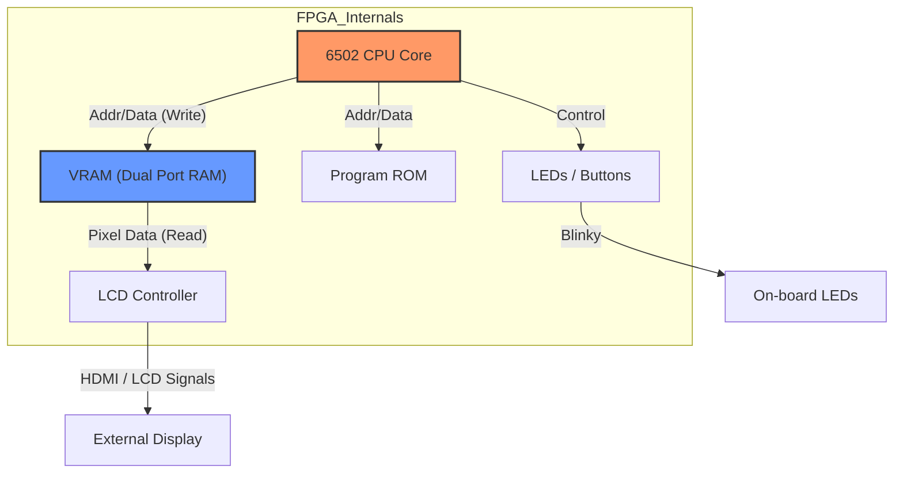

# Build a 6502 CPU from Scratch on an FPGA

---

🌐 Available languages:
[English](./README.md) | [日本語](./README_ja.md)

## 📖 Project Overview

This project is a step-by-step learning curriculum designed to guide you through implementing the legendary 8-bit MOS 6502 CPU from scratch in SystemVerilog on an FPGA (Tang Nano 9K/20K).

Ultimately, you will build a complete computer system on the FPGA, capable of running classic software like the Woz Monitor used in the Apple I.

## 🏗️ System Architecture

By the end of this course, you will have built the following system inside the FPGA.
The key feature is the **Hardware-Native Debugger**: the CPU writes debug info directly to VRAM, allowing you to see internal registers on the LCD screen.

## 🎯 Learning Objectives

- **Fundamentals of Digital Circuit Design**: Understand the basics of combinational and sequential logic.
- **Hardware Description Languages**: Master writing logic circuits using SystemVerilog.
- **CPU Architecture**: Gain a deep understanding of CPU components—such as the program counter, registers, ALU, and instruction decoder—by implementing them one by one.
- **Mastering Addressing Modes**: Learn how 6502's powerful addressing modes (indexed, indirect, etc.) are implemented in hardware.
- **Hardware Debugging**: Learn debugging techniques using both simulation and on-chip hardware (an LCD).

## 📋 Prerequisites

This curriculum assumes no prior FPGA experience. Here's what will help:

| Category         | Knowledge                               | Required |
| ---------------- | --------------------------------------- | :------: |
| **Essential**    | Basic programming in any language       |    ✅    |
| **Essential**    | Binary and hexadecimal numbers          |    ✅    |
| **Essential**    | Logical operations (AND, OR, XOR)       |    ✅    |
| **Helpful**      | C language (pointers, bit manipulation) |    ⭕    |
| **Helpful**      | Assembly language concepts              |    ⭕    |
| **Not Required** | FPGA/Verilog experience                 |    ❌    |
| **Not Required** | 6502 architecture knowledge             |    ❌    |

## 📂 Directory Structure & Workflow

Each day is split into two folders. Use them as follows:

| Directory | Purpose | How to use |
| :--- | :--- | :--- |
| **`dayXX/`** | **Your Workspace** | This folder contains the starter code and README. You will write your implementation here. |
| **`dayXX_completed/`** | **Reference Solution** | Contains the fully working code. If you get stuck, peek here, or copy files to your workspace to move forward. |

**Typical Daily Workflow:**

1. Read `dayXX/README.md`.
2. Edit `.sv` files in `dayXX/`.
3. Run `make test` to verify logic (Simulation).
4. Run `make download` to program the FPGA (Hardware).

## 📘 Resources for Software Engineers

Moving from software to hardware requires a shift in mindset. We have prepared guides to help you bridge the gap:

- **[SystemVerilog Cheatsheet](./docs/SYSTEMVERILOG_CHEATSHEET.md)**: "How do I write an `if` statement?", "What is `<=`, and why isn't it `=`?"
- **[Debugging Guide](./docs/DEBUGGING_GUIDE.md)**: How to read waveforms and debug logic that runs in parallel.
- **[Glossary](./docs/GLOSSARY.md)**: LUTs, FFs, Latches, PLLs... what do they mean?

## 📘 Other Links

- **[Required Software](./docs/PREREQS.md)**: Install them first
- **[Full Instruction Set List](./day99_completed/docs/INSTRUCTIONS.md)**: 6522 Instruction Set List.

## 📅 Curriculum Roadmap

The roadmap is divided into four main phases.

### Phase 1: Preparations (Day 01-04)

Setting up the environment and building the necessary debug tools.

|    Day     | Topic                 | What You'll Learn                                           |
| :--------: | :-------------------- | :---------------------------------------------------------- |
| **Day 01** | **Blinky LED**        | Environment setup and FPGA programming.                     |
| **Day 02** | **4-bit ALU**         | Combinational logic and basic logical operations.           |
| **Day 03** | **Traffic Light FSM** | Sequential logic and Finite State Machines.                 |
| **Day 04** | **Debug Foundation**  | LCD display circuit (BSRAM/pROM) and base register set.     |

### Phase 2: Core CPU Implementation (Day 05-10)

Implementing core CPU functionality and visualizing internal state.

|    Day     | Topic                   | Instructions (Examples)                   |
| :--------: | :---------------------- | :---------------------------------------- |
| **Day 05** | **CPU Skeleton**        | `NOP` (Program Counter only).             |
| **Day 06** | **Memory Access**       | `LDA #imm` (Immediate load).              |
| **Day 07** | **Reg Transfers**       | `TAX`, `TAY`, `INX`, `INY`.               |
| **Day 08** | **Arithmetic (ALU)**    | `ADC`, `SBC` (NVZC Flag calculations).    |
| **Day 09** | **Branching**           | `BNE`, `BEQ`, `BPL`, `BMI`.               |
| **Day 10** | **Stack & Subroutines** | `JSR`, `RTS`, `PHA`, `PLA`, `JMP`, `HLT`. |

### Phase 3: Addressing Modes & Data Processing (Day 11-15)

Strengthening memory operations and complex processing.

|    Day     | Topic                 | What You'll Learn                           |
| :--------: | :-------------------- | :------------------------------------------ |
| **Day 11** | **Zero Page**         | Zero Page addressing (`LDA $00`) and RAM.   |
| **Day 12** | **Absolute**          | Absolute addressing (`LDA $1234`).          |
| **Day 13** | **Logic Ops**         | `AND`, `ORA`, `EOR`, `BIT` (Bitwise logic). |
| **Day 14** | **Shift & Rotate**    | `ASL`, `LSR`, `ROL`, `ROR`.                 |
| **Day 15** | **Compare & Inc/Dec** | `CMP`, `CPX`, `CPY`, `INC`, `DEC`.          |

### Phase 4: Advanced Addressing & Custom Extension (Day 16-18)

Complex addressing modes and hardware-native custom instructions.

|    Day     | Topic              | What You'll Learn                                                |
| :--------: | :----------------- | :--------------------------------------------------------------- |
| **Day 16** | **Indexed**        | Indexed addressing (`LDA $1234,X` / `,Y`).                       |
| **Day 17** | **Indirect**       | Indirect addressing (`JMP ($1234)`, `($00,X)`, `($00),Y`).       |
| **Day 18** | **Custom Opcodes** | `WVS` (Wait V-Sync), `CVR` (Clear VRAM), `IFO` (Debug Info).     |

### 🏁 Final Goal (Day 99)

- **Nearly Complete 6502 CPU** (excluding full interrupts).
- **Running Woz Monitor** or **Apple I Basic**.
- Custom OS or programs controlling FPGA-native hardware.

## 🛠️ What You'll Need

- **Hardware**: Sipeed Tang Nano 9K / 20K and 480x272 LCD panel.
- **Software**: GOWIN EDA, verilator, GTKwave.

Check [Day 01](./day01/README.md) to get started!
