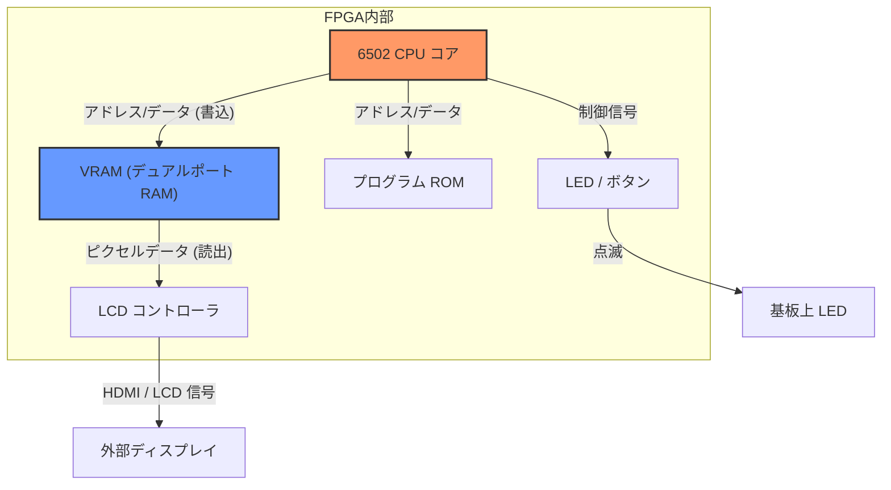

# FPGA で学ぶ 6502 CPU 自作入門

---

🌐 Available languages:
[English](./README.md) | [日本語](./README_ja.md)

## 📖 プロジェクト概要

このプロジェクトは、FPGA (Tang Nano 9K/20K) を使って、伝説的な 8 ビット CPU「MOS 6502」を SystemVerilog でゼロから実装することを目指す、ステップ・バイ・ステップ形式の学習カリキュラムです。

最終的には、Apple I などで使われた Woz Monitor のような古典的なソフトウェアが動作する、完全なコンピュータシステムを FPGA 上に構築します。

## 🏗️ システムアーキテクチャ

このコースを修了する頃には、FPGA 内部に以下のようなシステムが構築されます。
最大の特徴は **ハードウェアネイティブ・デバッガ** です。CPU がデバッグ情報を直接 VRAM に書き込み、LCD 画面上で内部レジスタの状態を確認できます。

## 🎯 学習目標

- **デジタル回路設計の基礎**: 組み合わせ回路や順序回路の基本を理解する。
- **ハードウェア記述言語**: SystemVerilog を使った論理回路の記述方法を習得する。
- **CPU アーキテクチャ**: プログラムカウンタ、レジスタ、ALU、命令デコーダなど、CPU の構成要素を一つずつ実装し、その仕組みを深く理解する。
- **アドレッシングモードの極意**: 6502 の強力なアドレッシングモード（インデックス、間接など）をハードウェアでどう実現するかを学ぶ。
- **ハードウェアデバッグ**: シミュレーションと実機（LCD 表示）の両方を使ったデバッグ手法を学ぶ。

## 📋 前提知識

このカリキュラムは FPGA 未経験者を対象としています。以下の知識があると理解がスムーズです：

| カテゴリ | 知識                               | 必要性 |
| -------- | ---------------------------------- | :----: |
| **必須** | 何らかの言語でのプログラミング経験 |   ✅   |
| **必須** | 2 進数・16 進数の理解              |   ✅   |
| **必須** | 論理演算(AND, OR, XOR)の基本       |   ✅   |
| **推奨** | C 言語(ポインタ、ビット演算)       |   ⭕   |
| **推奨** | アセンブリ言語の概念               |   ⭕   |
| **不要** | FPGA/Verilog 経験                  |   ❌   |
| **不要** | 6502 アーキテクチャの知識          |   ❌   |

## 📂 ディレクトリ構造とワークフロー

各 Day は 2 つのフォルダに分かれています。以下のように使い分けてください。

| ディレクトリ | 目的 | 使い方 |
| :--- | :--- | :--- |
| **`dayXX/`** | **あなたの作業場** | スターターコードと README が入っています。ここでコードを記述・実装します。 |
| **`dayXX_completed/`** | **回答例** | 完全に動作する完成コードが入っています。詰まったときに参照したり、ファイルをコピーして先に進むために使います。 |

**日々のワークフロー:**

1. `dayXX/README_ja.md` を読む。
2. `dayXX/` 内の `.sv` ファイルを編集して実装する。
3. `make test` を実行してロジックを確認する (シミュレーション)。
4. `make download` を実行して FPGA に書き込む (実機動作)。

## 📘 ソフトウェアエンジニア向けリソース

ソフトウェアからハードウェアへの移行には、考え方の転換が必要です。そのギャップを埋めるためのガイドを用意しました：

- **[SystemVerilog チートシート](./docs/SYSTEMVERILOG_CHEATSHEET_ja.md)**: 「if文はどう書く？」「`<=` と `=` は何が違う？」といった疑問に答えます。
- **[デバッグガイド](./docs/DEBUGGING_GUIDE_ja.md)**: 波形の読み方や、並列に動くロジックのデバッグ方法を解説します。
- **[用語集](./docs/GLOSSARY_ja.md)**: LUT, FF, ラッチ, PLL... これらの用語の意味を解説します。

## 📘 その他のリンク

- **[必要なソフトウェア](./docs/PREREQS_ja.md)**: はじめにこれらをインストールしてください。
- **[全命令リスト](./day99_completed/docs/INSTRUCTIONS.md)** 6502 CPU命令リスト。

## 📅 カリキュラム

ロードマップは以下の 4 つのフェーズで構成されています。

### Phase 1: 準備編 (Day 01-04)

まずは FPGA 開発の基本と、後の CPU 開発でデバッグに使う周辺回路を準備します。

|    Day     | テーマ           | 学習内容                                                  |
| :--------: | :--------------- | :-------------------------------------------------------- |
| **Day 01** | **L チカ**       | 開発環境の構築と FPGA への書き込み                        |
| **Day 02** | **4-bit ALU**    | 組み合わせ回路の基本と論理演算                            |
| **Day 03** | **信号機 FSM**   | 順序回路と状態遷移 (Finite State Machine)                 |
| **Day 04** | **デバッグ基盤** | LCD 表示回路（BSRAM/pROM 使用）とレジスタセットの基礎     |

### Phase 2: CPU の実装開始 (Day 05-10)

CPU の基本機能を一つずつ追加し、LCD に内部状態を表示しながらデバッグします。

|    Day     | テーマ             | 実装する命令（例）                       |
| :--------: | :----------------- | :--------------------------------------- |
| **Day 05** | **CPU の骨格**     | `NOP` (Program Counter のみ)             |
| **Day 06** | **メモリアクセス** | `LDA #imm` (即値ロード)                  |
| **Day 07** | **レジスタ転送**   | `TAX`, `TAY`, `INX`, `INY`               |
| **Day 08** | **算術演算 (ALU)** | `ADC`, `SBC` (フラグ NVZC の計算)        |
| **Day 09** | **分岐命令**       | `BNE`, `BEQ`, `BPL`, `BMI`               |
| **Day 10** | **スタック操作**   | `JSR`, `RTS`, `PHA`, `PLA`, `JMP`, `HLT` |

### Phase 3: アドレッシングモードとデータ処理 (Day 11-15)

メモリ操作を強化し、より複雑なデータ処理を可能にします。

|    Day     | テーマ           | 学習内容                                         |
| :--------: | :--------------- | :----------------------------------------------- |
| **Day 11** | **Zero Page**    | ゼロページアドレッシング (`LDA $00`) と RAM 実装 |
| **Day 12** | **Absolute**     | アブソリュートアドレッシング (`LDA $1234`)       |
| **Day 13** | **論理演算**     | `AND`, `ORA`, `EOR`, `BIT` (ビット操作)          |
| **Day 14** | **シフト・回転** | `ASL`, `LSR`, `ROL`, `ROR`                       |
| **Day 15** | **比較・増減**   | `CMP`, `CPX`, `CPY`, `INC`, `DEC`                |

### Phase 4: 高度なアドレッシングと独自命令 (Day 16-18)

6502 の真骨頂である複雑なアドレッシングと、FPGA ならではの独自拡張を実装します。

|    Day     | テーマ       | 学習内容                                                       |
| :--------: | :----------- | :------------------------------------------------------------- |
| **Day 16** | **Indexed**  | インデックス付きアドレッシング (`LDA $1234,X` / `,Y`)          |
| **Day 17** | **Indirect** | 間接アドレッシング (`JMP ($1234)`, `($00,X)`, `($00),Y`)       |
| **Day 18** | **独自命令** | `WVS` (V-Sync 待ち), `CVR` (VRAM クリア), `IFO` (情報表示)     |

### 🏁 最終目標 (Day 99)

- **完全な 6502 互換 CPU**（割り込みを除く）の完成
- **Woz Monitor** や **Apple I Basic** の動作
- 自作の周辺回路を制御する独自 OS/プログラムの作成

## 🛠️ 必要なもの

- **ハードウェア**: Sipeed Tang Nano 9K / 20K および 480x272 LCD パネル
- **ソフトウェア**: GOWIN EDA, verilator, GTKwave

詳細は [Day 01](./day01/README_ja.md) から始めてください！
