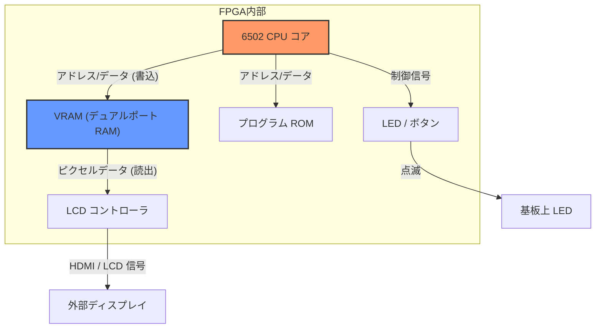

# FPGA で学ぶ 6502 CPU 自作入門

---

🌐 Available languages:
[English](./README.md) | [日本語](./README_ja.md)

## 📖 プロジェクト概要

このプロジェクトは、FPGA (Tang Nano 9K/20K) を使って、伝説的な 8 ビット CPU「MOS 6502」を SystemVerilog でゼロから実装することを目指す、ステップ・バイ・ステップ形式の学習カリキュラムです。

この教材の到達点は、Day 99 の統合デザインで扱う命令サブセットと LCD 周辺回路です。NMOS 6502 の完全互換（全命令・割り込み・タイミング互換）や、Woz Monitor / Apple I BASIC の動作は保証していません。

## 🏗️ システムアーキテクチャ

このコースを修了する頃には、FPGA 内部に以下のようなシステムが構築されます。
最大の特徴は**ハードウェアネイティブ・デバッガ**です。CPU がデバッグ情報を直接 VRAM に書き込み、LCD 画面上で内部レジスタの状態を確認できます。

```mermaid
graph TD
    subgraph FPGA内部
        CPU[6502 CPU コア]
        VRAM["VRAM (デュアルポート RAM)"]
        LCD[LCD コントローラ]
        ROM[プログラム ROM]
        GPIO[LED / ボタン]

        CPU -- "アドレス/データ" --> ROM
        CPU -- "アドレス/データ (書込)" --> VRAM
        CPU -- "制御信号" --> GPIO
        VRAM -- "ピクセルデータ (読出)" --> LCD
    end

    LCD -- "HDMI / LCD 信号" --> DISPLAY[外部ディスプレイ]
    GPIO -- "点滅" --> LEDS[基板上 LED]

    style CPU fill:#f96,stroke:#333,stroke-width:2px
    style VRAM fill:#69f,stroke:#333,stroke-width:2px
```

## 🎯 学習目標

- **デジタル回路設計の基礎**: 組み合わせ回路や順序回路の基本を理解する。
- **ハードウェア記述言語**: SystemVerilog を使った論理回路の記述方法を習得する。
- **CPU アーキテクチャ**: プログラムカウンタ、レジスタ、ALU、命令デコーダなど、CPU の構成要素を一つずつ実装し、その仕組みを深く理解する。
- **アドレッシングモードの極意**: 6502 の強力なアドレッシングモード（インデックス、間接など）をハードウェアでどう実現するかを学ぶ。
- **ハードウェアデバッグ**: シミュレーションと実機（LCD 表示）の両方を使ったデバッグ手法を学ぶ。

## 📋 前提知識

このカリキュラムは FPGA 未経験者を対象としています。以下の知識があると理解がスムーズです：

| カテゴリ | 知識                               | 必要性 |
| -------- | ---------------------------------- | :----: |
| **必須** | 何らかの言語でのプログラミング経験 |   ✅   |
| **必須** | 2 進数・16 進数の理解              |   ✅   |
| **必須** | 論理演算(AND, OR, XOR)の基本       |   ✅   |
| **推奨** | C 言語(ポインタ、ビット演算)       |   ⭕   |
| **推奨** | アセンブリ言語の概念               |   ⭕   |
| **不要** | FPGA/Verilog 経験                  |   ❌   |
| **不要** | 6502 アーキテクチャの知識          |   ❌   |

## 📂 ディレクトリ構造とワークフロー

各 Day は 2 つのフォルダに分かれています。以下のように使い分けてください。

| ディレクトリ           | 目的               | 使い方                                                                                                                    |
| :--------------------- | :----------------- | :------------------------------------------------------------------------------------------------------------------------ |
| **`dayXX/`**           | **あなたの作業場** | スターターコードと README が入っています。ここでコードを記述・実装します。                                                |
| **`dayXX_completed/`** | **回答例**         | そのDayの課題に対応する完成例です。対象範囲のテストに合格しても、全命令・全ボードの実機動作を保証するものではありません。 |

**日々のワークフロー:**

1. `dayXX/README_ja.md` を読む。
2. `dayXX/` 内の課題ファイルを編集して実装する。
3. 各 Day の README に記載された `make -C dayXX test-cpu` / `test` などを実行する。シミュレーションは指定されたテスト範囲だけを検証し、実機動作までは保証しない。
4. `make BOARD=9k download` または `make BOARD=20k download` は Day 99 をビルドして書き込むコマンド。個別 Day の書き込みは `make -C dayXX_completed download BOARD=9k` のように実行する。実機確認は別途ボード上で行う。

## 📘 ソフトウェアエンジニア向けリソース

ソフトウェアからハードウェアへの移行には、考え方の転換が必要です。そのギャップを埋めるためのガイドを用意しました：

- **[SystemVerilog チートシート](./docs/SYSTEMVERILOG_CHEATSHEET_ja.md)**:「if 文はどう書く？」「`<=` と `=` は何が違う？」といった疑問に答えます。
- **[よくある落とし穴](./docs/COMMON_PITFALLS_ja.md)**: 代入演算子の使い分け、チャタリング、不定値など、初心者が必ずと言っていいほどハマる罠を解説します。
- **[デバッグガイド](./docs/DEBUGGING_GUIDE_ja.md)**: 波形の読み方や、並列に動くロジックのデバッグ方法を解説します。
- **[用語集](./docs/GLOSSARY_ja.md)**: LUT, FF, ラッチ, PLL... これらの用語の意味を解説します。

## 📘 その他のリンク

- **[必要なソフトウェア](./docs/PREREQS_ja.md)**: はじめにこれらをインストールしてください。
- **[ボード設定と環境構築 (9K / 20K)](./docs/BOARD_SETUP_ja.md)**: Tang Nano 9K と 20K の仕様差（リセット極性・クロック・制約）と設定方法。
- **[全命令リスト](./day99_completed/docs/INSTRUCTIONS.md)** 6502 CPU 命令リスト。

## 📅 カリキュラム

ロードマップは以下の 4 つのフェーズで構成されています。

### Phase 1: 準備編 (Day 01-04)

まずは FPGA 開発の基本と、後の CPU 開発でデバッグに使う周辺回路を準備します。

| Day | テーマ | 学習内容 |
| :---: | :--- | :--- |
| [**Day 01**](./day01/README_ja.md) | **L チカ** | 開発環境の構築と FPGA への書き込み |
| [**Day 02**](./day02/README_ja.md) | **4-bit ALU** | 組み合わせ回路の基本と論理演算 |
| [**Day 03**](./day03/README_ja.md) | **信号機 FSM** | 順序回路と状態遷移 (Finite State Machine) |
| [**Day 04**](./day04/README_ja.md) | **デバッグ基盤** | LCD 表示回路（BSRAM/pROM 使用）の基礎 |

### Phase 2: CPU の実装開始 (Day 05-10)

CPU の基本機能を一つずつ追加し、LCD に内部状態を表示しながらデバッグします。

| Day | テーマ | 実装する命令（例） |
| :---: | :--- | :--- |
| [**Day 05**](./day05/README_ja.md) | **CPU の骨格** | `NOP` (Program Counter のみ) |
| [**Day 06**](./day06/README_ja.md) | **メモリアクセス** | `LDA #imm` (即値ロード) |
| [**Day 07**](./day07/README_ja.md) | **レジスタ転送** | `TAX`, `TAY`, `INX`, `INY` |
| [**Day 08**](./day08/README_ja.md) | **算術演算 (ALU)** | `ADC`, `SBC` (フラグ NVZC の計算) |
| [**Day 09**](./day09/README_ja.md) | **分岐命令** | `BNE`, `BEQ`, `BPL`, `BMI` |
| [**Day 10**](./day10/README_ja.md) | **スタック操作** | `JSR`, `RTS`, `PHA`, `PLA`, `JMP`, `HLT` |

### Phase 3: アドレッシングモードとデータ処理 (Day 11-15)

メモリ操作を強化し、より複雑なデータ処理を可能にします。

| Day | テーマ | 学習内容 |
| :---: | :--- | :--- |
| [**Day 11**](./day11/README_ja.md) | **Zero Page** | ゼロページアドレッシング (`LDA $00`) と RAM 実装 |
| [**Day 12**](./day12/README_ja.md) | **Absolute** | アブソリュートアドレッシング (`LDA $1234`) |
| [**Day 13**](./day13/README_ja.md) | **論理演算** | `AND`, `ORA`, `EOR`, `BIT` (ビット操作) |
| [**Day 14**](./day14/README_ja.md) | **シフト・回転** | `ASL`, `LSR`, `ROL`, `ROR` |
| [**Day 15**](./day15/README_ja.md) | **比較・増減** | `CMP`, `CPX`, `CPY`, `INC`, `DEC` |

### Phase 4: 高度なアドレッシングと独自命令 (Day 16-18)

6502 の真骨頂である複雑なアドレッシングと、FPGA ならではの独自拡張を実装します。

| Day | テーマ | 学習内容 |
| :---: | :--- | :--- |
| [**Day 16**](./day16/README_ja.md) | **Indexed** | インデックス付きアドレッシング (`LDA $1234,X` / `,Y`) |
| [**Day 17**](./day17/README_ja.md) | **Indirect** | 間接アドレッシング (`JMP ($1234)`, `($00,X)`, `($00),Y`) |
| [**Day 18**](./day18/README_ja.md) | **独自命令** | `WVS` (V-Sync 待ち), `CVR` (VRAM クリア), `IFO` (情報表示) |

### 🏁 最終目標 (Day 99)

- Day 99 で定義された 6502 命令サブセットと独自命令を実装した統合デザイン（全命令・割り込み・サイクル完全互換ではありません）
- 命令サブセットとカスタム命令を使ったサンプルプログラムの実行
- 自作の周辺回路を制御する独自プログラムの作成

## 🛠️ 必要なもの

- **ハードウェア**: Sipeed Tang Nano 9K / 20K および 480x272 LCD パネル
- **ソフトウェア**:
  - **GOWIN EDA**: FPGA 向けのコードを合成するための IDE・ツールチェーン（ハードウェア版の GCC/Clang のようなもの）。
  - **Verilator**: PC 上で SystemVerilog をシミュレーションするための高速なツール。テスト範囲は各テストベンチに依存します。
  - **GTKwave**: 信号の変化を視覚化する波形ビューア（ロジックのための「デバッガ」）。

詳細は[Day 01](./day01/README_ja.md)から始めてください！
