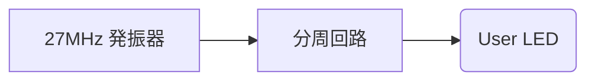
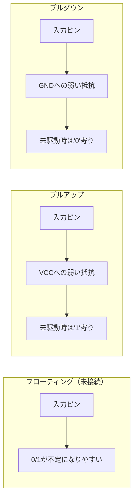
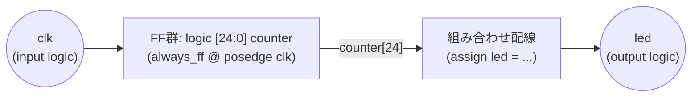

# Day 01: FPGA 基礎と環境構築

---

🌐 対応言語:
[English](./README.md) | [日本語](./README_ja.md)

## 📜 概要

6502 CPU 自作への第一歩へようこそ！複雑なロジックの世界に飛び込む前に、まずはハードウェアと開発環境に慣れる必要があります。

Day 01 の目標は、FPGA のツールチェーンをセットアップし、ハードウェアにおける「Hello World」である **LED チカチカ（L チカ）** を実装することです。

## 🎯 学習目標

- **ハードウェア仕様**: Tang Nano 9K/20K の基本構成を理解する。
- **ツールチェーン**: Gowin EDA の基本的なワークフローに慣れる。
- **RTL 開発**: 最初の SystemVerilog プロジェクトを作成する。
- **FPGA への書き込み**: 合成と配置配線を行い、実機で動作を確認する。

## 📚 事前準備

### ハードウェア

- Tang Nano 9K または Tang Nano 20K
- USB-C ケーブル
- PC (Windows/Linux/macOS)

### ソフトウェアの前提条件

以下のソフトウェアをインストールしてください。

[必要なソフトウェア(PREREQS_ja.md)](../docs/PREREQS_ja.md)

## 🏗️ アーキテクチャ

最初の設計は、高速なクロック信号を人間が視覚的に確認できる速度まで落とす「分周器」という非常にシンプルなものです。



## 🛠️ 実装ステップ

1. **プロジェクトの作成**:
    - Gowin EDA で `led_blink` という名前の新しいプロジェクトを作成。
    - 使用するボード（9K または 20K）に合わせて正しいデバイスを選択。
2. **ロジックの実装 (`top.sv`)**:
    - 25 ビットのカウンタを実装。
    - カウンタの最上位ビット（MSB）を LED 出力に接続。
3. **制約の設定 (`.cst`)**:
    - コード上の論理信号名（`clk`, `led`）を、FPGA の実際の物理ピンに割り当てる。
4. **ビルドと書き込み**:
    - Synthesize（合成）と Place & Route（配置配線）を実行。
    - Programmer ツールを使用してビットストリーム（`.fs`）を FPGA にダウンロード。

## 💡 ソフトウェア思考からハードウェア思考へ

ソフトウェア開発者にとって最大の意識改革は、「**これはプログラムではない**」と理解することです。あなたは SystemVerilog で**回路の構造**を設計しています。記述したロジックは（クロックでタイミングを制御しない限り）すべて**同時（並列）**に動作します。

1. **設計（RTL）** - HDL (Hardware Description Language) でロジックを記述
2. **合成（Synthesis）** - RTL を LUT/FF/RAM のつながり（ネットリスト）に変換
3. **配置配線（Place & Route）** - ネットリストを FPGA 内の物理リソースに割り当て
4. **ビットストリーム生成** - FPGA に書き込むバイナリファイルを生成
5. **プログラミング** - FPGA にビットストリームを書き込み

## 📖 理論学習

### ソフトウェアエンジニアのためのヒント：ハードウェア思考への切り替え

ソフトウェア開発の経験がある方にとって、最も大きな意識の転換は「**これはプログラムではない**」という点です。 HDL は**ハードウェア回路を記述するための言語**です。

- **逐次処理 vs 並列処理:** CPU は命令を一つずつ実行しますが、FPGA では、記述した回路はすべて**同時に（並列で）動作します**。クロックを使って順序を明示しない限り、すべてが並列です。
- **コードは構造を記述する:** SystemVerilog のコードは、部品がどう配線されているかを記述します。`assign led = a & b;` は一度だけ「実行」されるのではなく、`a`、`b`、`led` に接続された物理的な AND ゲートを「生成」します。
- **クロックがすべてを支配する:** クロック信号 (`clk`) は、並列動作に秩序をもたらすためのものです。クロックを使うことで、「次のクロックの立ち上がりで、このカウンタをインクリメントする」といった順序だった動作（シーケンシャルなロジック）を作ることができます。`always_ff @(posedge clk)` ブロックがまさにその役割を果たします。

この考え方を念頭に置いて学習を進めてみてください。あなたは単なるプログラマーではなく、回路設計者になるのです！

#### アナロジー：ビルドプロセス

- **合成 (Synthesis)** $\approx$ **コンパイル**: 構文をチェックし、コードを低レベルの論理要素（ゲートや LUT）に変換します。
- **配置配線 (Place & Route)** $\approx$ **リンク + 物理レイアウト**: チップ上の _どこ_ に回路を置くかを決め、物理的な配線を繋ぎます。これは計算コストが高く、ソフトウェアのコンパイルより時間がかかる主な理由です！

### Tang Nano の基本仕様

**Tang Nano 9K:**

- FPGA: Gowin GW1NR-9C
- 論理エレメント: 8,640 LUT4
- メモリ: 468Kbit BSRAM
- PLL: 2 個
- I/O ピン数: 63

**Tang Nano 20K:**

- FPGA: Gowin GW2AR-18C
- 論理エレメント: 20,736 LUT4
- メモリ: 828Kbit BSRAM
- PLL: 4 個
- I/O ピン数: 107

### 用語集（この Day で初めて出てくる言葉）

この Day は FPGA 入門なので、以降も頻出する単語をここで定義しておきます。

#### RTL（Register-Transfer Level）

**RTL**は「レジスタ（クロックで更新される状態）」と「その間の組み合わせ回路」を中心に書く設計スタイルです。
ざっくり言うと `.sv` に書く回路記述（`top.sv`など）が RTL です。

#### LUT / FF /（Block）RAM

FPGA は、設定可能な部品の集合体です。

- **LUT（Look-Up Table）**：小さな真理値表で論理関数を実現する部品（AND/OR/XOR などはここにマッピングされることが多い）。
- **FF（Flip-Flop）**：1 ビットのレジスタ。クロックのエッジ（`posedge`/`negedge`）で値が更新されます。
- **RAM / BSRAM（Block SRAM）**：FPGA 内蔵のメモリブロック（ROM/RAM/FIFO などに使う）。

後で「合成で RTL が LUT/FF/RAM に変換される」と言うときの LUT/FF/RAM はこれです。

#### プルアップ／プルダウン（なぜ必要？）

入力ピンがどこにも接続されていないと、電気的に「フワフワ（浮く）」して 0/1 が不定になりがちです。
そこで弱い抵抗で 1 側に寄せるのが **プルアップ**、0 側に寄せるのが **プルダウン**です。



FPGA では制約（`.cst`）の `PULL_MODE` で設定することがあります。

## 🛠️ 実習: LED チカチカプロジェクト

実機で「手順通りに動く」ことを優先する場合は、動作確認済みの完成版プロジェクト `day01_completed/` を使うのが最短です：
この完成版プロジェクトには、Tang Nano 9K と 20K それぞれに対応したファイルが含まれており、実機で試す場合はこちらを使うことをお勧めします。

```bash
cd day01_completed
make help
make BOARD=9k download   # または BOARD=20k
```

9K/20K の差分や macOS のツールパスなどは `docs/BOARD_SETUP_ja.md` を参照してください。

### Step 1: プロジェクト作成

1. GoWin EDA を起動
2. "File" → "New Project" を選択
3. プロジェクト名: `led_blink`
4. デバイス選択:
    - Tang Nano 9K: `GW1NR-LV9QN88PC6/I5`
    - Tang Nano 20K: `GW2AR-LV18QN88C8/I7`

### Step 2: HDL コード作成

`top.sv` ファイルを作成し、以下のコードを記述:

```systemverilog
module top (
    input  logic clk,    // 27MHz clock
    output logic led     // LED output
);

    // Clock divider for visible blinking (約1Hz)
    logic [24:0] counter;

    always_ff @(posedge clk) begin
        counter <= counter + 1;
    end

    // LED点滅 (counterの最上位ビットを使用)
    assign led = counter[24];

endmodule
```

#### `wire` / `logic` / `always_ff` / `posedge` / `assign` を図で理解する

この短い例には、以降も何度も出てくる「回路記述の基本」が詰まっています。



- `logic`: 最近の SystemVerilog で使われるデータ型で、配線とレジスタの両方に使えます。初心者向けのルールとして、**ほぼすべての場面で `logic` を使うことを推奨します**。
  - `assign` で駆動すれば配線として振る舞います。
  - `always_ff` 内で駆動すればレジスタとして振る舞います。
- `wire`: 古い Verilog で配線を表す型です。複数のドライバを持つ信号（双方向バスなど）には必須ですが、このコースでは使用しません。基本的には `logic` で代用可能です。
- `reg`: 古い Verilog で値を保持する変数のためのデータ型で、`always` ブロック内で使われます。新しい SystemVerilog のコードでは一般的に `logic` が推奨されます。

- `always_ff @(posedge clk)`: これは**シーケンシャル（順序）かつクロック同期**のロジックブロックを記述します。このブロック内のコードは、`clk` 信号の立ち上がりエッジ（0 から 1 への遷移）でのみ実行されます。これにより、状態を保持する**レジスタ**（フリップフロップなど）が作られます。
- `assign`: このキーワードは**組み合わせ（Combinational）ロジック**を作ります。これは、直接的な配線接続やロジックゲートのように、常に真である関係を記述します。例えば、`assign led = counter[24];` は、`counter` レジスタの 25 番目のビットを `led` 出力に直接接続する配線を生成します。

**ソフトウェアエンジニアのための重要ルール:**

- `always_ff` は **メモリ（状態）** を持つ部品を作ると考えてください。クロックが「刻む」ときにだけ変化します。
- `assign` は **メモリを持たない** 部品を作ると考えてください。入力が変化すると、出力は _即座に_ 変化します。これが並列ハードウェアの本質です。
- `always_ff` の中では `<=` （ノンブロッキング代入）を使い、すべてのレジスタがクロックエッジで同時に更新されるようにします。

### Step 3: 制約ファイル作成

`tang_nano.cst` ファイルを作成:

**Tang Nano 9K:**

```systemverilog
IO_LOC "clk" 52;
IO_LOC "led" 10;
IO_PORT "clk" IO_TYPE=LVCMOS33 PULL_MODE=NONE;
IO_PORT "led" IO_TYPE=LVCMOS18;
```

**Tang Nano 20K:**

```systemverilog
IO_LOC "clk" 4;
IO_LOC "led" 15;
IO_PORT "clk" IO_TYPE=LVCMOS33 PULL_MODE=UP;
IO_PORT "led" IO_TYPE=LVCMOS33;
```

#### `.cst`（制約ファイル）とは？ `IO_TYPE` / `PULL_MODE` とは？

`.cst` は「論理名（`clk`, `led`）を、基板の物理ピンへ結びつけ、電気特性も指定する」ためのファイルです。

- `IO_LOC "name" ピン番号;`：その信号をどの物理ピンに割り当てるか
- `IO_PORT "name" ...;`：そのピンの電気特性

よく使う項目：

- `IO_TYPE=LVCMOS33` / `LVCMOS18`：I/O の電圧規格（3.3V / 1.8V）。ボードの I/O バンク電圧に合わせます。
- `PULL_MODE=UP|DOWN|NONE`：
  - `UP`：弱いプルアップ（入力が浮くのを防ぐ）
  - `DOWN`：弱いプルダウン
  - `NONE`：なし

クロック入力は基板の発振器が強く駆動するので、`PULL_MODE=NONE` が一般的です。

### Step 4: 合成・配置配線

1. "Process" → "Synthesize" を実行
2. エラーがないことを確認
3. "Process" → "Place & Route" を実行

### Step 5: プログラミング

1. "Process" → "Program Device" を選択
2. Tang Nano を USB で接続
3. "SRAM Program" を実行
4. LED が約 0.8 秒間隔で点滅することを確認

## 🔧 トラブルシューティング

### よくある問題

1. **デバイスが認識されない**

    - USB ドライバーが正しくインストールされているか確認
    - Tang Nano のスイッチが適切な位置にあるか確認

2. **合成エラー**

    - SystemVerilog の構文エラーをチェック
    - モジュール名とファイル名が一致しているか確認

3. **配置配線エラー**
    - 制約ファイルのピン番号が正しいか確認
    - 使用しているボードに対応した制約ファイルか確認

## 📝 課題

### 基礎課題

1. 点滅速度を変更してみる (counter のビット位置を変更)
2. 2 つの LED を交互に点滅させる
3. PWM を使って LED の明度を変化させる

### 発展課題

1. スイッチ入力で LED の点滅速度を制御
2. 7 セグメントディスプレイにカウンタ表示
3. RGB LED で様々な色を表示

## 📚 今日学んだこと

- [ ] Tang Nano の基本仕様
- [ ] GoWin EDA の基本操作
- [ ] SystemVerilog の基本構文
- [ ] FPGA 開発フローの理解
- [ ] 制約ファイルの役割
- [ ] 実機での動作確認

## 🎯 明日の予習

Day 02 では SystemVerilog の組み合わせ回路について詳しく学習します:

- always_comb 文の使い方
- 条件分岐 (if-else, case)
- 論理演算とビット操作
- モジュール間の接続

**準備課題**: 2 進数、16 進数、論理演算の基本を復習しておきましょう。
