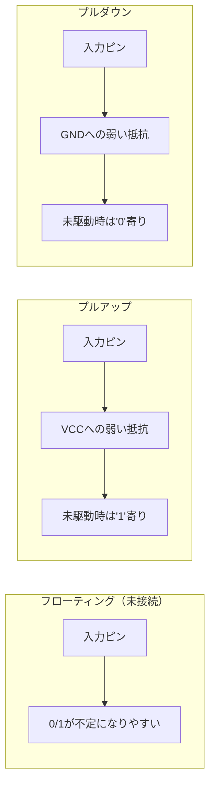
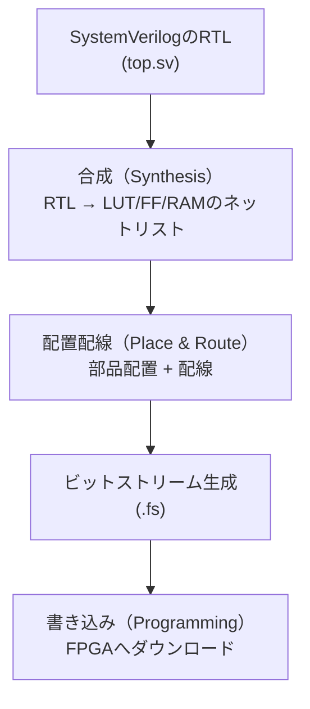
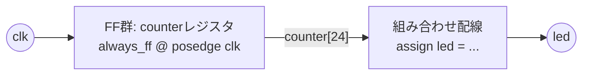

# Day 01: Tang Nano + GoWin EDA 基礎

---

🌐 Available languages:
[English](./README.md) | [日本語](./README_ja.md)

## 🎯 学習目標

- Tang Nano 9K/20K の基本仕様を理解する
- GoWin EDA の基本操作をマスターする
- 最初のHDLプロジェクトとしてLEDチカチカを作成する
- FPGA開発の基本的なワークフローを習得する

## 📚 事前準備

### ハードウェア

- Tang Nano 9K または Tang Nano 20K
- USB-C ケーブル
- PC (Windows/Linux/macOS)

### ソフトウェア

- GoWin EDA (公式サイトからダウンロード・インストール)

## 📖 理論学習

### ソフトウェアエンジニアのためのヒント：ハードウェア思考への切り替え

ソフトウェア開発の経験がある方にとって、最も大きな意識の転換は「**これはプログラムではない**」という点です。 HDLは**ハードウェア回路を記述するための言語**です。

- **逐次処理 vs 並列処理:** CPUは命令を一つずつ実行しますが、FPGAでは、記述した回路はすべて**同時に（並列で）動作します**。クロックを使って順序を明示しない限り、すべてが並列です。
- **コードは構造を記述する:** SystemVerilogのコードは、部品がどう配線されているかを記述します。`assign led = a & b;` は一度だけ「実行」されるのではなく、`a`、`b`、`led` に接続された物理的なANDゲートを「生成」します。
- **クロックがすべてを支配する:** クロック信号 (`clk`) は、並列動作に秩序をもたらすためのものです。クロックを使うことで、「次のクロックの立ち上がりで、このカウンタをインクリメントする」といった順序だった動作（シーケンシャルなロジック）を作ることができます。`always_ff @(posedge clk)` ブロックがまさにその役割を果たします。

この考え方を念頭に置いて学習を進めてみてください。あなたは単なるプログラマーではなく、回路設計者になるのです！

#### アナロジー：ビルドプロセス

- **合成 (Synthesis)** $\approx$ **コンパイル**: 構文をチェックし、コードを低レベルの論理要素（ゲートやLUT）に変換します。
- **配置配線 (Place & Route)** $\approx$ **リンク + 物理レイアウト**: チップ上の *どこ* に回路を置くかを決め、物理的な配線を繋ぎます。これは計算コストが高く、ソフトウェアのコンパイルより時間がかかる主な理由です！

### Tang Nano の基本仕様

**Tang Nano 9K:**

- FPGA: Gowin GW1NR-9C
- 論理エレメント: 8,640 LUT4
- メモリ: 468Kbit BSRAM
- PLL: 2個
- I/Oピン数: 63

**Tang Nano 20K:**

- FPGA: Gowin GW2AR-18C
- 論理エレメント: 20,736 LUT4
- メモリ: 828Kbit BSRAM
- PLL: 4個
- I/Oピン数: 107

### 用語集（このDayで初めて出てくる言葉）

このDayはFPGA入門なので、以降も頻出する単語をここで定義しておきます。

#### RTL（Register-Transfer Level）

**RTL**は「レジスタ（クロックで更新される状態）」と「その間の組み合わせ回路」を中心に書く設計スタイルです。
ざっくり言うと `.sv` に書く回路記述（`top.sv`など）がRTLです。

#### LUT / FF /（Block）RAM

FPGAは、設定可能な部品の集合体です。

- **LUT（Look-Up Table）**：小さな真理値表で論理関数を実現する部品（AND/OR/XORなどはここにマッピングされることが多い）。
- **FF（Flip-Flop）**：1ビットのレジスタ。クロックのエッジ（`posedge`/`negedge`）で値が更新されます。
- **RAM / BSRAM（Block SRAM）**：FPGA内蔵のメモリブロック（ROM/RAM/FIFOなどに使う）。

後で「合成でRTLがLUT/FF/RAMに変換される」と言うときのLUT/FF/RAMはこれです。

#### プルアップ／プルダウン（なぜ必要？）

入力ピンがどこにも接続されていないと、電気的に「フワフワ（浮く）」して0/1が不定になりがちです。
そこで弱い抵抗で 1 側に寄せるのが **プルアップ**、0 側に寄せるのが **プルダウン**です。



FPGAでは制約（`.cst`）の `PULL_MODE` で設定することがあります。

### FPGA開発の基本フロー



1. **設計（RTL）** - HDL (Hardware Description Language) でロジックを記述
2. **合成（Synthesis）** - RTLをLUT/FF/RAMのつながり（ネットリスト）に変換
3. **配置配線（Place & Route）** - ネットリストをFPGA内の物理リソースに割り当て
4. **ビットストリーム生成** - FPGAに書き込むバイナリファイルを生成
5. **プログラミング** - FPGAにビットストリームを書き込み

## 🛠️ 実習: LEDチカチカプロジェクト

実機で「手順通りに動く」ことを優先する場合は、動作確認済みの完成版プロジェクト `day01_completed/` を使うのが最短です：
この完成版プロジェクトには、Tang Nano 9Kと20Kそれぞれに対応したファイルが含まれており、実機で試す場合はこちらを使うことをお勧めします。

```bash
cd day01_completed
make help
make BOARD=9k download   # または BOARD=20k
```

9K/20K の差分や macOS のツールパスなどは `docs/BOARD_SETUP_ja.md` を参照してください。

### Step 1: プロジェクト作成

1. GoWin EDA を起動
2. "File" → "New Project" を選択
3. プロジェクト名: `led_blink`
4. デバイス選択:
   - Tang Nano 9K: `GW1NR-LV9QN88PC6/I5`
   - Tang Nano 20K: `GW2AR-LV18QN88C8/I7`

### Step 2: HDLコード作成

`top.sv` ファイルを作成し、以下のコードを記述:

```systemverilog
module top (
    input  wire clk,     // 27MHz clock
    output wire led      // LED output
);

    // Clock divider for visible blinking (約1Hz)
    logic [24:0] counter;

    always_ff @(posedge clk) begin
        counter <= counter + 1;
    end

    // LED点滅 (counterの最上位ビットを使用)
    assign led = counter[24];

endmodule
```

#### `wire` / `logic` / `always_ff` / `posedge` / `assign` を図で理解する

この短い例には、以降も何度も出てくる「回路記述の基本」が詰まっています。



- `wire`: 物理的な配線を表すデータ型です。ロジックゲートの出力などで継続的に駆動されますが、それ自体に値を保持することはできません。`assign`文かモジュール出力によって駆動される必要があります。
- `logic`: 最近のSystemVerilogで使われるデータ型で、配線とレジスタの両方に使えます。初心者向けのルールとして、**`reg` よりも `logic` を使うことを推奨します**。`assign` で駆動すれば配線として振る舞い、`always` ブロックで使えばレジスタとして振る舞います。
- `reg`: 古いVerilogで値を保持する変数のためのデータ型で、`always` ブロック内で使われます。サンプルコードでは `reg` を使っていますが、新しいSystemVerilogのコードでは一般的に `logic` が推奨されます。
- `always_ff @(posedge clk)`: これは**シーケンシャル（順序）かつクロック同期**のロジックブロックを記述します。このブロック内のコードは、`clk` 信号の立ち上がりエッジ（0から1への遷移）でのみ実行されます。これにより、状態を保持する**レジスタ**（フリップフロップなど）が作られます。
- `assign`: このキーワードは**組み合わせ（Combinational）ロジック**を作ります。これは、直接的な配線接続やロジックゲートのように、常に真である関係を記述します。例えば、`assign led = counter[24];` は、`counter` レジスタの25番目のビットを `led` 出力に直接接続する配線を生成します。

**ソフトウェアエンジニアのための重要ルール:**

- `always_ff` は **メモリ（状態）** を持つ部品を作ると考えてください。クロックが「刻む」ときにだけ変化します。
- `assign` は **メモリを持たない** 部品を作ると考えてください。入力が変化すると、出力は *即座に* 変化します。これが並列ハードウェアの本質です。
- `always_ff` の中では `<=` （ノンブロッキング代入）を使い、すべてのレジスタがクロックエッジで同時に更新されるようにします。

### Step 3: 制約ファイル作成

`tang_nano.cst` ファイルを作成:

**Tang Nano 9K:**

```systemverilog
IO_LOC "clk" 52;
IO_LOC "led" 10;
IO_PORT "clk" IO_TYPE=LVCMOS33 PULL_MODE=NONE;
IO_PORT "led" IO_TYPE=LVCMOS18;
```

**Tang Nano 20K:**

```systemverilog
IO_LOC "clk" 4;
IO_LOC "led" 15;
IO_PORT "clk" IO_TYPE=LVCMOS33 PULL_MODE=UP;
IO_PORT "led" IO_TYPE=LVCMOS33;
```

#### `.cst`（制約ファイル）とは？ `IO_TYPE` / `PULL_MODE` とは？

`.cst` は「論理名（`clk`, `led`）を、基板の物理ピンへ結びつけ、電気特性も指定する」ためのファイルです。

- `IO_LOC "name" ピン番号;`：その信号をどの物理ピンに割り当てるか
- `IO_PORT "name" ...;`：そのピンの電気特性

よく使う項目：

- `IO_TYPE=LVCMOS33` / `LVCMOS18`：I/Oの電圧規格（3.3V / 1.8V）。ボードのI/Oバンク電圧に合わせます。
- `PULL_MODE=UP|DOWN|NONE`：
  - `UP`：弱いプルアップ（入力が浮くのを防ぐ）
  - `DOWN`：弱いプルダウン
  - `NONE`：なし

クロック入力は基板の発振器が強く駆動するので、`PULL_MODE=NONE` が一般的です。

### Step 4: 合成・配置配線

1. "Process" → "Synthesize" を実行
2. エラーがないことを確認
3. "Process" → "Place & Route" を実行

### Step 5: プログラミング

1. "Process" → "Program Device" を選択
2. Tang Nano をUSBで接続
3. "SRAM Program" を実行
4. LEDが約0.8秒間隔で点滅することを確認

## 🔧 トラブルシューティング

### よくある問題

1. **デバイスが認識されない**
   - USBドライバーが正しくインストールされているか確認
   - Tang Nanoのスイッチが適切な位置にあるか確認

2. **合成エラー**
   - SystemVerilogの構文エラーをチェック
   - モジュール名とファイル名が一致しているか確認

3. **配置配線エラー**
   - 制約ファイルのピン番号が正しいか確認
   - 使用しているボードに対応した制約ファイルか確認

## 📝 課題

### 基礎課題

1. 点滅速度を変更してみる (counterのビット位置を変更)
2. 2つのLEDを交互に点滅させる
3. PWMを使ってLEDの明度を変化させる

### 発展課題

1. スイッチ入力でLEDの点滅速度を制御
2. 7セグメントディスプレイにカウンタ表示
3. RGB LEDで様々な色を表示

## 📚 今日学んだこと

- [ ] Tang Nano の基本仕様
- [ ] GoWin EDA の基本操作
- [ ] SystemVerilog の基本構文
- [ ] FPGA開発フローの理解
- [ ] 制約ファイルの役割
- [ ] 実機での動作確認

## 🎯 明日の予習

Day 02では SystemVerilog の組み合わせ回路について詳しく学習します:

- always_comb文の使い方
- 条件分岐 (if-else, case)
- 論理演算とビット操作
- モジュール間の接続

**準備課題**: 2進数、16進数、論理演算の基本を復習しておきましょう。
