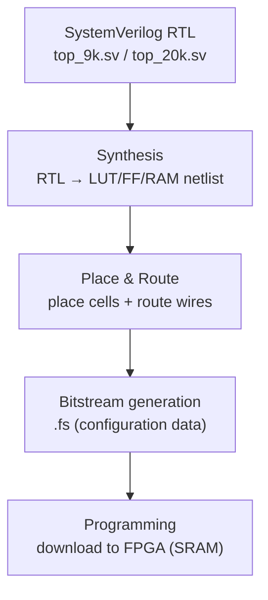
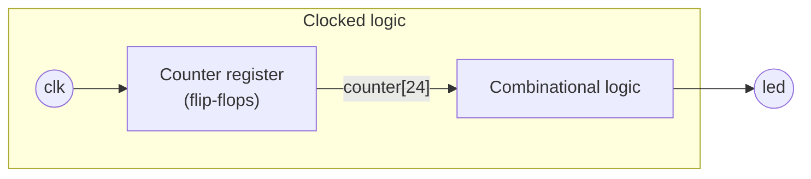
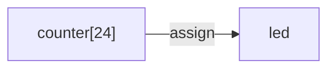

# Day 01 Completed: LED Blink Project

This is the completed version of the simple LED blinking project for the Tang Nano FPGA.

---

🌐 Available languages:
[English](./README.md) | [日本語](./README_ja.md)

## File Structure

- `top_9k.sv` - Top module for Tang Nano 9K (LED blink, open-drain style output)
- `top_20k.sv` - Top module for Tang Nano 20K (LED blink, push-pull output)
- `tang_nano_9k.cst` - Pin constraints for Tang Nano 9K
- `tang_nano_20k.cst` - Pin constraints for Tang Nano 20K
- `led_blink_9k.gprj`, `led_blink_20k.gprj` - GoWin EDA project files
- `Makefile` - Build automation

## Functionality

- Divides the 27MHz clock with a 25-bit counter
- Blinks the LED at approximately 0.8Hz (about 1.25-second intervals)
- Compatible with both Tang Nano 9K and 20K

## How to Build

### For Tang Nano 9K

```bash
make BOARD=9k download
```

### For Tang Nano 20K

```bash
make BOARD=20k download
```

## Verification

After programming, confirm that the LED on the board blinks at approximately 1.25-second intervals.

## What is a `.cst` (constraint) file?

FPGA designs don’t run on a “generic board”. The same RTL can be wired to different packages/boards, so the FPGA tools need a mapping from **logical port names** (like `clk`, `led`) to **physical pins**.

Gowin uses `.cst` files for this. You will typically see:

- `IO_LOC "signal" <pin>;`
  Assigns a design port (or top-level signal) to a physical package pin number.
- `IO_PORT "signal" ...;`
  Sets electrical I/O properties for that pin.

For example, in `tang_nano_9k.cst`:

- `IO_LOC "clk" 52;` means the `clk` port is physically connected to pin 52.
- `IO_PORT "clk" IO_TYPE=LVCMOS33 ...;` means the input expects 3.3V CMOS levels.

### Common `IO_PORT` options (beginner-friendly)

- `IO_TYPE=...`
  The I/O standard (voltage level + electrical behavior).
  - `LVCMOS33`: 3.3V CMOS logic levels.
  - `LVCMOS18`: 1.8V CMOS logic levels.
  Your board may have different banks powered at different voltages, so output pins often *must* match the bank voltage.
- `PULL_MODE=...`
  Built-in weak pull resistor configuration (when the pin is not actively driven).
  - `UP`: weak pull-up.
  - `DOWN`: weak pull-down.
  - `NONE`: no pull resistor.
  For clock inputs you usually want `NONE` (external oscillator drives it). For buttons/switches, a pull-up/down can make the signal stable when not pressed.
- `DRIVE=...` (for outputs)
  Output drive strength (mA). Higher is “stronger”, but can increase noise/EMI; use what your board needs.

## FPGA build flow: Synthesis vs Place & Route

FPGA toolchains typically do:



1. **Synthesis**
   Converts your SystemVerilog into a network of logic primitives (LUTs, flip-flops, RAM blocks, etc.).
2. **Place & Route (P&R)**
   Physically places those primitives onto actual resources on the FPGA chip and routes the wires between them, meeting timing constraints if possible.
3. **Bitstream generation**
   Produces a configuration file (e.g. `.fs`) that programs the FPGA.
4. **Programming**
   Downloads the bitstream into the FPGA (SRAM) so it starts running on hardware.

## SystemVerilog basics used here



### `always_ff` / `posedge` (clocked logic)

In this project, the counter is a *register* that updates on the rising edge of the clock:

- `posedge clk` means “when `clk` goes from 0 → 1”.
- In a clocked block you typically use **non-blocking assignment** `<=`:
  - `counter <= counter + 1;` means “update `counter` after the clock edge”.
  - This models flip-flops and avoids common simulation mismatches.

You’ll see `always @(posedge clk)` here; many codebases prefer `always_ff @(posedge clk)` (a SystemVerilog keyword that helps catch mistakes). Both represent edge-triggered sequential logic, but `always_ff` enforces stricter rules.

### `assign` (continuous combinational wiring)

`assign led = counter[24];` is a **continuous assignment**:

- It describes “wiring” logic: whenever `counter[24]` changes, `led` updates immediately (combinationally).
- This is the natural way to drive a top-level `output wire led` from a simple expression.



### “Can I just write `=`? Do I need `wire`?”

- **`=` (blocking assignment)** is mainly used inside combinational `always_comb` logic, or for temporary variables in a procedural block.
- **`<=` (non-blocking assignment)** is the standard for flip-flops (clocked logic).
- A signal driven by `assign ...` must be a net type (`wire`) or an `output` that behaves like a net.
- A signal assigned inside an `always` block is typically declared as `logic` (SystemVerilog).

In other words, this pattern is common and correct:

- `counter` is written in an `always @(posedge clk)` block → declare it as `logic`.
- `led` is driven by `assign` → declare it as `wire` (or an output net).

### Why does the 9K version use `1'bz`?

On some Tang Nano 9K builds, the user LED pin is in a 1.8V I/O bank and behaves better when driven “open-drain style”:

- `0` turns the LED **on** (sink current)
- `Z` means **high impedance** (pin is effectively disconnected), letting the board’s pull-up/pull-down behavior define “off”

That’s why `top_9k.sv` uses `assign led = counter[24] ? 1'b0 : 1'bz;`.

## Learning Points

1. **Basic SystemVerilog Syntax**

    - Module definition
    - Clock-synchronous circuits using `always_ff` / `posedge`
    - Combinational circuits using `assign`

2. **Clock Division**

    - Divider circuit using a counter
    - Calculation of bit width (27MHz / 2^25 ≈ 0.8Hz)

3. **FPGA Development Flow**

    - Synthesis
    - Place & Route
    - Bitstream Generation
    - Programming

4. **Constraint File**
    - Specifying pin assignments
    - Setting electrical properties
