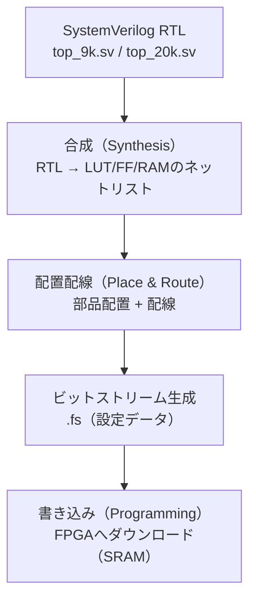
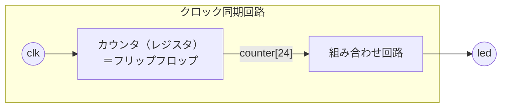

# Day 01 Completed: LED Blink Project

Tang Nano FPGA用のシンプルなLEDチカチカプロジェクトの完成版です。

---

🌐 Available languages:
[English](./README.md) | [日本語](./README_ja.md)

## ファイル構成

- `top_9k.sv` - Tang Nano 9K用トップ（LED点滅。open-drain風の出力）
- `top_20k.sv` - Tang Nano 20K用トップ（LED点滅。通常のpush-pull出力）
- `tang_nano_9k.cst` - Tang Nano 9K用ピン制約（ピン配置・電気特性）
- `tang_nano_20k.cst` - Tang Nano 20K用ピン制約（ピン配置・電気特性）
- `led_blink_9k.gprj`, `led_blink_20k.gprj` - GoWin EDAプロジェクトファイル
- `Makefile` - ビルド自動化（BOARDで切り替え）

## 機能

- 27MHzクロックを25bitカウンタで分周
- 約0.8Hz (約1.25秒間隔) でLED点滅
- Tang Nano 9K/20K 両対応

## ビルド方法

### Tang Nano 9K の場合

```bash
make BOARD=9k download
```

### Tang Nano 20K の場合

```bash
make BOARD=20k download
```

## 動作確認

プログラム後、ボード上のLEDが約1.25秒間隔で点滅することを確認してください。

## `.cst`（制約ファイル）とは？

FPGAは「RTLを書けば勝手にピンにつながる」わけではありません。
トップモジュールのポート名（例：`clk`, `led`）を、FPGAの**物理ピン番号**へ結び付ける必要があります。

Gowinではその指定を `.cst` に書きます。

- `IO_LOC "信号名" ピン番号;`
  その信号をどの物理ピンに出す/入れるかを指定します。
- `IO_PORT "信号名" ...;`
  そのピンの電気特性（電圧、プルアップ、ドライブ強度など）を指定します。

例：`tang_nano_9k.cst`

- `IO_LOC "clk" 52;` → `clk` はピン52につながる
- `IO_PORT "clk" IO_TYPE=LVCMOS33 ...;` → `clk` は3.3V CMOSの入力として扱う

### よく使う `IO_PORT` の項目（初心者向け）

- `IO_TYPE=...`
  I/O規格（電圧レベルなど）です。
  - `LVCMOS33`: 3.3V CMOS
  - `LVCMOS18`: 1.8V CMOS
    FPGA内部は「バンク」という単位でI/O電圧が決まることが多く、**そのバンクの電圧と一致するIO_TYPE**を選ぶ必要があります。
- `PULL_MODE=...`
  ピンが未駆動のときに効く弱い抵抗です。
  - `UP`: 弱いプルアップ
  - `DOWN`: 弱いプルダウン
  - `NONE`: なし
    ボタン入力などはプルアップ/ダウンで安定させます。クロック入力は外部発振器が駆動するので `NONE` が多いです。
- `DRIVE=...`（主に出力）
  出力の駆動強度(mA)です。強すぎるとノイズが増えることがあるため、ボードに合う値を使います。

## FPGA開発フロー：合成と配置配線は何をしている？

FPGAのビルドはだいたい次の流れです。



1. **合成（Synthesis）**
   SystemVerilogを、FPGA内部の部品（LUT、FF、RAMなど）のつながりに変換します。
2. **配置配線（Place & Route / P&R）**
   その部品をFPGAのどこに置くか（配置）と、配線をどう通すか（配線）を決めます。
   このときタイミング（動作周波数）が満たせるかも評価されます。
3. **ビットストリーム生成**
   FPGAに書き込むための設定データ（例：`.fs`）を作ります。
4. **書き込み（Programming）**
   ボードのFPGAにダウンロードして動かします。

## SystemVerilogの基本（このDayで出てくるところ）



### `always_ff` / `posedge`（クロック同期回路）

このプロジェクトではカウンタをクロックの立ち上がりで更新します。

- `posedge clk` は「`clk` が 0→1 になった瞬間」を意味します。
- クロック同期回路では **ノンブロッキング代入** `<=` を使うのが基本です。
  - `counter <= counter + 1;` は「クロックのタイミングで値が更新される」ことを表します。

コードでは `always @(posedge clk)` を使っていますが、SystemVerilogでは `always_ff @(posedge clk)` と書く流儀もあります（`always_ff` のほうが「FFとして書いている」ことが明確で、ミスを検出しやすいです）。

### `assign`（組み合わせ回路・配線）

`assign led = counter[24];` のように書くと、これは**常に成り立つ配線ルール**になります。

- `counter[24]` が変われば `led` もすぐに変わる（組み合わせ回路）
- `output wire led` のような「ネット（配線）」を式で駆動するのに向いています


### `=`で代入しちゃだめ？ `wire`にしないとだめ？

結論から言うと、「どこで代入するか」で使い分けます。

- **クロック同期回路**（`always @(posedge clk)` など）では `<=` を使うのが基本
  → 代入される信号は `logic`（SystemVerilog）で宣言します。
- **`assign` で駆動する信号**は、`wire`（ネット）として扱うのが自然
  → `output wire led` を `assign` で駆動する、という形がよくあります。

「`wire`してはいけない」わけではなく、**`always`ブロックで代入する信号を`wire`にすると（古いVerilogでは）扱えない**、というのがポイントです。

### 9K版で `1'bz` を出している理由

Tang Nano 9Kでは、LEDピンが1.8Vバンクにあり、`1`で強く駆動すると挙動が微妙になるケースがあります。
そのため `top_9k.sv` は open-drain風にして、

- `0` を出す → LED ON（電流を吸い込む）
- `Z`（ハイインピーダンス）→ LED OFF（ピンを駆動しない）

というやり方を取っています。

## 学習ポイント

1. **SystemVerilogの基本構文**
   - モジュール定義
   - always_ff / posedge によるクロック同期回路
   - assign文による組み合わせ回路

2. **クロック分周**
   - カウンタによる分周回路
   - ビット幅の計算 (27MHz / 2^25 ≈ 0.8Hz)

3. **FPGA開発フロー**
   - 合成 (Synthesis)
   - 配置配線 (Place & Route)
   - ビットストリーム生成
   - プログラミング

4. **制約ファイル**
   - ピン配置の指定
   - 電気的特性の設定
