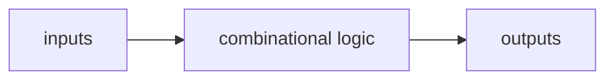
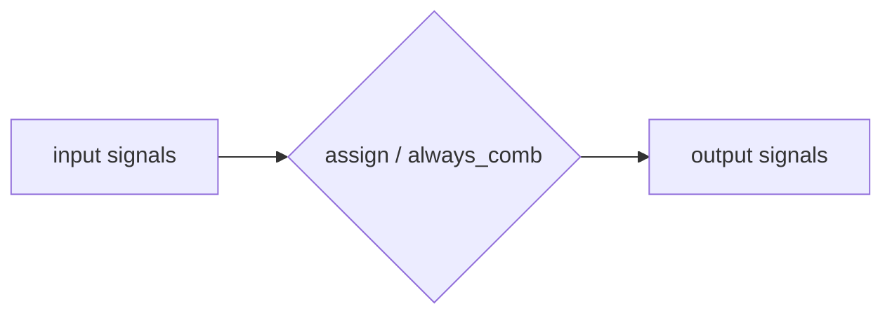
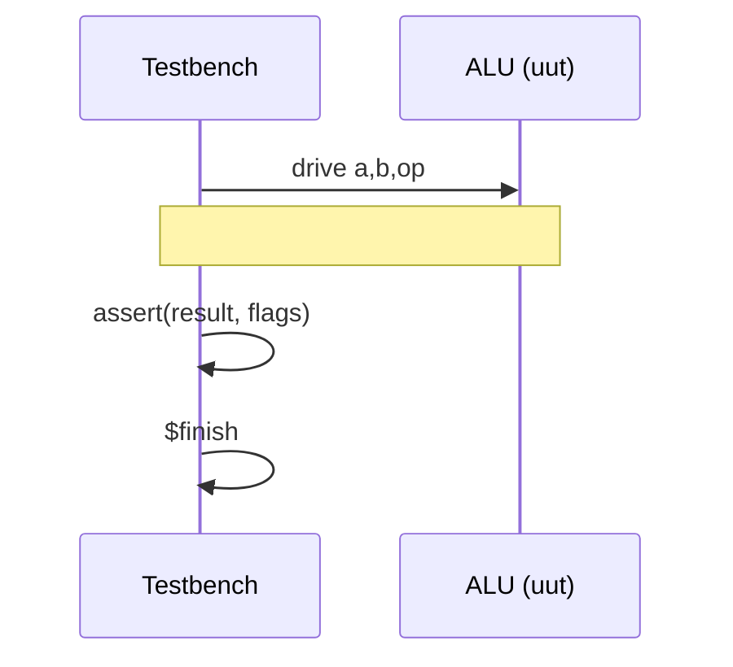

# Day 02: SystemVerilog Basics (Combinational Circuits)

---

🌐 Available languages:
[English](./README.md) | [日本語](./README_ja.md)

## 🎯 Learning Objectives

- Understand the basic syntax of SystemVerilog
- Learn how to design combinational circuits
- Learn the difference between `assign` and `always_comb`
- Understand the basics of testbenches

## 📚 Theory

### For Software Engineers: Combinational Logic is like a Pure Function

Think of the combinational circuits you are building today as **pure functions** in software. Their outputs depend _only_ on their current inputs, with no side effects or memory of past states. `assign` and `always_comb` are the tools you use to describe these "instantaneous" calculations.

### Combinational vs. Sequential (what you’re building today)

In Day 01 you used a **counter**, which is a _sequential_ circuit (it updates on a clock edge and “remembers” state).

Day 02 focuses on **combinational circuits**:

- Output is determined only by the current inputs (no memory).
- In RTL, you describe them with `assign` or `always_comb`.



### SystemVerilog Basic Syntax

**Data Types:**

```systemverilog
logic [7:0] data_bus;   // 8-bit wire, a net for connections
logic [3:0] counter;     // 4-bit variable, can be a register or a wire
logic select;          // 1-bit variable
logic [15:0] address;  // 16-bit variable
```

#### `wire` vs `logic` (A Simple Rule for Beginners)

You learned about this in Day 01, but here's a recap for the context of combinational logic:

- `logic`: The modern SystemVerilog data type. **For this course, you should use `logic` for almost everything.** It can be used as a simple "variable". The tools are smart enough to figure out if it should become a wire or a register based on how you use it.
  - If you assign to it in an `always_comb` or `always_ff` block, it acts like a variable (a "register").
  - If you assign to it with `assign`, it acts like a `wire`.
- `wire`: Represents a physical wire. It cannot store a value and must be continuously driven by something, for example with an `assign` statement. You'll see it used for module inputs and outputs, which is a common convention.

**Operators:**

```systemverilog
// Logical Operations
a & b    // AND
a | b    // OR
a ^ b    // XOR
~a       // NOT

// Comparison Operations
a == b   // Equal
a != b   // Not equal
a > b    // Greater than

// Bitwise Operations
data[7:4]  // Upper 4 bits
data[0]    // Least significant bit
{a, b}     // Concatenation
```

### How to Describe Combinational Circuits

**Method 1: `assign` statement**

```systemverilog
assign output = input1 & input2;
assign sum = a + b;
```

**Method 2: `always_comb` statement**

```systemverilog
always_comb begin
    if (select)
        output = input1;
    else
        output = input2;
end
```

#### `assign` vs `always_comb`

- `assign` is great for simple expressions (a wire driven by one expression).
- `always_comb` is great when you need `if`/`case` or multiple intermediate values.



#### Blocking assignment `=` and “why default matters”

Inside `always_comb` you usually use **blocking** assignment `=`. The key rule is:

- Assign _every output_ in _every path_.

If you forget to assign an output in some branch, simulation may infer a “memory” (a latch), which is not what you want for Day 02.

#### Software Engineer Pitfall: The "Implicit Else"

In C/Python, `if (condition) x = 1;` implies "if condition is false, keep x as it is".
In hardware combinational logic, "keep as it is" requires **memory** (a latch).
Since we are building circuits _without_ memory today, you **must** specify what happens in the `else` case (e.g., `else x = 0;`).

## 🛠️ Practice 1: 7-Segment Decoder

### Specifications

- Convert a 4-bit input (0-15) to signals for a 7-segment display
- Active-low drive (lights up at 0)

```mermaid
flowchart LR
  D[digit 0..15] --> CASE{case (digit)}
  CASE --> SEG[segments[6:0]<br/>{g,f,e,d,c,b,a}]
  SEG --> DISP[7-seg LED]
```

### Implementation Hint

```systemverilog
module seven_seg_decoder (
    input  logic [3:0] digit,
    output logic [6:0] segments  // {g,f,e,d,c,b,a}
);

    always_comb begin
        case (digit)
            4'h0: segments = 7'b1000000;  // 0
            4'h1: segments = 7'b1111001;  // 1
            // TODO: Implement the remaining digits
            default: segments = 7'b1111111;  // Off
        endcase
    end

endmodule
```

## 🛠️ Practice 2: 4-bit ALU

### Specifications

- Two 4-bit inputs (A, B)
- 2-bit operation selection (OP)
- 4-bit output + flags (Zero, Carry)

```mermaid
flowchart LR
  A[a[3:0]] --> ALU[ALU core]
  B[b[3:0]] --> ALU
  OP[op[1:0]] --> ALU
  ALU --> R[result[3:0]]
  ALU --> Z[zero]
  ALU --> C[carry]
```

### Operations

- 00: A + B (Addition)
- 01: A - B (Subtraction)
- 10: A & B (AND)
- 11: A | B (OR)

### Implementation Template

```systemverilog
module alu_4bit (
    input  logic [3:0] a,
    input  logic [3:0] b,
    input  logic [1:0] op,
    output logic [3:0] result,
    output logic zero,
    output logic carry
);

    logic [4:0] temp_result;  // For carry calculation

    always_comb begin
        case (op)
            2'b00: begin  // Addition
                temp_result = a + b;
                result = temp_result[3:0];
                carry = temp_result[4];
            end
            // TODO: Implement other operations
            default: begin
                result = 4'b0000;
                carry = 1'b0;
            end
        endcase

        zero = (result == 4'b0000);
    end

endmodule
```

## 🛠️ Practice 3: Multiplexer

### 8-to-1 Multiplexer

Multiplexer (MUX) = “select one of many inputs”.

```mermaid
flowchart LR
  IN[data_in[7:0]] --> MUX[8:1 MUX]
  SEL[select[2:0]] --> MUX
  MUX --> OUT[data_out]
```

```systemverilog
module mux_8to1 (
    input  logic [7:0] data_in,
    input  logic [2:0] select,
    output logic data_out
);

    // TODO: Output the appropriate bit of data_in according to select

endmodule
```

## 🧪 Testbench Basics

Testbenches are for **simulation only**. Things like `#10` delays are not synthesizable.

### Simple Testbench Example

```systemverilog
module tb_alu_4bit;

    logic [3:0] a, b;
    logic [1:0] op;
    logic [3:0] result;
    logic zero, carry;

    // Instantiate the unit under test
    alu_4bit uut (
        .a(a),
        .b(b),
        .op(op),
        .result(result),
        .zero(zero),
        .carry(carry)
    );

    initial begin
        // Test case 1: 5 + 3 = 8
        a = 4'd5;
        b = 4'd3;
        op = 2'b00;
        #10;

        // Check result
        assert (result == 4'd8) else $error("Test failed: 5+3");

        // TODO: Add other test cases

        $display("All tests completed");
        $finish;
    end

endmodule
```



## 📝 Assignments

### Basic Assignments

1. Complete the 7-segment decoder (to display 0-F)
2. Implement all operations of the 4-bit ALU
3. Create testbenches for each module

### Advanced Assignments

1. Implement a BCD (Binary Coded Decimal) decoder
2. Implement a priority encoder
3. Implement a parity generator

## 🔧 Debugging Tips

1. **Synthesis Error Countermeasures**
   - Check for missing semicolons
   - Check for matching `begin`-`end` pairs
   - Check for duplicate signal names

2. **Logic Error Countermeasures**
   - Compare with a truth table
   - Test step-by-step from simple cases
   - Verify operation using waveforms

## 📚 What I Learned Today

- [ ] Basic syntax of SystemVerilog
- [ ] How to design combinational circuits
- [ ] The difference between `assign` and `always_comb`
- [ ] Use of `case` and `if-else` statements
- [ ] Basic structure of a testbench

## 🎯 Preview for Tomorrow

In Day 03, we will learn about sequential circuits:

- Clock-synchronous circuits
- Flip-flops and latches
- Finite State Machines (FSM)
- Counters and timers

**Preparation task**: Review the basics of digital circuits (flip-flops, clocks, setup time).
