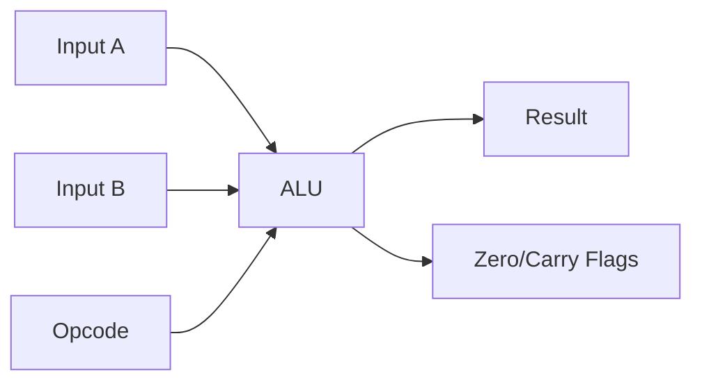
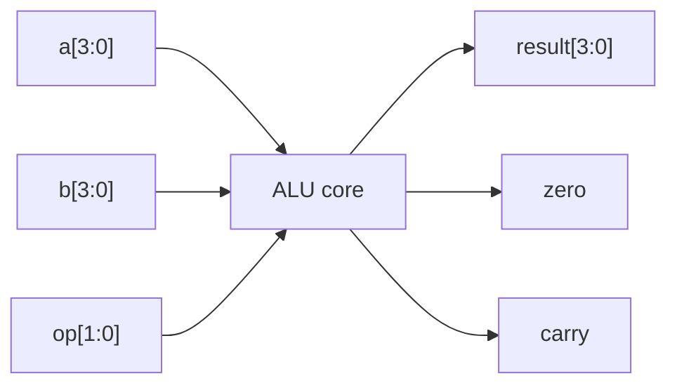
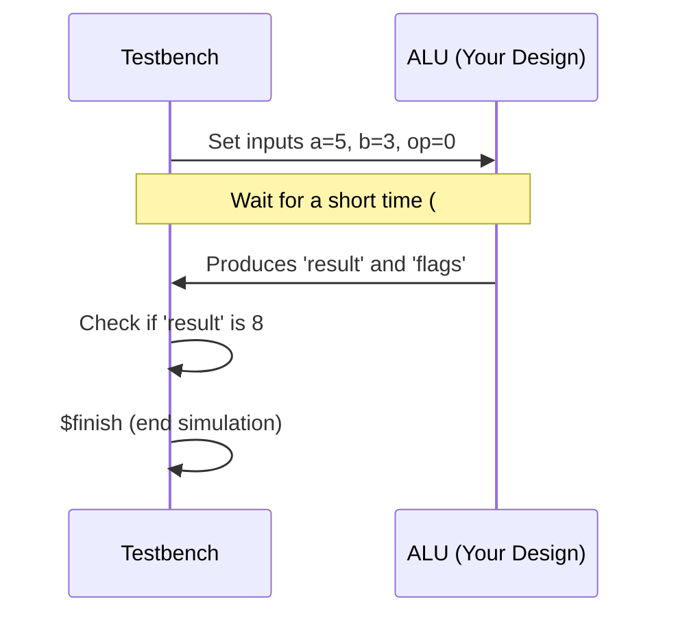
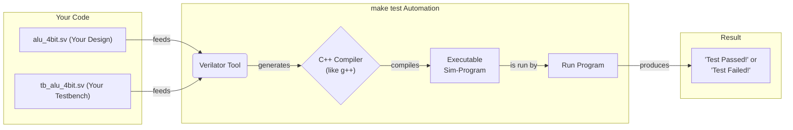

# Day 02: SystemVerilog Basics (Combinational Circuits)

---

🌐 Available languages:
[English](./README.md) | [日本語](./README_ja.md)

## 📜 Overview

In Day 02, we move from simple sequential circuits (counters) to **combinational circuits**. Combinational circuits handle "computation" in hardware; they have no state and react instantly to changes in input.

Today's goal is to build the mathematical heart of any CPU: a **4-bit ALU (Arithmetic Logic Unit)**.

## 🎯 Learning Objectives

- **`always_comb` vs `assign`**: Learn when to use continuous assignment versus block-based logic.
- **Arithmetic Logic Unit (ALU)**: Implement basic operations like addition, subtraction, AND, and OR.
- **Unit Testing (Testbenches)**: Verify your logic using simulation before hitting the hardware.
- **Verilator/GTKWave**: Master the diagnostic tools of an FPGA engineer.

## 🏗️ Architecture

A combinational circuit is like a set of pipes; what goes in immediately determines what comes out.



## 🛠️ Implementation Steps

1. **4-bit ALU**:
    - Implement the main operations using a `case` statement inside an `always_comb` block.
    - Ensure all outputs are defined to avoid "inferred latches" (accidental memory).
2. **Simulation & Verification**:
    - Write a testbench (`tb_alu_4bit.sv`) to feed values into your ALU.
    - Use `make test` to run the simulation and check for errors.
3. **Hardware Display**:
    - Integrate your ALU into the board and see the results on external LEDs or 7-segment displays.

## 💡 Pure Functions in Hardware

Combinational circuits are basically **pure functions**. Given the same inputs, they instantly produce the same outputs. It is critical to always have a default case to ensure you don't accidentally ask the circuit to "remember" its previous state.

**Note**: Unlike sequential logic, `always_comb` and `assign` use `=` (blocking assignment). See [SystemVerilog Cheatsheet](../docs/SYSTEMVERILOG_CHEATSHEET.md) for details.

## 🛠️ Practice: 4-bit ALU

### Specifications

- Two 4-bit inputs (A, B)
- 2-bit operation selection (OP)
- 4-bit output + flags (Zero, Carry)



### Operations

- 00: A + B (Addition)
- 01: A - B (Subtraction)
- 10: A & B (AND)
- 11: A | B (OR)

### Implementation Template

```systemverilog
module alu_4bit (
    input  logic [3:0] a,
    input  logic [3:0] b,
    input  logic [1:0] op,
    output logic [3:0] result,
    output logic zero,
    output logic carry
);

    logic [4:0] temp_result;  // For carry calculation

    always_comb begin
        case (op)
            2'b00: begin  // Addition
                temp_result = a + b;
                result = temp_result[3:0];
                carry = temp_result[4];
            end
            // TODO: Implement other operations
            default: begin
                result = 4'b0000;
                carry = 1'b0;
            end
        endcase

        zero = (result == 4'b0000);
    end

endmodule
```

## 🧪 What is a Testbench? (Your First "Unit Test" in Hardware)

If you're a software engineer, think of a **testbench** as a **unit test for your hardware module**.

It's a separate SystemVerilog file that exists **only for simulation**. Its job is to "wrap around" your design, feed it inputs, and check if the outputs are correct. This code is **never synthesized** into an actual FPGA circuit.

A testbench typically does three things:

1. **Instantiate the DUT**: "DUT" stands for "Design Under Test". In your testbench, you create an instance of the module you want to test (e.g., `alu_4bit`).
2. **Provide Stimulus**: You drive the input ports of your DUT with various values to simulate different scenarios (e.g., `a = 5; b = 3;`). The `#10` is a **simulation-only delay** to give the circuit time to react to the new inputs.
3. **Check Results**: You use `assert` or `$display` to verify that the DUT's output ports produce the expected values. If an `assert` fails, the simulation stops and reports an error.

```systemverilog
// This is a testbench module, not for synthesis!
module tb_alu_4bit;

    // 1. Create signals to connect to the DUT
    logic [3:0] a, b;
    logic [1:0] op;
    logic [3:0] result;
    logic zero, carry;

    // 2. Instantiate the Design Under Test (DUT)
    //    Think of this as: alu_4bit uut = new alu_4bit();
    alu_4bit uut (
        .a(a), .b(b), .op(op),         // Provide inputs
        .result(result), .zero(zero), .carry(carry) // Observe outputs
    );

    // 3. Provide stimulus and check results
    initial begin
        // Test case 1: 5 + 3 = 8
        a = 4'd5;
        b = 4'd3;
        op = 2'b00;
        #10; // Wait for the combinational logic to settle

        // Check the result. If not correct, show an error.
        assert (result == 4'd8) else $error("Test failed: 5+3 != 8");

        // TODO: Add more test cases here...

        $display("All tests completed successfully!");
        $finish; // End the simulation
    end

endmodule
```



## 🔬 What is Verilator? (The Hardware "Transpiler")

So, how do you run a testbench? You can't just "execute" SystemVerilog. You need a **simulator**. **Verilator** is a popular, high-performance, open-source simulator.

Think of Verilator as a **transpiler**. It converts your SystemVerilog code into a C++ model that behaves exactly like your hardware design. This C++ code is then compiled into a normal executable program that you can run.

The `make test` command automates this entire flow for you:



### How to Run Tests and Debug

1. **Run the Simulation:**

    ```bash
    make test
    ```

    This command will run the Verilator flow described above. You will see output from the `$display` and `assert` statements in your testbench.

2. **View Waveforms (Optional but Recommended):**
   Sometimes, just seeing "pass" or "fail" isn't enough. You need to see _how_ the signals are changing over time. A waveform is a graph of your circuit's signals.

    To generate a waveform, you need to add these two lines to your `initial begin` block in the testbench:

    ```systemverilog
    $dumpfile("tb_alu_4bit.vcd");
    $dumpvars(0, tb_alu_4bit);
    ```

    After running `make test`, a file named `tb_alu_4bit.vcd` will be created. You can open it with a waveform viewer like **GTKWave**.

    ```bash
    gtkwave tb_alu_4bit.vcd
    ```

    `a`, `b`, `carry`, `zero`, and `result` will be displayed as waveforms over time.
    

    This is incredibly useful for debugging why a value is not what you expect.

## 🔧 Debugging Tips

1. **Synthesis Error Countermeasures**

    - Check for missing semicolons
    - Check for matching `begin`-`end` pairs
    - Check for duplicate signal names

2. **Logic Error Countermeasures**
    - Compare with a truth table
    - Test step-by-step from simple cases
    - Verify operation using waveforms

## 📚 What I Learned Today

- [ ] Basic syntax of SystemVerilog
- [ ] How to design combinational circuits
- [ ] The difference between `assign` and `always_comb`
- [ ] Use of `case` and `if-else` statements
- [ ] Basic structure of a testbench

## 🎯 Preview for Tomorrow

In Day 03, we will learn about sequential circuits:

- Clock-synchronous circuits
- Flip-flops and latches
- Finite State Machines (FSM)
- Counters and timers

**Preparation task**: Review the basics of digital circuits (flip-flops, clocks, setup time).
