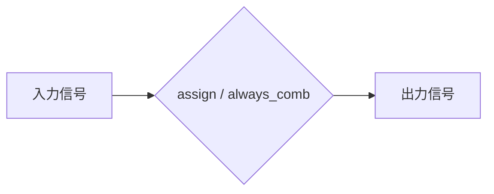
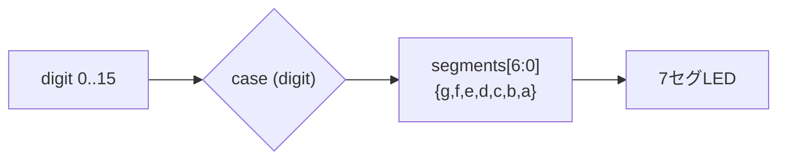
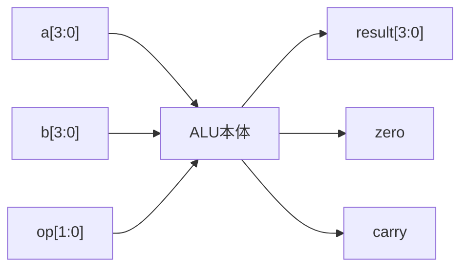
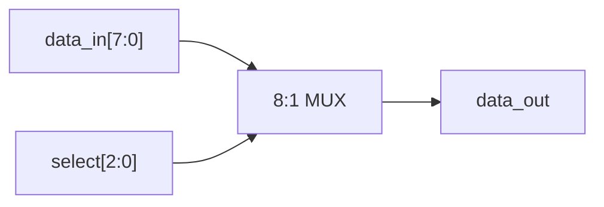
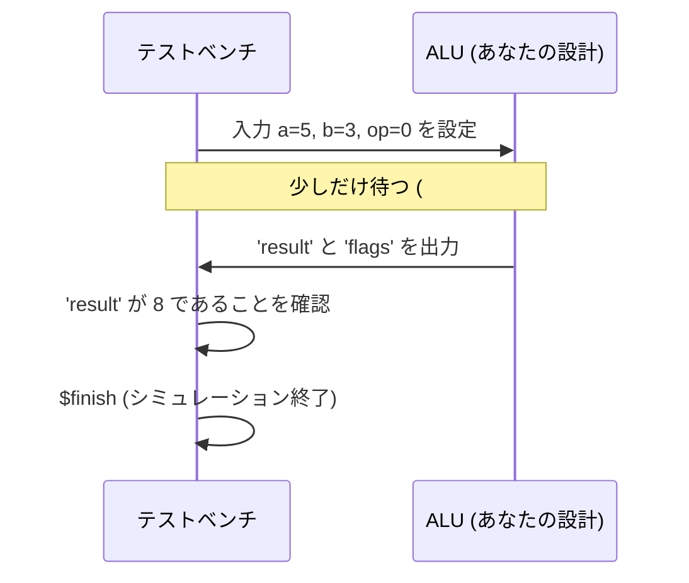
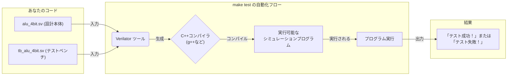

# Day 02: SystemVerilog 基礎 (組み合わせ回路)

---

🌐 Available languages:
[English](./README.md) | [日本語](./README_ja.md)

## 🎯 学習目標

- SystemVerilogの基本構文を理解する
- 組み合わせ回路の設計方法を習得する
- assign文とalways_comb文の使い分けを学ぶ
- テストベンチの基本を理解する

## 📚 理論学習

### ソフトウェアエンジニアのためのヒント：組み合わせ回路は純粋関数のようなもの

今日作る組み合わせ回路は、ソフトウェアにおける**純粋関数**のようなものだと考えてください。その出力は現在の入力*のみ*に依存し、副作用や過去の状態の記憶はありません。`assign` と `always_comb` は、こうした「瞬時」の計算を記述するためのツールです。

### 組み合わせ回路と順序回路（今日はどっち？）

Day 01では「カウンタ」を作りました。カウンタは **順序回路**（クロックで状態が更新され、値を記憶する回路）です。

Day 02では **組み合わせ回路** を扱います。

- 入力が決まれば出力が一意に決まる（記憶を持たない）
- RTLでは `assign` または `always_comb` で記述する


### SystemVerilog 基本構文

**データ型:**

```systemverilog
logic [7:0] data_bus;   // 8bit ワイヤ、接続用のネット
logic [3:0] counter;     // 4bit 変数、レジスタにもワイヤにもなれる
logic select;          // 1bit 変数
logic [15:0] address;  // 16bit 変数
```

#### `wire` vs `logic` (初心者向けシンプルルール)

Day 01でも学びましたが、組み合わせ回路の文脈で再確認しましょう。

- `logic`: SystemVerilogの現代的なデータ型です。**このコースでは、ほとんどすべての場面で `logic` を使ってください。** これは単純な「変数」として使え、どのように使われるかに応じて、ツールがワイヤにすべきかレジスタにすべきかを賢く判断してくれます。
  - `always_comb` や `always_ff` ブロックで代入すれば、変数（レジスタ）のように振る舞います。
  - `assign` で代入すれば、`wire` のように振る舞います。
- `wire`: 物理的な配線を表します。現代のSystemVerilogでは、双方向バスなどの「複数のドライバを持つ信号」以外は `logic` で記述できます。このコースでは `wire` が必須となる場面はありません。

**演算子:**

```systemverilog
// 論理演算
a & b    // AND
a | b    // OR
a ^ b    // XOR
~a       // NOT

// 比較演算
a == b   // 等しい
a != b   // 等しくない
a > b    // より大きい

// ビット操作
data[7:4]  // 上位4ビット
data[0]    // 最下位ビット
{a, b}     // 連結
```

### 組み合わせ回路の記述方法

**方法1: assign文**

```systemverilog
assign output = input1 & input2;
assign sum = a + b;
```

**方法2: always_comb文**

```systemverilog
always_comb begin
    if (select)
        output = input1;
    else
        output = input2;
end
```

#### `assign` と `always_comb` の使い分け

- `assign`：1本の式で書ける簡単な配線に向く
- `always_comb`：`if`/`case` や中間変数が必要なときに向く



#### `always_comb` の中は `=`（ブロッキング代入）／なぜdefaultが必要？

`always_comb` の中では通常 `=` を使います。重要なのは：

- **どの分岐でも必ず出力に値を代入する**（defaultを用意する等）

代入漏れがあると「覚えてしまう回路（ラッチ）」っぽい挙動になり、Day 02の目的（組み合わせ回路）から外れてしまいます。

#### ソフトウェアエンジニアの落とし穴：「暗黙のElse」

CやPythonで `if (condition) x = 1;` と書くと、「条件が偽なら x はそのまま（値を維持）」という意味になります。
ハードウェアの組み合わせ回路において「値を維持する」ということは、**メモリ（ラッチ）** を意味してしまいます。
今日はメモリを持たない回路を作っているので、必ず `else` ケース（例: `else x = 0;`）で値を確定させる必要があります。

## 🛠️ 実習1: 7セグメントデコーダ

### 仕様

- 4bit 入力 (0-15) を7セグメント表示用の信号に変換
- アクティブローで駆動 (0で点灯)



### 実装のヒント

```systemverilog
module seven_seg_decoder (
    input  logic [3:0] digit,
    output logic [6:0] segments  // {g,f,e,d,c,b,a}
);

    always_comb begin
        case (digit)
            4'h0: segments = 7'b1000000;  // 0
            4'h1: segments = 7'b1111001;  // 1
            // TODO: 残りの数字を実装
            default: segments = 7'b1111111;  // 消灯
        endcase
    end

endmodule
```

## 🛠️ 実習2: 4bit ALU

### 仕様

- 2つの4bit入力 (A, B)
- 2bit操作選択 (OP)
- 4bit出力 + フラグ (Zero, Carry)



### 操作

- 00: A + B (加算)
- 01: A - B (減算)
- 10: A & B (AND)
- 11: A | B (OR)

### 実装テンプレート

```systemverilog
module alu_4bit (
    input  logic [3:0] a,
    input  logic [3:0] b,
    input  logic [1:0] op,
    output logic [3:0] result,
    output logic zero,
    output logic carry
);

    logic [4:0] temp_result;  // キャリー計算用

    always_comb begin
        case (op)
            2'b00: begin  // 加算
                temp_result = a + b;
                result = temp_result[3:0];
                carry = temp_result[4];
            end
            // TODO: 他の操作を実装
            default: begin
                result = 4'b0000;
                carry = 1'b0;
            end
        endcase

        zero = (result == 4'b0000);
    end

endmodule
```

## 🛠️ 実習3: マルチプレクサ

### 8-to-1 マルチプレクサ

マルチプレクサ（MUX）は「複数の入力のうち、1つだけを選んで出力する回路」です。



```systemverilog
module mux_8to1 (
    input  logic [7:0] data_in,
    input  logic [2:0] select,
    output logic data_out
);

    // TODO: selectに応じてdata_inの適切なビットを出力

endmodule
```

## 🧪 テストベンチとは？ (ハードウェアの「ユニットテスト」)

ソフトウェアエンジニアの方なら、**テストベンチ**を**ハードウェアモジュール用のユニットテスト**のようなものだと考えてください。

テストベンチは、**シミュレーションのためだけ**に存在する、独立したSystemVerilogファイルです。その役割は、あなたが設計した回路（デザイン）を「包み込み」、様々な入力を与え、出力が正しいかを確認することです。このコードがFPGAチップ上の実際の回路になる（**合成される**）ことはありません。

テストベンチは、通常3つのことを行います。

1. **DUTをインスタンス化する**: "DUT" は "Design Under Test" (テスト対象デザイン) の略です。テストしたいモジュール（例: `alu_4bit`）のインスタンスをテストベンチ内に作成します。
2. **刺激 (Stimulus) を与える**: DUTの入力ポートに様々な値を設定し、異なるシナリオをシミュレートします（例: `a = 5; b = 3;`）。`#10` は**シミュレーション専用の遅延**で、回路が新しい入力に反応する時間を与えます。
3. **結果をチェックする**: `assert` や `$display` を使い、DUTの出力ポートが期待通りの値になったかを確認します。`assert` が失敗すると、シミュレーションはエラーを報告して停止します。

```systemverilog
// これはテストベンチモジュールです。合成はされません！
module tb_alu_4bit;

    // 1. DUTに接続するための信号を用意する
    logic [3:0] a, b;
    logic [1:0] op;
    logic [3:0] result;
    logic zero, carry;

    // 2. テスト対象デザイン (DUT) をインスタンス化する
    //    C++なら alu_4bit uut = new alu_4bit(); のようなイメージ
    alu_4bit uut (
        .a(a), .b(b), .op(op),         // 入力を与える
        .result(result), .zero(zero), .carry(carry) // 出力を観測する
    );

    // 3. 刺激を与え、結果をチェックする
    initial begin
        // テストケース1: 5 + 3 = 8
        a = 4'd5;
        b = 4'd3;
        op = 2'b00;
        #10; // 組み合わせ回路の出力が安定するまで待つ

        // 結果をチェック。もし正しくなければエラーメッセージを表示
        assert (result == 4'd8) else $error("Test failed: 5+3 != 8");

        // TODO: 他のテストケースをここに追加...

        $display("すべてのテストが成功しました！");
        $finish; // シミュレーションを終了
    end

endmodule
```



## 🔬 Verilatorとは？ (ハードウェアの「トランスパイラ」)

では、どうやってテストベンチを動かすのでしょうか？SystemVerilogはそのままでは「実行」できません。**シミュレータ**というツールが必要です。**Verilator**は、広く使われている高性能なオープンソースのシミュレータです。

Verilatorを**トランスパイラ**のようなものだと考えてください。あなたのSystemVerilogコードを、ハードウェア設計と全く同じように動作するC++のモデルに変換します。そのC++コードがコンパイルされ、実行可能なプログラムが作られます。このプログラムを実行することで、シミュレーションが行われます。

`make test` コマンドは、この一連の流れをすべて自動化してくれます。



### テストの実行とデバッグ方法

1. **シミュレーションの実行:**

   ```bash
   make test
   ```

   このコマンドで、上で説明したVerilatorのフローが実行されます。テストベンチ内の `$display` や `assert` からのメッセージが出力されます。

2. **波形表示 (任意ですが推奨):**
   「成功」か「失敗」かだけでは、なぜ間違っているのかわからないことがあります。信号が時間と共に*どのように*変化しているかを見る必要があります。波形は、回路の信号をグラフにしたものです。

   波形を生成するには、テストベンチの `initial begin` ブロックに以下の2行を追加します。

   ```systemverilog
   $dumpfile("tb_alu_4bit.vcd");
   $dumpvars(0, tb_alu_4bit);
   ```

   `make test` を実行すると、`tb_alu_4bit.vcd` というファイルが生成されます。これを **GTKWave** のような波形ビューアで開くことができます。

   ```bash
   gtkwave tb_alu_4bit.vcd
   ```

   以下のように`a`, `b`, `carry`, `zero`, `result`の波形が時間軸に沿って表示されます。
   

   これは、期待通りの値にならない原因を突き止めるのに非常に役立ちます。

## 🔧 デバッグのヒント

1. **合成エラー対策**
   - セミコロン忘れをチェック
   - begin-end の対応を確認
   - 信号名の重複をチェック

2. **論理エラー対策**
   - 真理値表と照合
   - 簡単なケースから段階的にテスト
   - 波形を使った動作確認

## 📚 今日学んだこと

- [ ] SystemVerilogの基本構文
- [ ] 組み合わせ回路の設計方法
- [ ] assign文とalways_comb文の使い分け
- [ ] case文とif-else文の使用
- [ ] テストベンチの基本構造

## 🎯 明日の予習

Day 03では順序回路について学習します:

- クロック同期回路
- フリップフロップとラッチ
- 状態機械 (FSM)
- カウンタとタイマー

**準備課題**: デジタル回路の基本 (フリップフロップ、クロック、セットアップ時間) を復習しておきましょう。
