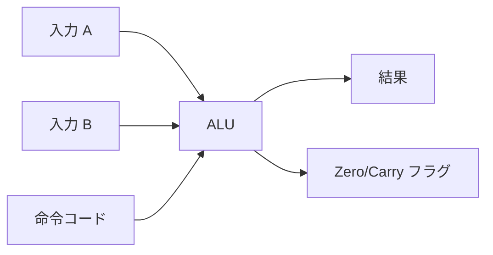
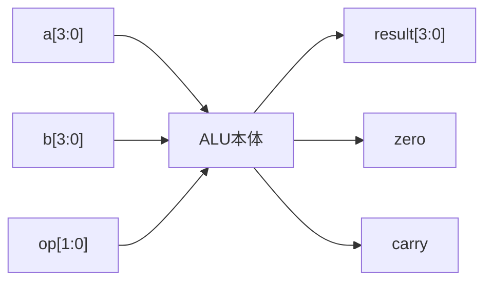
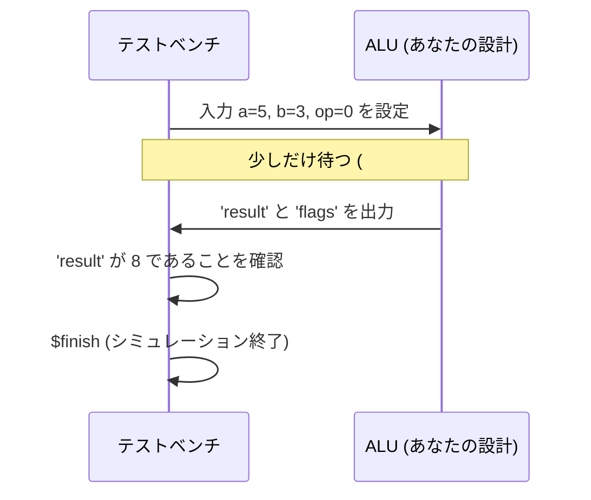
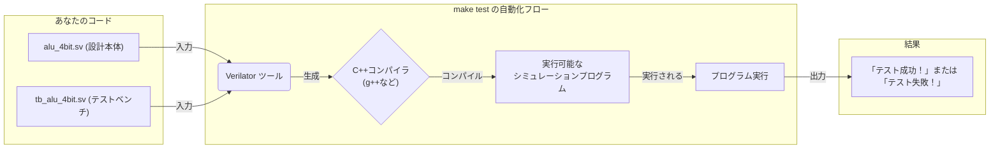
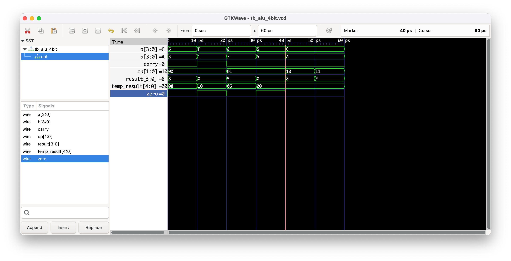

# Day 02: 組み合わせ回路と ALU の基礎

---

🌐 対応言語:
[English](./README.md) | [日本語](./README_ja.md)

## 📜 概要

Day 02 では、単純な順序回路（カウンタ）から **組み合わせ回路** へと進みます。組み合わせ回路はハードウェアにおける「演算」を担う部分であり、状態を持たず、入力の変化に即座に反応します。

今日の目標は、あらゆる CPU の数学的中心部である **4 ビット ALU (Arithmetic Logic Unit)** を構築することです。

## 🎯 学習目標

- **`always_comb` と `assign`**: 継続的代入とブロックベースのロジックの使い分けを学ぶ。
- **算術論理演算ユニット (ALU)**: 加算、減算、AND、OR といった基本演算を実装する。
- **ユニットテスト (テストベンチ)**: ハードウェアに書き込む前に、シミュレーションでロジックを検証する。
- **Verilator/GTKWave**: FPGA エンジニアの必須ツールである診断ツールの使い方を習得する。

## 🏗️ アーキテクチャ

組み合わせ回路は水路のようなものです。何が入ってくるかによって、出ていくものが即座に決まります。



## 🛠️ 実装ステップ

1. **4 ビット ALU**:
    - `always_comb` ブロック内の `case` 文を使用して主要な演算を実装。
    - 「ラッチ（意図しないメモリ）」の発生を防ぐため、すべての出力が常に定義されるようにする。
2. **シミュレーションと検証**:
    - ALU に値を流し込むテストベンチ (`tb_alu_4bit.sv`) を作成。
    - `make test` を実行してシミュレーションを行い、エラーがないか確認。
3. **ハードウェアでの表示**:
    - ALU をボードに統合し、LED や 7 セグメントディスプレイで演算結果を確認。

## 💡 ハードウェアにおける「純粋関数」

組み合わせ回路は、基本的には **純粋関数** です。同じ入力が与えられれば、即座に同じ出力が生成されます。ロジックに必ず `default` ケースを用意し、回路が以前の状態を「覚えよう」としないように注意することが重要です。

**注意**: `always_comb` や `assign` では、順序回路と異なり `=` (ブロッキング代入) を使用します。詳しくは [SystemVerilog チートシート](../docs/SYSTEMVERILOG_CHEATSHEET_ja.md) を参照してください。

## 🛠️ 実習: 4bit ALU

### 仕様

- 2 つの 4bit 入力 (A, B)
- 2bit 操作選択 (OP)
- 4bit 出力 + フラグ (Zero, Carry)



### 操作

- 00: A + B (加算)
- 01: A - B (減算)
- 10: A & B (AND)
- 11: A | B (OR)

### 実装テンプレート

```systemverilog
module alu_4bit (
    input  logic [3:0] a,
    input  logic [3:0] b,
    input  logic [1:0] op,
    output logic [3:0] result,
    output logic zero,
    output logic carry
);

    logic [4:0] temp_result;  // キャリー計算用

    always_comb begin
        case (op)
            2'b00: begin  // 加算
                temp_result = a + b;
                result = temp_result[3:0];
                carry = temp_result[4];
            end
            // TODO: 他の操作を実装
            default: begin
                result = 4'b0000;
                carry = 1'b0;
            end
        endcase

        zero = (result == 4'b0000);
    end

endmodule
```

## 🧪 テストベンチとは？ (ハードウェアの「ユニットテスト」)

ソフトウェアエンジニアの方なら、**テストベンチ**を**ユニットテストのファイル**（`test_alu.cpp` や `alu_test.py` など）だと考えてください。

これは**シミュレーションのためだけ**に存在する SystemVerilog ファイルです。その役割は、回路の周囲の環境を「モック（模倣）」し、入力を与え、出力が期待通りかを確認することです。このコードが実際の FPGA 回路に**合成されることはありません**。

テストベンチは通常、次の3つのことを行います：

1.  **DUT (Design Under Test) のインスタンス化**:
    クラスのインスタンスを作成するのと同じです：`ALU uut = new ALU();`
2.  **刺激 (Stimulus) を与える**:
    入力ポートに特定の値を設定します。引数付きで関数を呼び出すようなものです：`uut.add(5, 3);`
    *   **重要な違い**: 関数呼び出しとは異なり、ハードウェアの信号が伝わるには時間がかかるため、しばしば時間を進める（`#10;`）必要があります。
3.  **結果をチェックする**:
    `assert` を使って出力を検証します。これは C++ や Python の `assert(result == 8);` と全く同じです。

```systemverilog
// これはテストベンチモジュールです。合成はされません！
module tb_alu_4bit;

    // 1. DUTに接続するための信号 (戻り値を受け取る変数のようなもの)
    logic [3:0] a, b;
    logic [1:0] op;
    logic [3:0] result;
    logic zero, carry;

    // 2. テスト対象デザイン (DUT) をインスタンス化する
    //    イメージ: alu_4bit uut = new alu_4bit(a, b, op, result...);
    alu_4bit uut (
        .a(a), .b(b), .op(op),         // 入力を与える
        .result(result), .zero(zero), .carry(carry) // 出力を観測する
    );

    // 3. テストシナリオ
    initial begin
        // テストケース1: 5 + 3 = 8
        a = 4'd5;
        b = 4'd3;
        op = 2'b00;
        #10; // 回路が安定するまで10単位時間待つ

        // 結果を検証
        assert (result == 4'd8) else $error("Test failed: 5+3 != 8");

        // TODO: 他のテストケースをここに追加...

        $display("すべてのテストが成功しました！");
        $finish; // シミュレーションを終了
    end

endmodule
```



## 🔬 Verilator とは？ (ハードウェアの「トランスパイラ」)

では、どうやってテストベンチを動かすのでしょうか？SystemVerilog はそのままでは「実行」できません。**シミュレータ**というツールが必要です。**Verilator**は、広く使われている高性能なオープンソースのシミュレータです。

Verilator を**トランスパイラ**のようなものだと考えてください。あなたの SystemVerilog コードを、ハードウェア設計と全く同じように動作する C++のモデルに変換します。その C++コードがコンパイルされ、実行可能なプログラムが作られます。このプログラムを実行することで、シミュレーションが行われます。

`make test` コマンドは、この一連の流れをすべて自動化してくれます。



### テストの実行とデバッグ方法

1. **シミュレーションの実行:**

    ```bash
    make test
    ```

    このコマンドで、上で説明した Verilator のフローが実行されます。テストベンチ内の `$display` や `assert` からのメッセージが出力されます。

2. **波形表示 (任意ですが推奨):**
   「成功」か「失敗」かだけでは、なぜ間違っているのかわからないことがあります。信号が時間と共に*どのように*変化しているかを見る必要があります。波形は、回路の信号をグラフにしたものです。

    波形を生成するには、テストベンチの `initial begin` ブロックに以下の 2 行を追加します。

    ```systemverilog
    $dumpfile("tb_alu_4bit.vcd");
    $dumpvars(0, tb_alu_4bit);
    ```

    `make test` を実行すると、`tb_alu_4bit.vcd` というファイルが生成されます。これを **GTKWave** のような波形ビューアで開くことができます。

    ```bash
    gtkwave tb_alu_4bit.vcd
    ```

    以下のように`a`, `b`, `carry`, `zero`, `result`の波形が時間軸に沿って表示されます。
    

    これは、期待通りの値にならない原因を突き止めるのに非常に役立ちます。

## 🔧 デバッグのヒント

1. **合成エラー対策**

    - セミコロン忘れをチェック
    - begin-end の対応を確認
    - 信号名の重複をチェック

2. **論理エラー対策**
    - 真理値表と照合
    - 簡単なケースから段階的にテスト
    - 波形を使った動作確認

## 📚 今日学んだこと

- [ ] SystemVerilog の基本構文
- [ ] 組み合わせ回路の設計方法
- [ ] assign 文と always_comb 文の使い分け
- [ ] case 文と if-else 文の使用
- [ ] テストベンチの基本構造

## 🎯 明日の予習

Day 03 では順序回路について学習します:

- クロック同期回路
- フリップフロップとラッチ
- 状態機械 (FSM)
- カウンタとタイマー

**準備課題**: デジタル回路の基本 (フリップフロップ、クロック、セットアップ時間) を復習しておきましょう。
