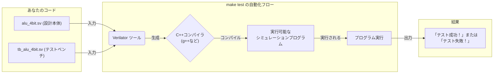

# Day 02 Completed: SystemVerilog Combinational Circuits

SystemVerilogの組み合わせ回路設計の完成版プロジェクトです。

## ファイル構成

- `alu_4bit.sv` - 4bit ALU
- `tb_alu_4bit.sv` - ALUテストベンチ
- `Makefile` - ビルド・テスト自動化

## 実装モジュール

### 1. 4bit ALU

- 4種類の演算: 加算、減算、AND、OR
- フラグ出力: Zero、Carry
- オーバーフロー/アンダーフロー検出

## ビルド方法

### シミュレーションテスト

```bash
make test
```

### FPGAビルド

```bash
# Tang Nano 9K
make BOARD=9k download

# Tang Nano 20K
make BOARD=20k download
```

### 個別テスト

```bash
# ALU シミュレーション
make test

# 波形表示 (GTKWave必要)
# WSL High Resolution Display User Only
# export GDK_SCALE=2        # Window scale
# export GDK_DPI_SCALE=1.0  # Font scale
gtkwave tb_alu_4bit.vcd
```

## テスト内容

ALUテストベンチで以下をテスト:

1. 基本加算 (5 + 3 = 8)
2. オーバーフロー (15 + 1 = 0, carry=1)
3. 基本減算 (8 - 3 = 5)
4. ゼロ結果 (5 - 5 = 0, zero=1)
5. AND演算 (12 & 10 = 8)
6. OR演算 (12 | 10 = 14)

## 🧪 テストベンチとは？ (ハードウェアの「ユニットテスト」)

**テストベンチ**は、**シミュレーションのためだけ**に存在するSystemVerilogモジュールです。その役割は、あなたが設計した回路（"Design Under Test" or DUT）を「包み込み」、入力を与え、出力が正しいかを確認することです。このコードがFPGAチップ上の実際の回路になる（**合成される**）ことはありません。

テストベンチは、通常3つのことを行います。

1. **DUTをインスタンス化する**: テストしたいモジュール（例: `alu_4bit`）のインスタンスを作成します。
2. **刺激 (Stimulus) を与える**: DUTの入力ポートに様々な値を設定します。`#10` はシミュレーション専用の遅延で、回路が反応する時間を与えます。
3. **結果をチェックする**: `assert` を使い、DUTの出力が期待値と一致するかを検証します。

## 🔬 Verilatorとは？ (ハードウェアの「トランスパイラ」)

**Verilator**は**トランスパイラ**のように動作するシミュレータです。SystemVerilogコードを、ハードウェアと全く同じように動作するC++モデルに変換します。そのC++コードがコンパイルされ、実行可能なプログラムが作られます。このプログラムを実行すると、テスト結果が表示されます。

`make test` コマンドは、この一連の流れをすべて自動化します。



### 波形の表示方法

設計を視覚的にデバッグするために、波形ファイルを生成できます。同梱の`tb_alu_4bit.sv`には、必要な記述がすでに含まれています。

```systemverilog
initial begin
    $dumpfile("tb_alu_4bit.vcd");
    $dumpvars(0, tb_alu_4bit);
    // ... この後にテストケースが続く
end
```

`make test` を実行した後、生成された `tb_alu_4bit.vcd` ファイルをGTKWaveのようなビューアで開くことができます。

```bash
gtkwave tb_alu_4bit.vcd
```

## 学習ポイント

### SystemVerilog構文

- `always_comb` による組み合わせ回路
- `case文` による条件分岐
- ビット幅指定とキャリー計算
- アサーション (`assert`) によるテスト

### 設計手法

- モジュラー設計とインターフェース定義
- テストベンチによる機能検証
- 階層的な回路構成

### デバッグ技法

- シミュレーションでの動作確認
- 波形による信号解析
- エラーメッセージによる問題特定

## 発展課題

1. **BCD デコーダ**: 2進化10進数用のデコーダ実装
2. **優先エンコーダ**: 最上位の1ビット位置を出力
3. **パリティ生成器**: 偶数/奇数パリティ計算

これらの基本モジュールは、後のCPU設計で重要な構成要素となります。
