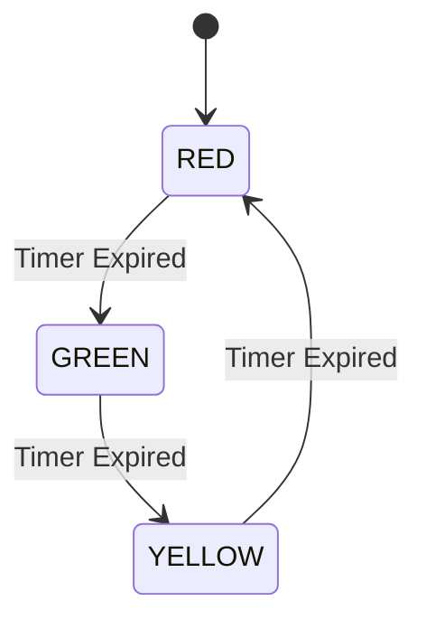
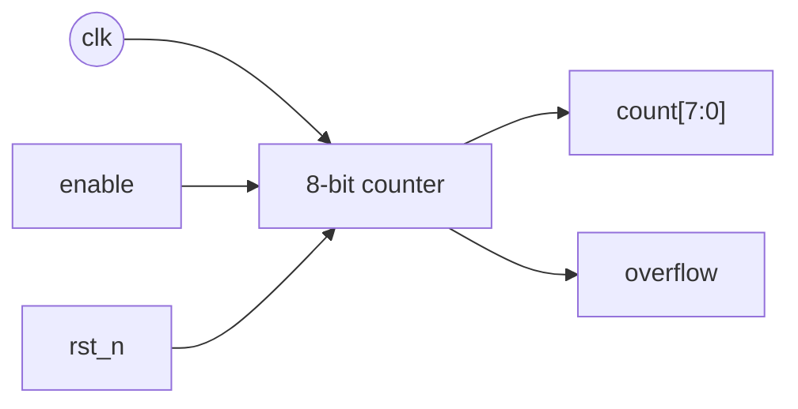
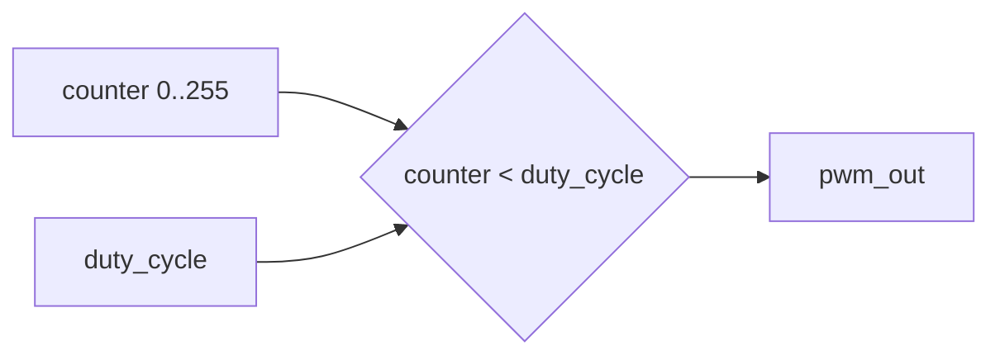
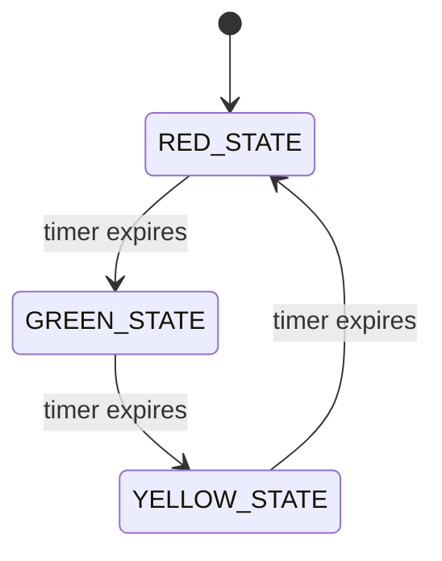
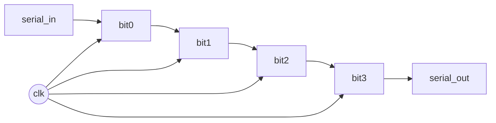
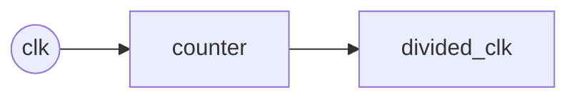

# Day 03: SystemVerilog Basics (Sequential Circuits)

---

🌐 Available languages:
[English](./README.md) | [日本語](./README_ja.md)

## 📜 Overview

Up until Day 02, we learned about arithmetic logic using combinational circuits. However, for a CPU to execute programs, it needs to "remember" values and transition through "states" over time.

Today's goal is to master the basics of **sequential circuits**, which operate in synchronization with a clock signal.

## 🔙 Review: Day 02

Before proceeding, make sure you understand:

- **ALU (Arithmetic Logic Unit)**: The calculation core of the CPU that performs addition, subtraction, and logic operations
- **`always_comb`**: The block used for describing combinational logic
- **Unit Testing**: How to verify circuit behavior in simulation using testbenches

## 🎯 Learning Objectives

- Understand the concept of clock-synchronous circuits
- Learn the difference between flip-flops and latches
- Master register design using `always_ff`
- Understand the basics of Finite State Machines (FSM)

## 🏗️ Architecture

A state machine cycles through defined states (Red, Green, Yellow) based on a timer. In this project, we follow the **Two-Block FSM style** (or Three-Block) which is a standard industry practice for clarity and reliability.

1. **Sequential Block (`always_ff`)**: Updates the `current_state` on the clock edge.
2. **Combinational Block (`always_comb`)**: Determines the `next_state` based on inputs and `current_state`.
3. **Output Block (`assign` or `always_comb`)**: Drives outputs based on the `current_state`.



## 🛠️ Implementation Steps

1. **Clock Divider / Timer**:
    - Create a counter that counts up to a certain value to create delays (e.g., 2 seconds).
    - **Pro Tip**: Use a `parameter` for the limit so you can speed it up during simulation!
2. **State Definition**:
    - Use a `typedef enum` to define the states. **Always explicitly list all states in your `case` statement.**
3. **State Transition Logic**:
    - Implement the `always_ff` block to update the `current_state`.
    - Implement the `always_comb` block to calculate the `next_state`.
4. **Peripheral Integration**:
    - Connect the state outputs to the physical LEDs.
    - **Note for Tang Nano 9K**: LEDs are **Active Low** (0 = ON). You might need to invert the signals in your board wrapper.

## 🧪 Simulation with Parameters

To avoid waiting for 50 million cycles in simulation, we use parameters to shorten the time:

```systemverilog
// In your module
module traffic_light #(
    parameter TIMER_LIMIT = 26'd50_000_000
) (...);

// In your testbench
traffic_light #(.TIMER_LIMIT(26'd10)) dut (...);
```

## 💡 The Tick of the Clock

In hardware, the clock is your **heartbeat**. Every `posedge clk`, all registers in your CPU update simultaneously.

**Analogy for Software Engineers:**
Think of the clock like the **frame update loop (tick)** in a game engine or the **event loop** in JavaScript.

- **Combinational Logic** is like the code inside `update()`: it calculates the new state based on the current state.
- **Clock Edge** is the moment the frame actually renders and the new state is saved for the next frame.

This synchronicity is what allows complex systems like 6502 to function reliably without chaotic race conditions.

## 🛠️ Practice 1: Counter Circuit

### 8-bit Up Counter



// 8bit Counter
// 8ビット アップカウンタ

// 8-bit Up Counter with Enable and Synchronous Reset

module counter_8bit (

    input logic clk,

    input logic rst_n,  // Active Low Reset

    input logic enable,  // Increment only when enable is high

    output logic [7:0] count,

    output logic overflow  // Set to 1 when count rolls over from FF to 00

);


    // Sequential block using always_ff

    always_ff @(posedge clk or negedge rst_n) begin

        if (!rst_n) begin

            // Reset state

            count <= 8'b0;

        end else if (enable) begin

            // Non-blocking assignment (<=) is mandatory here

            count <= count + 1'b1;

        end

    end


    // Combinational logic for overflow flag

    assign overflow = (count == 8'hFF) && enable;


endmodule


```

## 🛠️ Practice 2: PWM Generator

### Specifications

- 8-bit duty cycle control
- Supports variable frequency

PWM = Pulse Width Modulation. It toggles an output fast and changes the **ON ratio** (duty cycle).



// PWM Generator
// PWM信号生成器

// Pulse Width Modulation (PWM) Generator
// Controls the average power delivered by an electrical signal by turning it ON and OFF fast.
module pwm_generator (
    input logic clk,
    input logic rst_n,
    input logic [7:0] duty_cycle,  // 0 (0% ON) to 255 (100% ON)
    output logic pwm_out
);

    logic [7:0] counter;

    always_ff @(posedge clk or negedge rst_n) begin
        if (!rst_n) begin
            counter <= 8'b0;
        end else begin
            counter <= counter + 1'b1;
        end
    end

    // Combinational comparison
    // If the counter is less than the duty cycle, the output is HIGH.
    assign pwm_out = (counter < duty_cycle);

endmodule
```

## 🛠️ Practice 3: Traffic Light Controller

### Signal Control with a State Machine



```systemverilog
module traffic_light (
    input  logic clk,
    input  logic rst_n,
    output logic red,
    output logic yellow,
    output logic green
);

    typedef enum logic [1:0] {
        RED_STATE    = 2'b00,
        GREEN_STATE  = 2'b01,
        YELLOW_STATE = 2'b10
    } state_t;

    state_t current_state, next_state;
    logic [25:0] timer;

    // State transition logic
    always_ff @(posedge clk or negedge rst_n) begin
        if (!rst_n) begin
            current_state <= RED_STATE;
            timer <= 26'b0;
        end else begin
            current_state <= next_state;
            timer <= timer + 1;
        end
    end

    // Next state decision logic
    always_comb begin
        case (current_state)
            RED_STATE: begin
                if (timer >= 26'd50_000_000)  // Approx. 2 seconds
                    next_state = GREEN_STATE;
                else
                    next_state = RED_STATE;
            end
            // TODO: Implement other states
            default: next_state = RED_STATE;
        endcase
    end

    // Output logic
    assign red    = (current_state == RED_STATE);
    assign green  = (current_state == GREEN_STATE);
    assign yellow = (current_state == YELLOW_STATE);

endmodule
```

## 📝 Assignments

### Basic Assignments

1. Implement an up/down counter
2. Control LED brightness with PWM
3. Complete the traffic light controller

### Advanced Assignments

1. State machine for a UART transmitter
2. Variable-length shift register
3. Implement a clock divider

#### What is a shift register?

A shift register moves bits left/right each clock, and is useful for serial I/O.



#### What is a clock divider?

A clock divider creates a slower tick from a fast clock (e.g. for visible LEDs).



## 📚 What I Learned Today

- [ ] Basics of clock-synchronous circuits
- [ ] How to use `always_ff`
- [ ] State machine design methods
- [ ] Implementation of timers and counters

## 🎯 Preview for Tomorrow

In Day 04, we will dive into practical CPU components and hardware interaction:

- **LCD Display**: Learn how to interface with an external LCD module.
- **CPU Registers**: Implement the core registers (A, X, Y, etc.) of the 6502.
- **Memory & Flags**: Understand how to manage state and calculate processor flags.
