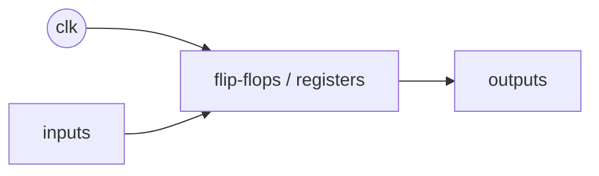
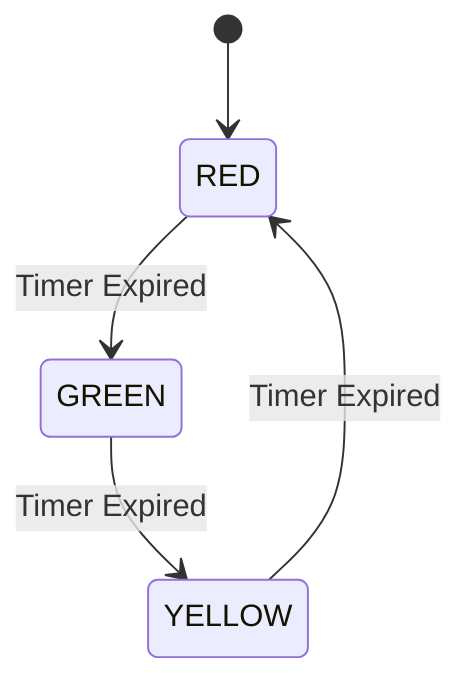
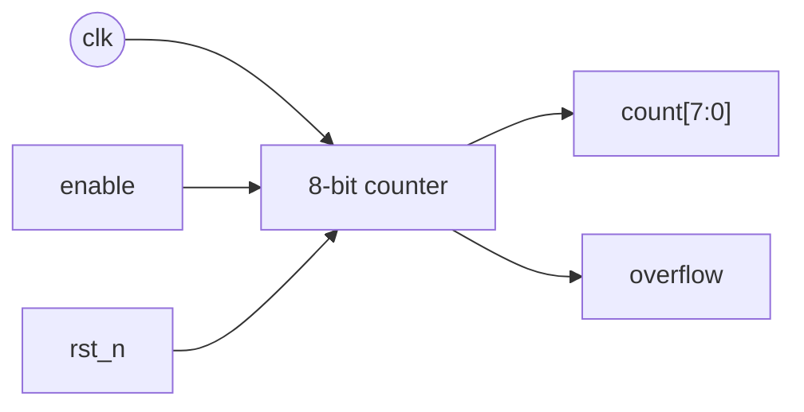
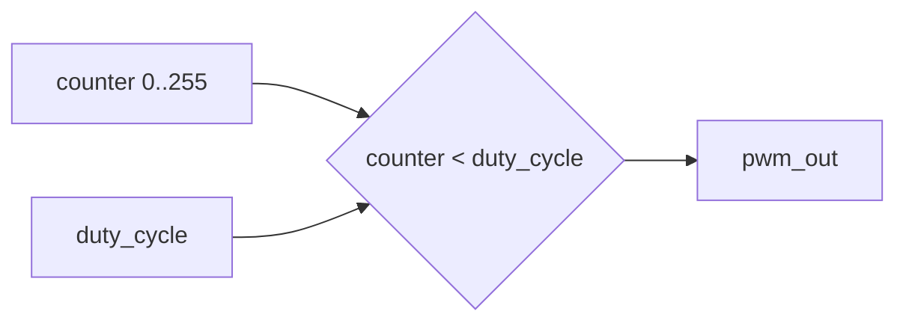
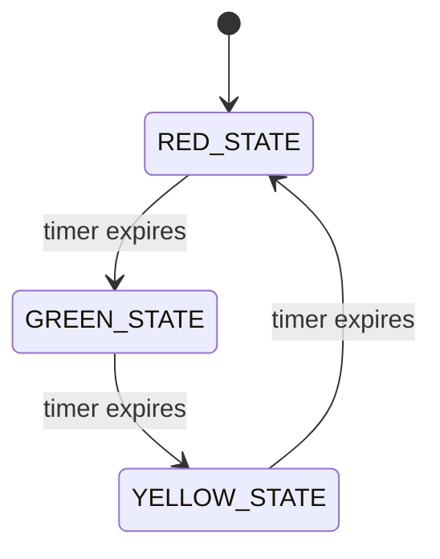
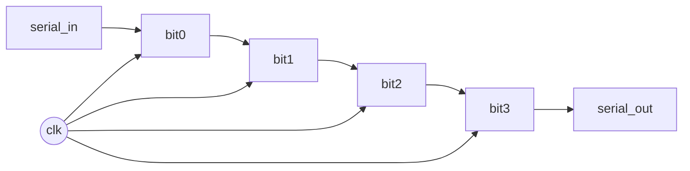
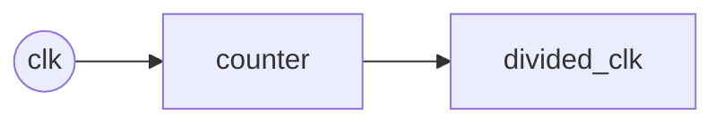

# Day 03: SystemVerilog Basics (Sequential Circuits)

---

🌐 Available languages:
[English](./README.md) | [日本語](./README_ja.md)

## 🎯 Learning Objectives

-   Understand the concept of clock-synchronous circuits
-   Learn the difference between flip-flops and latches
-   Master register design using `always_ff`
-   Understand the basics of Finite State Machines (FSM)

## 📚 Theory

### For Software Engineers: The Clock is Your Update Loop

In Day 02, you learned that combinational logic is like a pure function. Today, you're adding **state**.

Think of a sequential circuit as an object with private member variables (the registers). The `always_ff @(posedge clk)` block is like a special method that gets called automatically on every clock "tick". This is the **only place where the state should change**.

-   **State is local:** The `counter` register in the examples is not a global variable. It's a local state variable inside your hardware module.
-   **No pre-emption:** Unlike software threads, these hardware "processes" all execute in perfect lock-step with the clock. One `always_ff` block can't interrupt another. They all trigger on the exact same clock edge.

This clock-driven, synchronous nature is what makes hardware design predictable and manageable.

### What is a sequential circuit?

Sequential circuits “remember” state. The output depends on current inputs **and** stored values (registers).



#### Flip-flop vs latch (why we prefer flip-flops)

-   **Flip-flop (FF)** updates only on a clock edge (e.g. `posedge clk`) → predictable timing.
-   **Latch** can be transparent while an enable is active → easier to accidentally infer in RTL.

-   **`always_ff`**: Understand how to describe registers and flip-flops.
-   **Clock & Reset**: Learn the importance of the `posedge clk` and `negedge rst_n` pattern.
-   **Finite State Machines (FSM)**: Design a multi-state logic system with transitions.
-   **Non-blocking Assignment (`<=`)**: Master the fundamental syntax of synchronous digital design.

## 🏗️ Architecture

A state machine cycles through defined states (Red, Green, Yellow) based on a timer.



## 🛠️ Implementation Steps

1.  **Clock Divider / Timer**:
    -   Create a counter that counts up to a certain value to create delays (e.g., 2 seconds).
2.  **State Definition**:
    -   Use a `typedef enum` to define the states of the traffic light.
3.  **State Transition Logic**:
    -   Implement the `always_ff` block to update the `current_state`.
    -   Implement the `always_comb` block to calculate the `next_state`.
4.  **Peripheral Integration**:
    -   Connect the state outputs to the physical LEDs on your Tang Nano board.

## 💡 The Tick of the Clock

In hardware, the clock is your **heartbeat**. Every `posedge clk`, all registers in your CPU update simultaneously. This synchronicity is what allows complex systems like 6502 to function reliably without chaotic race conditions.

## 🛠️ Practice 1: Counter Circuit

### 8-bit Up Counter



```systemverilog
module counter_8bit (
    input  logic clk,
    input  logic rst_n,
    input  logic enable,
    output logic [7:0] count,
    output logic overflow
);

    always_ff @(posedge clk or negedge rst_n) begin
        if (!rst_n) begin
            count <= 8'b0;
        end else if (enable) begin
            count <= count + 1;
        end
    end

    assign overflow = (count == 8'hFF) && enable;

endmodule
```

## 🛠️ Practice 2: PWM Generator

### Specifications

-   8-bit duty cycle control
-   Supports variable frequency

PWM = Pulse Width Modulation. It toggles an output fast and changes the **ON ratio** (duty cycle).



```systemverilog
module pwm_generator (
    input  logic clk,
    input  logic rst_n,
    input  logic [7:0] duty_cycle,  // 0-255
    output logic pwm_out
);

    logic [7:0] counter;

    always_ff @(posedge clk or negedge rst_n) begin
        if (!rst_n) begin
            counter <= 8'b0;
        end else begin
            counter <= counter + 1;
        end
    end

    assign pwm_out = (counter < duty_cycle);

endmodule
```

## 🛠️ Practice 3: Traffic Light Controller

### Signal Control with a State Machine



```systemverilog
module traffic_light (
    input  logic clk,
    input  logic rst_n,
    output logic red,
    output logic yellow,
    output logic green
);

    typedef enum logic [1:0] {
        RED_STATE    = 2'b00,
        GREEN_STATE  = 2'b01,
        YELLOW_STATE = 2'b10
    } state_t;

    state_t current_state, next_state;
    logic [25:0] timer;

    // State transition logic
    always_ff @(posedge clk or negedge rst_n) begin
        if (!rst_n) begin
            current_state <= RED_STATE;
            timer <= 26'b0;
        end else begin
            current_state <= next_state;
            timer <= timer + 1;
        end
    end

    // Next state decision logic
    always_comb begin
        case (current_state)
            RED_STATE: begin
                if (timer >= 26'd50_000_000)  // Approx. 2 seconds
                    next_state = GREEN_STATE;
                else
                    next_state = RED_STATE;
            end
            // TODO: Implement other states
            default: next_state = RED_STATE;
        endcase
    end

    // Output logic
    assign red    = (current_state == RED_STATE);
    assign green  = (current_state == GREEN_STATE);
    assign yellow = (current_state == YELLOW_STATE);

endmodule
```

## 📝 Assignments

### Basic Assignments

1. Implement an up/down counter
2. Control LED brightness with PWM
3. Complete the traffic light controller

### Advanced Assignments

1. State machine for a UART transmitter
2. Variable-length shift register
3. Implement a clock divider

#### What is a shift register?

A shift register moves bits left/right each clock, and is useful for serial I/O.



#### What is a clock divider?

A clock divider creates a slower tick from a fast clock (e.g. for visible LEDs).



## 📚 What I Learned Today

-   [ ] Basics of clock-synchronous circuits
-   [ ] How to use `always_ff`
-   [ ] State machine design methods
-   [ ] Implementation of timers and counters

## 🎯 Preview for Tomorrow

In Day 04, we will learn about the 6502 CPU architecture:

-   Basic components of a CPU
-   Relationship between registers and memory
-   Instruction execution cycle
