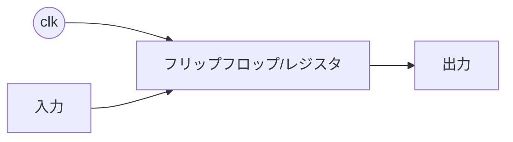
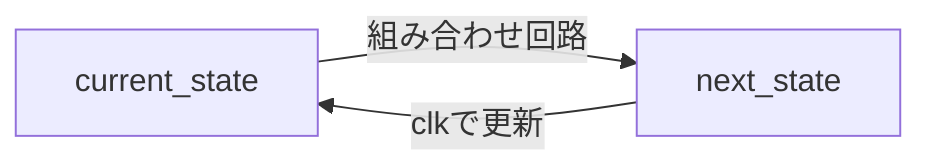
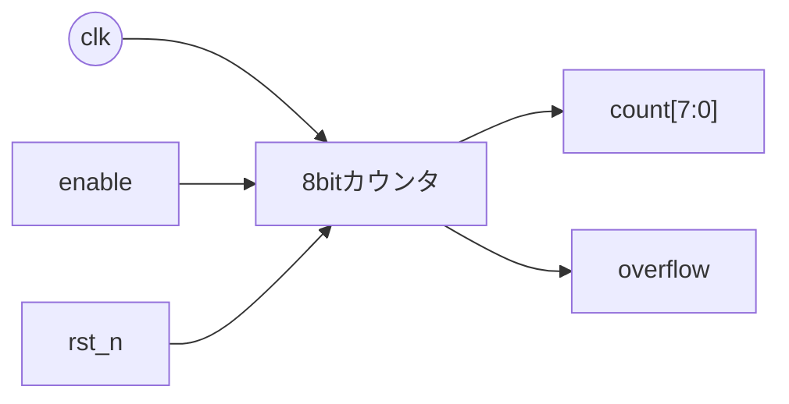
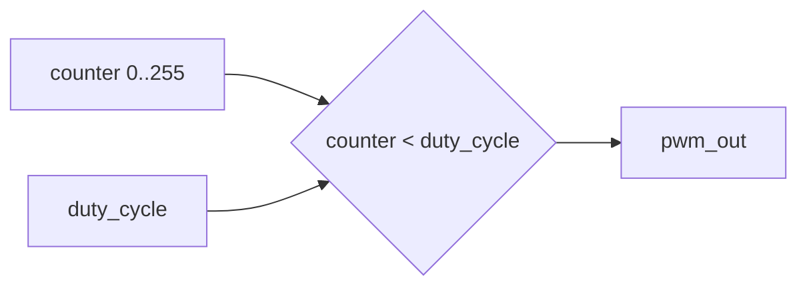
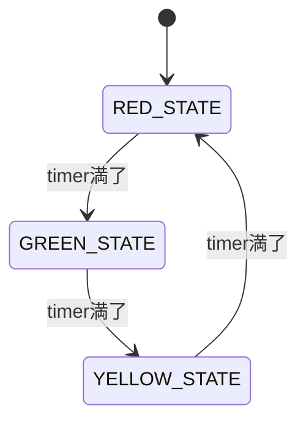
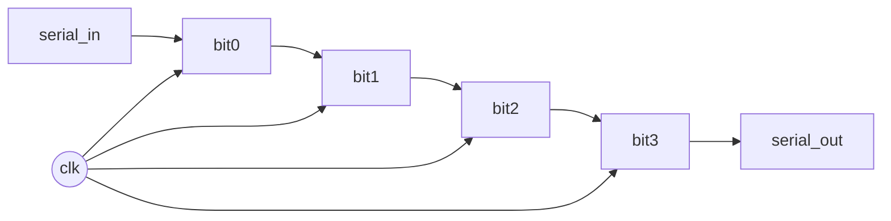
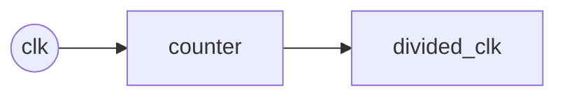

# Day 03: SystemVerilog 基礎 (順序回路)

---

🌐 Available languages:
[English](./README.md) | [日本語](./README_ja.md)

## 🎯 学習目標

- クロック同期回路の概念を理解する
- フリップフロップとラッチの違いを学ぶ
- always_ff文によるレジスタ設計を習得する
- 状態機械 (FSM) の基本を理解する

## 📚 理論学習

### ソフトウェアエンジニアのためのヒント：クロックはあなたの更新ループ

Day 02で、組み合わせ回路が純粋関数のようなものだと学びました。今日はそれに**状態**を追加します。

順序回路を、プライベートなメンバー変数（レジスタ）を持つオブジェクトだと考えてみてください。`always_ff @(posedge clk)` ブロックは、クロックの「ティック」ごとに自動的に呼び出される特別なメソッドのようなものです。状態が変化するのは**この場所だけ**です。

- **状態はローカル:** サンプルコードの `counter` レジスタは、グローバル変数ではありません。それはハードウェアモジュール内のローカルな状態変数です。
- **プリエンプション（横取り）はない:** ソフトウェアのスレッドとは異なり、これらのハードウェア「プロセス」はすべて、クロックと完全に同期して実行されます。ある `always_ff` ブロックが別のブロックを中断することはできません。すべてのブロックが、まったく同じクロックエッジでトリガーされます。

このクロック駆動の同期的性質こそが、ハードウェア設計を予測可能で管理しやすくするのです。

### 順序回路とは？

順序回路は「状態（メモリ）」を持つ回路です。出力は入力だけでなく、内部に保持している値（レジスタ）にも依存します。



#### フリップフロップ（FF）とラッチの違い（なぜFFを使う？）

- **FF**：クロックエッジ（例：`posedge clk`）でだけ更新 → タイミングが読みやすい
- **ラッチ**：イネーブルが有効な間は入力が透過する → RTLで意図せず推論されやすい

FPGA設計では基本的に `always_ff` を使って「エッジで更新されるFF」を書くのが定石です。

### クロック同期回路の基本

**クロックエッジ:**

```systemverilog
always_ff @(posedge clk) begin
    // 立ち上がりエッジで実行
end

always_ff @(negedge clk) begin
    // 立ち下がりエッジで実行
end
```

**リセット付きレジスタ:**

```systemverilog
always_ff @(posedge clk or negedge rst_n) begin
    if (!rst_n)
        counter <= 8'b0;
    else
        counter <= counter + 1;
end
```

#### なぜ `<=`（ノンブロッキング代入）？

`always_ff` の中では `<=` を使うのが基本です。複数のレジスタが「同じクロックエッジで同時に更新される」挙動を正しく表現でき、シミュレーションの罠を減らせます。

#### `<=` と `=` のイメージ

- **`=` (ブロッキング)**: ソフトウェアの変数と同じ動きです。`a = 1; b = a;` と書くと、両方 1 になります。
- **`<=` (ノンブロッキング)**: ステップの最後に「コミット」されるイメージです。

  ```systemverilog
  // <= を使ったスワップ
  a <= b;
  b <= a;
  ```

  これは一時変数なしで `a` と `b` を1クロックで入れ替えることができます。すべての右辺を先に計算し、その後に一斉に左辺を更新するような動作です。

#### `rst_n` という名前の意味

`rst_n` は「reset, active-low（0でリセット）」という慣習的な命名です。

- `rst_n = 0` → リセット中
- `rst_n = 1` → 動作中

### 状態機械 (FSM) の基本

**状態の定義:**

```systemverilog
typedef enum logic [1:0] {
    IDLE  = 2'b00,
    START = 2'b01,
    WORK  = 2'b10,
    DONE  = 2'b11
} state_t;

state_t current_state, next_state;
```

#### FSMの基本形（2プロセススタイル）

- `always_ff`：現在状態 `current_state` を保持（レジスタ）
- `always_comb`：次状態 `next_state` を計算（組み合わせ回路）



## 🛠️ 実習1: カウンタ回路

### 8bit アップカウンタ



```systemverilog
module counter_8bit (
    input  logic clk,
    input  logic rst_n,
    input  logic enable,
    output logic [7:0] count,
    output logic overflow
);

    always_ff @(posedge clk or negedge rst_n) begin
        if (!rst_n) begin
            count <= 8'b0;
        end else if (enable) begin
            count <= count + 1;
        end
    end

    assign overflow = (count == 8'hFF) && enable;

endmodule
```

## 🛠️ 実習2: PWM生成器

### 仕様

- 8bit デューティサイクル制御
- 可変周波数対応

PWM（Pulse Width Modulation）は「高速にON/OFFする信号のON比率（デューティ）を変えて、見かけ上の明るさなどを制御する」方式です。



```systemverilog
module pwm_generator (
    input  logic clk,
    input  logic rst_n,
    input  logic [7:0] duty_cycle,  // 0-255
    output logic pwm_out
);

    logic [7:0] counter;

    always_ff @(posedge clk or negedge rst_n) begin
        if (!rst_n) begin
            counter <= 8'b0;
        end else begin
            counter <= counter + 1;
        end
    end

    assign pwm_out = (counter < duty_cycle);

endmodule
```

## 🛠️ 実習3: 交通信号制御器

### 状態機械による信号制御



```systemverilog
module traffic_light (
    input  logic clk,
    input  logic rst_n,
    output logic red,
    output logic yellow,
    output logic green
);

    typedef enum logic [1:0] {
        RED_STATE    = 2'b00,
        GREEN_STATE  = 2'b01,
        YELLOW_STATE = 2'b10
    } state_t;

    state_t current_state, next_state;
    logic [25:0] timer;

    // 状態遷移ロジック
    always_ff @(posedge clk or negedge rst_n) begin
        if (!rst_n) begin
            current_state <= RED_STATE;
            timer <= 26'b0;
        end else begin
            current_state <= next_state;
            timer <= timer + 1;
        end
    end

    // 次状態決定ロジック
    always_comb begin
        case (current_state)
            RED_STATE: begin
                if (timer >= 26'd50_000_000)  // 約2秒
                    next_state = GREEN_STATE;
                else
                    next_state = RED_STATE;
            end
            // TODO: 他の状態を実装
            default: next_state = RED_STATE;
        endcase
    end

    // 出力ロジック
    assign red    = (current_state == RED_STATE);
    assign green  = (current_state == GREEN_STATE);
    assign yellow = (current_state == YELLOW_STATE);

endmodule
```

## 📝 課題

### 基礎課題

1. アップ/ダウンカウンタの実装
2. PWMでLEDの明度制御
3. 交通信号制御器の完成

### 発展課題

1. UART送信器の状態機械
2. 可変長シフトレジスタ
3. 分周器の実装

#### シフトレジスタとは？

クロックのたびにビット列を左/右へずらすレジスタです。シリアル通信などでよく使います。



#### 分周器とは？

高速なクロックから、より遅い“周期”を作る回路です（LEDを目で見える速さで点滅させたい時など）。



## 📚 今日学んだこと

- [ ] クロック同期回路の基本
- [ ] always_ff文の使用方法
- [ ] 状態機械の設計手法
- [ ] タイマーとカウンタの実装

## 🎯 明日の予習

Day 04では6502 CPUアーキテクチャについて学習します:

- CPUの基本構成要素
- レジスタとメモリの関係
- 命令実行サイクル
