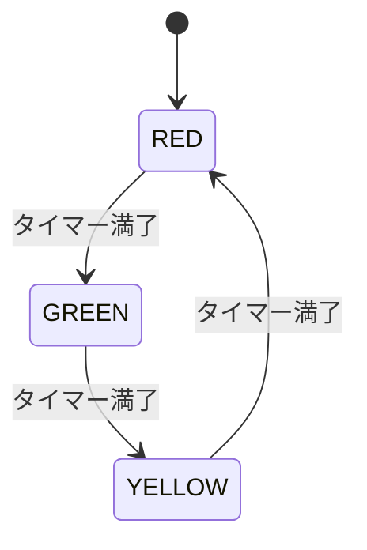
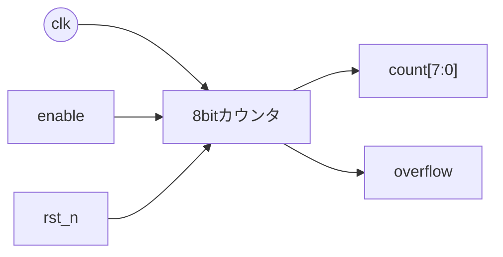
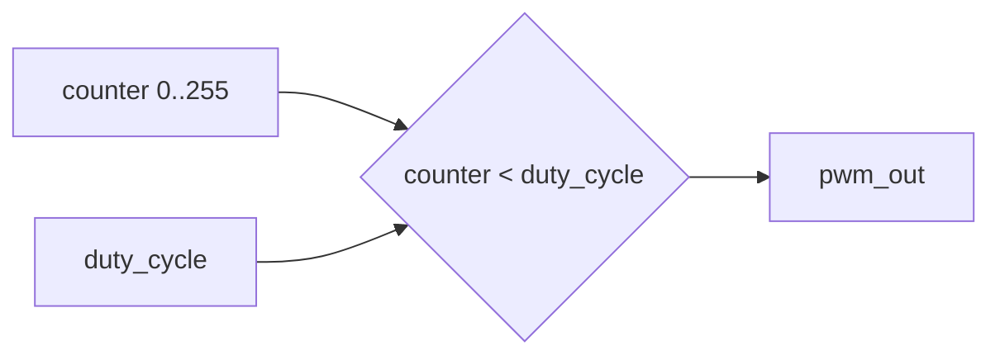
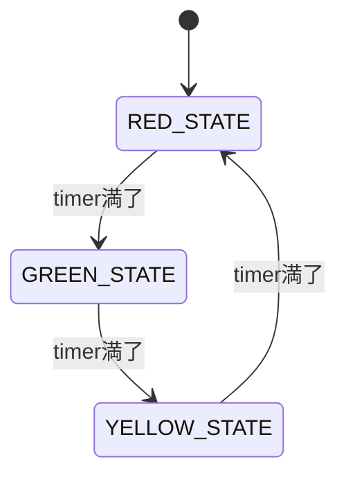
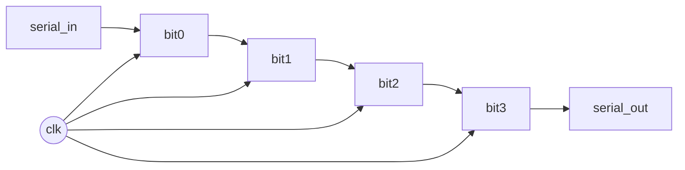
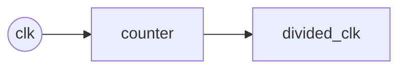

# Day 03: 順序回路と状態機械

---

🌐 対応言語:
[English](./README.md) | [日本語](./README_ja.md)

## 📜 概要

今日、アーキテクチャの最後のパズルの一片である **「状態（State）」** を追加します。「即座に」変化する組み合わせ回路とは異なり、順序回路は **クロック** を使用して更新のタイミングを決定し、**リセット** を使用して開始地点を決定します。

今日の目標は、**有限状態機械 (FSM: Finite State Machine)** の実践的な導入として、**交通信号制御器** を実装することです。

## 🎯 学習目標

- **`always_ff`**: レジスタやフリップフロップの記述方法を理解する。
- **クロックとリセット**: `posedge clk` と `negedge rst_n` パターンの重要性を学ぶ。
- **有限状態機械 (FSM)**: 状態遷移を持つマルチステートなロジックシステムを設計する。
- **ノンブロッキング代入 (`<=`)**: 同期デジタル設計の基本構文を習得する。

## 🏗️ アーキテクチャ

状態機械は、タイマーに基づいて定義された状態（赤、青、黄）を循環します。



## 🛠️ 実装ステップ

1. **クロック分周器 / タイマー**:
    - 特定の値までカウントして遅延（例：2 秒間）を作るカウンタを作成。
2. **状態の定義**:
    - `typedef enum` を使用して、信号機の状態を定義。
3. **状態遷移ロジック**:
    - `current_state` を更新する `always_ff` ブロックを実装。
    - `next_state` を計算する `always_comb` ブロックを実装。
4. **周辺機器への統合**:
    - 状態の出力を Tang Nano ボード上の物理的な LED に接続。

## 💡 クロックの「鼓動」

ハードウェアにおいて、クロックは **心臓の鼓動** です。すべての `posedge clk` において、CPU 内のすべてのレジスタが同時に更新されます。この同期性こそが、6502 のような複雑なシステムが、カオスな競合状態を起こさずに確実に動作することを可能にしています。

## 🛠️ 実習 1: カウンタ回路

### 8bit アップカウンタ



```systemverilog
module counter_8bit (
    input  logic clk,
    input  logic rst_n,
    input  logic enable,
    output logic [7:0] count,
    output logic overflow
);

    always_ff @(posedge clk or negedge rst_n) begin
        if (!rst_n) begin
            count <= 8'b0;
        end else if (enable) begin
            count <= count + 1;
        end
    end

    assign overflow = (count == 8'hFF) && enable;

endmodule
```

## 🛠️ 実習 2: PWM 生成器

### 仕様

- 8bit デューティサイクル制御
- 可変周波数対応

PWM（Pulse Width Modulation）は「高速に ON/OFF する信号の ON 比率（デューティ）を変えて、見かけ上の明るさなどを制御する」方式です。



```systemverilog
module pwm_generator (
    input  logic clk,
    input  logic rst_n,
    input  logic [7:0] duty_cycle,  // 0-255
    output logic pwm_out
);

    logic [7:0] counter;

    always_ff @(posedge clk or negedge rst_n) begin
        if (!rst_n) begin
            counter <= 8'b0;
        end else begin
            counter <= counter + 1;
        end
    end

    assign pwm_out = (counter < duty_cycle);

endmodule
```

## 🛠️ 実習 3: 交通信号制御器

### 状態機械による信号制御



```systemverilog
module traffic_light (
    input  logic clk,
    input  logic rst_n,
    output logic red,
    output logic yellow,
    output logic green
);

    typedef enum logic [1:0] {
        RED_STATE    = 2'b00,
        GREEN_STATE  = 2'b01,
        YELLOW_STATE = 2'b10
    } state_t;

    state_t current_state, next_state;
    logic [25:0] timer;

    // 状態遷移ロジック
    always_ff @(posedge clk or negedge rst_n) begin
        if (!rst_n) begin
            current_state <= RED_STATE;
            timer <= 26'b0;
        end else begin
            current_state <= next_state;
            timer <= timer + 1;
        end
    end

    // 次状態決定ロジック
    always_comb begin
        case (current_state)
            RED_STATE: begin
                if (timer >= 26'd50_000_000)  // 約2秒
                    next_state = GREEN_STATE;
                else
                    next_state = RED_STATE;
            end
            // TODO: 他の状態を実装
            default: next_state = RED_STATE;
        endcase
    end

    // 出力ロジック
    assign red    = (current_state == RED_STATE);
    assign green  = (current_state == GREEN_STATE);
    assign yellow = (current_state == YELLOW_STATE);

endmodule
```

## 📝 課題

### 基礎課題

1. アップ/ダウンカウンタの実装
2. PWM で LED の明度制御
3. 交通信号制御器の完成

### 発展課題

1. UART 送信器の状態機械
2. 可変長シフトレジスタ
3. 分周器の実装

#### シフトレジスタとは？

クロックのたびにビット列を左/右へずらすレジスタです。シリアル通信などでよく使います。



#### 分周器とは？

高速なクロックから、より遅い“周期”を作る回路です（LED を目で見える速さで点滅させたい時など）。



## 📚 今日学んだこと

- [ ] クロック同期回路の基本
- [ ] always_ff 文の使用方法
- [ ] 状態機械の設計手法
- [ ] タイマーとカウンタの実装

## 🎯 明日の予習

Day 04 では 6502 CPU アーキテクチャについて学習します:

- CPU の基本構成要素
- レジスタとメモリの関係
- 命令実行サイクル
