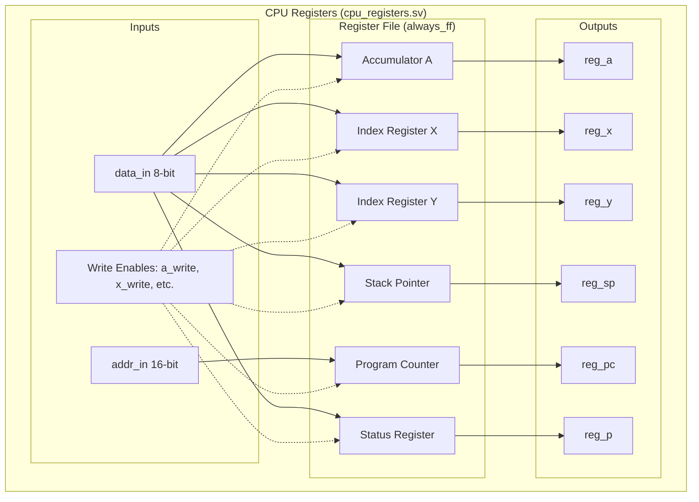
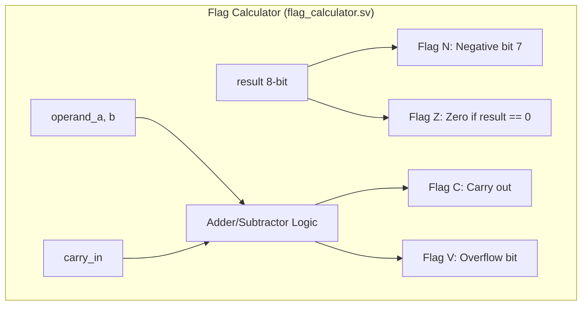
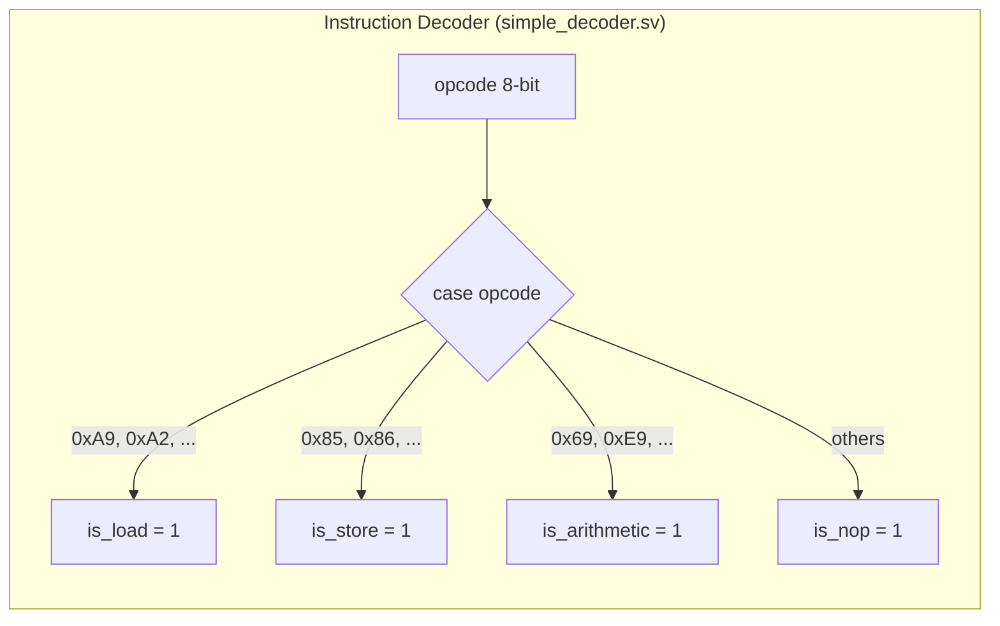
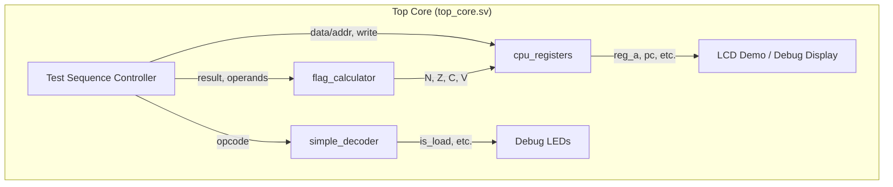

# Day 04: Foundation (LCD Display & Register Set)

---

🌐 Languages:
[English](./README.md) | [日本語](./README_ja.md)

## 📜 Overview

Up until Day 03, we learned about combinational circuits and basic sequential circuits. In Day 04, we will begin combining these elements to build the primary components of a CPU.

Today's goal is to integrate the **register set** that holds the internal state of the 6502 CPU and the **LCD display pipeline** for visualizing information.

## 🔙 Review: Day 03

Before proceeding, make sure you understand:

- **Sequential Logic (`always_ff`)**: Logic that updates values in synchronization with the rising edge of a clock
- **Clock Synchronization**: Handling asynchronous resets (`negedge rst_n`) and setting initial values
- **Counters and PWM**: Applications that count states and control signals at specific timings

## 🎯 Learning Objectives

- **LCD Pipeline**: Complete the data flow from VRAM (**BSRAM/SDPB**) through Font ROM (**pROM**) to the LCD panel.
- **6502 Register Set**: Implement A, X, Y, SP, PC, and Status (P) registers in hardware.
- **Instruction Decoding**: Build a decoder to classify 8-bit opcodes into instruction categories (Load, Store, Branch, etc.).
- **System Integration**: Understand the separation between board wrappers (`top_9k.sv`/`top_20k.sv`) and the logic core (`top_core.sv`).

## 🛠️ Implementation Steps

Follow these steps for Day 04. Refer to the `TODO` comments in each file.

### Step 1: Implement Core Logic

First, complete the registers that hold the CPU state and the logic for calculating status flags.

1. **`cpu_registers.sv`**:

Implement an `always_ff` block to manage the 6502 register set (A, X, Y, SP, PC, P). Define the reset state (e.g., PC=0x0200, SP=0xFF) and update logic triggered by write-enable signals (`a_write`, etc.).
2. **`flag_calculator.sv`**:

Implement combinational logic to derive status flags (N, Z, C, V) from the operation result. Ensure the Carry (C) and Overflow (V) flags are calculated correctly based on arithmetic rules.
3. **`simple_decoder.sv`**:

Implement decoding logic using a `case` statement to translate 8-bit opcodes into category flags like `is_load`. This allows the CPU to identify the type of instruction to execute.

### Step 2: System Integration (`top_core.sv`)

Integrate the components into `top_core.sv`.

1. **`top_core.sv`**:
    - Instantiate `lcd_demo` to enable screen output.
    - Instantiate `cpu_registers` and `simple_decoder`, connecting them to the test signals.
    - Connect decoder outputs to the board LEDs (`led_load`, etc.) for verification.

### Step 3: Verification

Verify your implementation using simulation and the actual board.

1. **Simulation**:
    - Run `make sim` and ensure that LCD signals (DEN) are output correctly and the simulation results in `PASS`.
2. **Hardware Verification**:
    - Run `make download` (for Tang Nano 9K) and verify that the demo screen appears on the LCD and the LEDs blink in sequence.

## 💡 Design Pattern: Wrapper and Core Separation

This project strictly separates the **Logic Core (`top_core.sv`)** from **Board-Specific Wrappers (`top_9k.sv` / `top_20k.sv`)**.

- **`top_core.sv` (System Core)**: Contains the 6502 logic and system integration common to any FPGA board.
- **`top_9k.sv` / `top_20k.sv` (Board Wrapper)**: Handles board-specific pin definitions, reset button polarity, and LED signal inversions (Active-Low vs. Active-High).

This separation improves portability and allows learners to focus on the hardware description (Core) rather than board-specific details. Other lessons follow this same structure.

## 📝 Exercises

### Basic Tasks

- [ ] Complete `cpu_registers.sv` and verify PC is `0x0200` and SP is `0xFF` after reset.
- [ ] Implement `flag_calculator.sv` so the Negative flag is set when the result is negative (bit 7 is 1).
- [ ] Set `is_load` to 1 for LDA, LDX, and LDY instructions in `simple_decoder.sv`.
- [ ] Instantiate all modules in `top_core.sv` and verify that LEDs blink in sequence on the actual board.

### Advanced Tasks

- [ ] Add your favorite 6502 opcodes to `simple_decoder.sv` and light up the corresponding LEDs.
- [ ] Predict and verify the state of bit 7 (Negative flag) in the P register when writing `0x55` to the A register.

## 📚 Technical Overview

(Further details on memory mapping and pipeline architecture...)
