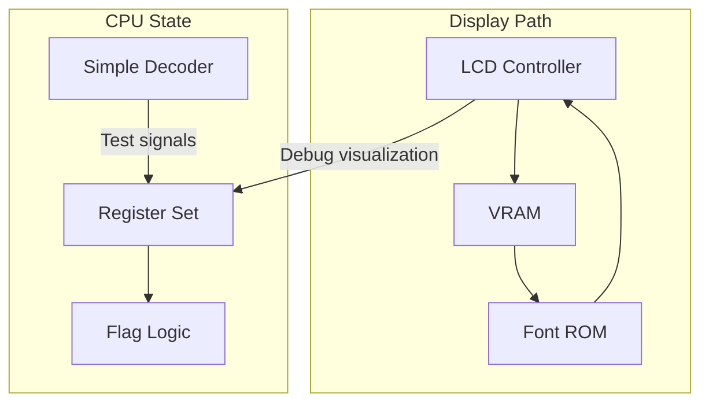
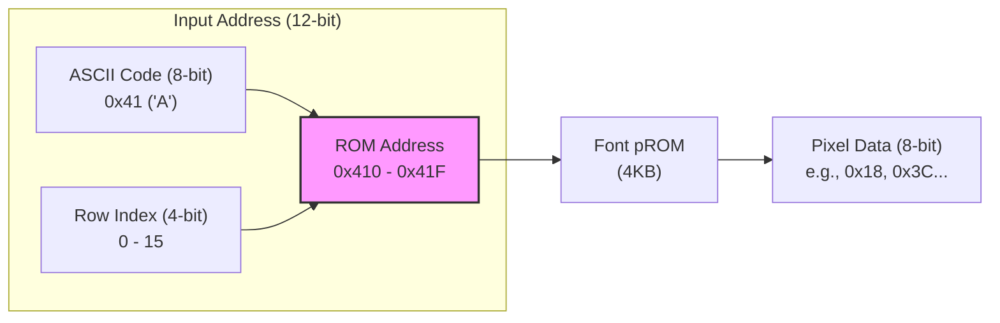
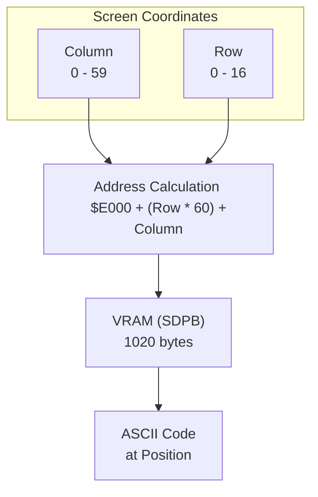

# Day 04: The Foundation (LCD & Registers)

---

🌐 Available languages:
[English](./README.md) | [日本語](./README_ja.md)

## 📜 Overview

Before we build the CPU's brain (the Control Unit), we need to establish two critical foundations:

1. **A Window into the Machine (LCD)**: Building a display pipeline so we can see what the CPU is doing.
2. **The Internal State (Registers)**: Implementing the architectural registers where the 6502 stores its data and flags.

Today's work is a transition from simple per-day logic to a permanent architectural foundation.

## 🎯 Learning Objectives

- **LCD Pipeline**: Understand how pixels flow from VRAM (**BSRAM/SDPB**), through Font ROM (**pROM**), to the Panel.
- **Hardware Memory**: Basics of high-speed memory access using FPGA internal resources (BSRAM).
- **Clock Management**: Use Phase Locked Loops (PLL) to generate precise frequencies (9MHz for LCD).
- **6502 Register Set**: Implement A, X, Y, SP, PC, and the Status Register (P).
- **Instruction Decoding**: Basic categorization of opcodes (Load, Store, Branch, etc.).

## 🏗️ Architecture

Day 04 combines a fast rendering pipeline with the CPU's register set.



## 🛠️ Implementation Steps

### Part 1: Driving the LCD

1. **PLL Setup**: Generate a 9MHz clock from the 27MHz base.
2. **Timing Generator**: Create HSYNC/VSYNC/DEN signals in `lcd.sv`.
3. **Rendering**: Wire `vram.sv` and `font_rom.sv` in `lcd_demo.sv`.

### Part 2: The Register Set

1. **Register Storage**: Implement the synchronous register file in `cpu_registers.sv`.
2. **Flag Logic**: Implement the Zero (Z), Negative (N), and Carry (C) flag calculators.
3. **Test Bench**: Use `tb_cpu_registers.sv` to verify that data is written and read correctly.

## 💡 Technical Insight: Using BSRAM (SDPB) & pROM

Building memory using only FPGA logic (LUTs) quickly consumes resources. Instead, we use the dedicated **BSRAM (Block Static RAM)** blocks available on the Tang Nano 9K.

Using Gowin EDA's **IP Core Generator**, we create and instantiate two types of memory:

### 1. SDPB (Semi-Dual Port Block RAM)

Used for the **VRAM**. One port is dedicated to the LCD controller for reading pixels, while the other is used by the CPU for writing character data. This "dual-port" access allows smooth updates without interfering with display timing.

**Example Instantiation:**

```systemverilog
// Gowin_SDPB_vram: 1024x8-bit memory
Gowin_SDPB_vram vram_inst (
    .dout(vram_data),    // Data out (to LCD)
    .clka(CPU_CLK),      // Write clock
    .cea(vram_we),       // Write enable
    .ada(write_addr),    // Write address
    .din(write_data),    // Write data (ASCII)
    .clkb(LCD_CLK),      // Read clock
    .ceb(1'b1),
    .adb(read_addr)      // Read address (from LCD)
);
```

### 2. pROM (Programmable ROM)

Used for the **Font ROM**. By providing a `.mi` (Memory Initialization) file during the IP configuration in Gowin EDA, the memory comes pre-loaded with font patterns upon power-up.

**Example Instantiation:**

```systemverilog
Gowin_pROM_font font_rom_inst (
    .dout(font_data),
    .clk(LCD_CLK),
    .ce(1'b1),
    .ad(font_addr)
);
```

> [!TIP] > **SDPB** stands for Semi-Dual Port. It is optimized for scenarios where one process (the display) is constantly reading while another (the CPU) is occasionally writing.

## 🏗️ Memory Data Flow & Layout

Understanding the flow of data from memory to the screen is key to building the display pipeline.

### 1. Font ROM Addressing

The Font ROM takes two inputs: **"Which character (ASCII)"** and **"Which row of that character"**. It outputs an 8-bit bitmap representing one row of pixels.

**Example: Character 'A' (ASCII 0x41)**
The letter 'A' is defined across 16 bytes in memory. Below is a mapping of the hex values, binary representation, and the visual pattern using `*`.

```text
Address                Hex    Binary      Visual
0x41 * 16 + 0  (Row 0) 0x00   (00000000)
0x41 * 16 + 1  (Row 1) 0x00   (00000000)
0x41 * 16 + 2  (Row 2) 0x18   (00011000)     **
0x41 * 16 + 3  (Row 3) 0x3C   (00111100)    ****
0x41 * 16 + 4  (Row 4) 0x66   (01100110)   **  **
0x41 * 16 + 5  (Row 5) 0x66   (01100110)   **  **
0x41 * 16 + 6  (Row 6) 0x7E   (01111110)   ******
0x41 * 16 + 7  (Row 7) 0x66   (01100110)   **  **
0x41 * 16 + 8  (Row 8) 0x66   (01100110)   **  **
0x41 * 16 + 9  (Row 9) 0x66   (01100110)   **  **
0x41 * 16 + 10 (Row 10) 0x66   (01100110)   **  **
0x41 * 16 + 11 (Row 11) 0x00   (00000000)
0x41 * 16 + 12 (Row 12) 0x00   (00000000)
... (and so on) ...
```



### 2. VRAM Screen Layout

The VRAM is logically organized as a 60 columns × 17 rows grid (1020 bytes total). For example, if we map the VRAM starting at address `$E000`:

- `$E000`: Top-left character (Column 0, Row 0)
- `$E000 + 59`: Top-right character of the first row (Column 59, Row 0)
- `$E000 + 60`: Leftmost character of the second row (Column 0, Row 1)
- `$E000 + 1019`: Bottom-right character of the screen (Column 59, Row 16)



## 💡 The "Architecture of Visibility"

In hardware development, you cannot "print" to a console. By building the LCD controller early, you create a hardware-native debugger. Throughout the rest of this course, you will see your registers and PC values updating in real-time on your desk!
