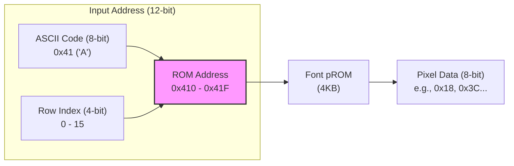
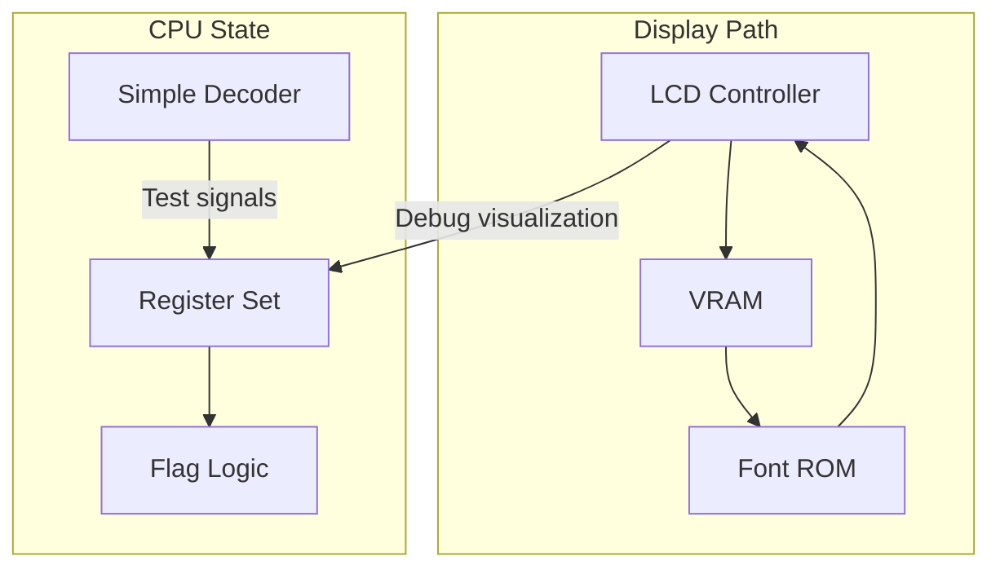
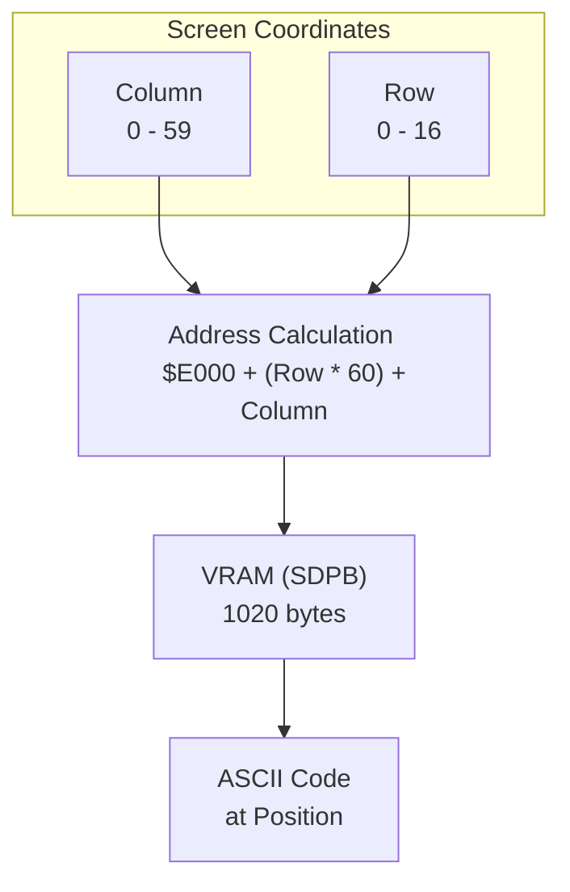

# Day 04: The Foundation (LCD & Registers)

---

🌐 Available languages:
[English](./README.md) | [日本語](./README_ja.md)

## 🎯 Learning Objectives

- **LCD Pipeline**: Understand how pixels flow from VRAM (**BSRAM/SDPB**), through Font ROM (**pROM**), to the Panel.
- **Hardware Memory**: Basics of high-speed memory access using FPGA internal resources (BSRAM).
- **Clock Management**: Use Phase Locked Loops (PLL) to generate precise frequencies (9MHz for LCD).
- **6502 Register Set**: Implement A, X, Y, SP, PC, and the Status Register (P).
- **Instruction Decoding**: Basic categorization of opcodes (Load, Store, Branch, etc.).

## 📚 Theory

### For Software Engineers: A Window into the Machine

Before we build the CPU's brain (the Control Unit), we need to establish two critical foundations:

1. **A Window into the Machine (LCD)**: Building a display pipeline so we can see what the CPU is doing.
2. **The Internal State (Registers)**: Implementing the architectural registers where the 6502 stores its data and flags.

In hardware development, you cannot simply "print" to a console. By building the LCD controller early, you create a **hardware-native debugger**. Throughout the rest of this course, you will see your registers and PC values updating in real-time on your desk!

### FPGA Memory: BSRAM (SDPB) & pROM

Building memory using only FPGA logic (LUTs) quickly consumes resources. Instead, we use the dedicated **BSRAM (Block Static RAM)** blocks available on the Tang Nano 9K.

We use two types of memory IP cores:

1. **SDPB (Semi-Dual Port Block RAM)** for **VRAM**:
    - One port is dedicated to the **LCD controller** for reading pixels.
    - The other is used by the **CPU** for writing character data.
    - This "dual-port" access allows smooth updates without interfering with display timing.

2. **pROM (Programmable ROM)** for **Font ROM**:
    - Pre-loaded with font patterns (ASCII bitmaps) upon power-up.

### Memory Data Flow

The Font ROM takes two inputs: **"Which character (ASCII)"** and **"Which row of that character"**. It outputs an 8-bit bitmap representing one row of pixels.

## 🏗️ Architecture

Day 04 combines a fast rendering pipeline with the CPU's register set.

## 🛠️ Practice 1: Driving the LCD

### Steps

1. **PLL Setup**: Generate a 9MHz clock from the 27MHz base using the IP Core Generator.
2. **Timing Generator**: Create HSYNC/VSYNC/DEN signals in `lcd.sv` to drive the physical panel.
3. **Rendering**: Connect `vram.sv` (SDPB) and `font_rom.sv` (pROM) in `lcd_demo.sv` to display characters.

### VRAM Screen Layout

The VRAM is logically organized as a **60 columns × 17 rows** grid (1020 bytes total).

## 🛠️ Practice 2: The Register Set

### Steps

1. **Register Storage**: Implement the synchronous register file in `cpu_registers.sv`. This includes 8-bit registers (A, X, Y, P) and 16-bit registers (PC, SP).
2. **Flag Logic**: Implement the Zero (Z), Negative (N), and Carry (C) flag calculators based on operation results.
3. **Test Bench**: Use `tb_cpu_registers.sv` to verify that data is written and read correctly and that flags update as expected.

## 📝 Assignments

### Basic Assignments

1. **LCD**: Display "HELLO FPGA" on the LCD screen using the VRAM.
2. **Registers**: Implement the `cpu_registers` module and pass the simulation tests.
3. **Integration**: Show the value of a register (e.g., the 'A' register) on the LCD screen.

### Advanced Assignments

1. **Scrolling**: Implement a hardware scrolling feature by modifying the VRAM read address offset.
2. **Cursor**: Add a blinking cursor to the display.

## 📚 What I Learned Today

- [ ] How to use FPGA internal Block RAM (BSRAM)
- [ ] How to interface with an LCD panel (HSYNC/VSYNC)
- [ ] The architecture of the 6502 register set
- [ ] How to calculate CPU status flags (Zero, Negative)

## 🎯 Preview for Tomorrow

In Day 05, we will build the core processing unit:

- **The ALU (Arithmetic Logic Unit)**: Moving beyond the simple Day 02 ALU to a full CPU-capable ALU.
- **Control Logic**: connecting instructions to ALU operations.
- **Execution Cycle**: Fetch, Decode, Execute.
