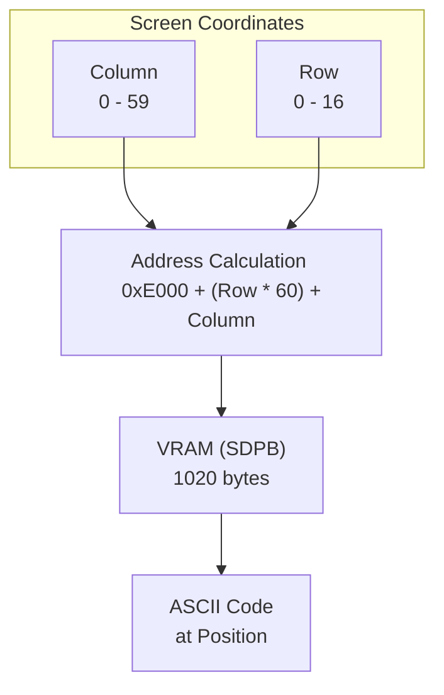
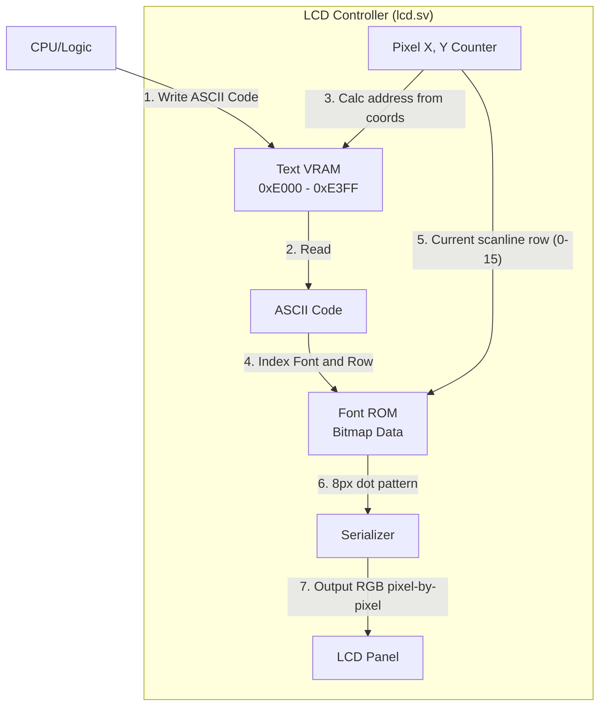

# Day 04: Visual Foundation (LCD Display & Memory Map)

---

🌐 Languages:
[English](./README.md) | [日本語](./README_ja.md)

## 📜 Overview

Until now, we have verified operations using only LEDs—providing just "one bit" of information. However, as we build a complex CPU, LEDs are no longer sufficient.

In Day 04, we will build an **"LCD Debug Dashboard"** to support our CPU development. The goal today is to create the environment that will let us see CPU internals (like instructions and registers) in real-time once the CPU is brought up.

## 🧠 Memory Model Note

Day 04–09 use a simple program ROM (`rom.sv`) to supply instructions. RAM is still used for data; the RAM-backed program flow starts in Day 11.

## 🎯 Learning Objectives

- **LCD Pipeline**: Understand how pixels flow from VRAM (**BSRAM/SDPB**), through Font ROM (**pROM**), to the Panel.
- **Hardware Memory**: Basics of high-speed memory access using FPGA internal resources (BSRAM).
- **Clock Management**: Use Phase Locked Loops (PLL) to generate precise frequencies (9MHz for LCD).
- **Memory Map**: Understand the layout of the 6502 address space.
- **VRAM Operation**: Learn how writing character codes to specific memory locations corresponds to screen positions.

## 💡 Memory Map and VRAM

The **Memory Map** defines how the CPU's address space is connected to various memory blocks and peripherals. The memory map for our 6502 system is as follows:

### 6502 System Memory Map (used in this Training)

| Address Range | Purpose | Description |
| :--- | :--- | :--- |
| `0x0000 - 0x00FF` | Zero Page | Fast-access 256-byte memory area |
| `0x0100 - 0x01FF` | Stack | Area used by the Stack Pointer (SP) |
| `0x0200 - 0x7BFF` | Program RAM | Main memory for programs/data (30.5KB) |
| `0x7C00 - 0x7FFF` | Shadow VRAM | CPU-readable VRAM copy (1KB) |
| `0x8000 - 0xDFFF` | (Unmapped) | Reserved for future expansion |
| `0xE000 - 0xE3FF` | Text VRAM | Character codes (ASCII) for LCD display (1KB) |
| `0xE400 - 0xFFFF` | (Unmapped) | Reserved for I/O or expansion |

### VRAM to LCD Mapping

The LCD screen (480x272 pixels) is divided into 8x16 pixel character units, allowing for a display of **60 columns × 17 rows**. Each ASCII code in VRAM maps to a specific coordinate.

**Display Address Formula:**
`VRAM Address = 0xE000 + (Row * 60) + Column`

For example, writing `8'h41` ('A') to `0xE000` displays 'A' in the top-left corner.

### Character Rendering Pipeline

## 💡 Technical Insight: Using BSRAM (SDPB) & pROM

Instead of consuming limited logic resources (LUTs), we use dedicated **BSRAM (Block Static RAM)** available on the Tang Nano.

### 1. SDPB (Semi-Dual Port Block RAM)

Used for the **VRAM**. One port is dedicated to the LCD controller for reading pixels, while the other is used for writing character data. This allows smooth updates without display flickering.

### 2. pROM (Programmable ROM)

Used for the **Font ROM**. It comes pre-loaded with font patterns upon power-up, allowing the hardware to draw glyphs for each ASCII character.

## 🛠️ Implementation Steps

1. **Integrate `lcd_demo.sv`**:
    - Instantiate `lcd_demo` in `top_core.sv` to enable video output on the actual LCD.
2. **Display Demo Text**:
    - VRAM is pre-filled with text like "VRAM TEXT" on boot. Verify that this appears correctly on the screen.

### Part 2: Integrating the Demo Circuit (Demo Sequence Controller)

The bottom of `top_core.sv` includes logic with names like `demo_counter` and `demo_state`. These components serve essential roles in providing the "visualization" features of this educational board:

1. **Scaffolding for Development**: At this stage, the CPU's ability to fetch instructions from memory is not yet implemented. This demo circuit acts as "scaffolding" by manually supplying "pseudo-opcodes (e.g., `0xA9`)" and "data (e.g., `0x55`)" to the registers, allowing us to verify that individual components work correctly.
2. **Human-Readable Speed**: A real CPU runs at several MHz, far too fast for the human eye to track LED blinks or LCD updates. This circuit purposefully switches states every ~1.8 seconds, making it possible to visually verify the operation.
3. **Persistent "Status Dashboard"**: Even after the actual CPU logic (`cpu.sv`) is completed in later days (Day 07 and beyond), this `demo_` logic remains in `top_core.sv`. It functions as a **"Status Dashboard"**, independent of the high-speed CPU, to continuously demonstrate that the instruction decoder correctly recognizes categories via the slow-blinking LEDs.

In this project, we utilize the technique of coexisting "high-speed production logic" with "low-speed monitoring logic" to facilitate real-time visual verification on hardware.

## 💡 Design Tip: The Importance of Visualization

In hardware development, it is notoriously difficult to see what's happening inside the chip. By building this dashboard today, you will be able to visually confirm things like the Program Counter moving starting tomorrow.

## 📝 Exercises

- [ ] Correctly instantiate `lcd_demo` in `top_core.sv` and ensure the simulation results in `PASS`.
- [ ] Program the hardware and confirm that the demo text appears on the LCD.
- [ ] (Advanced) Modify the initialization code in `lcd_demo.sv` to display your own name.

## 📚 What I Learned Today

- [ ] Concepts of Memory Mapping.
- [ ] Relationship between VRAM and screen coordinates.
- [ ] Mechanics of character display (Font ROM).

## 🎯 Preview for Tomorrow

From Day 05, we finally start building the CPU itself. We will begin by implementing the **Register Set** for memory and the **Program Counter** to track execution flow.
