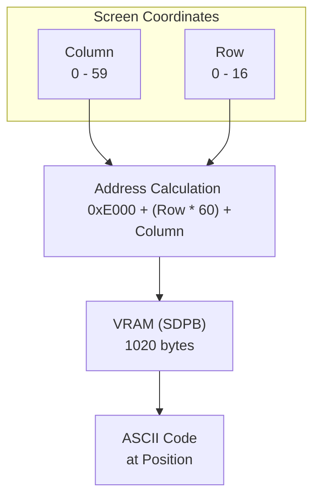
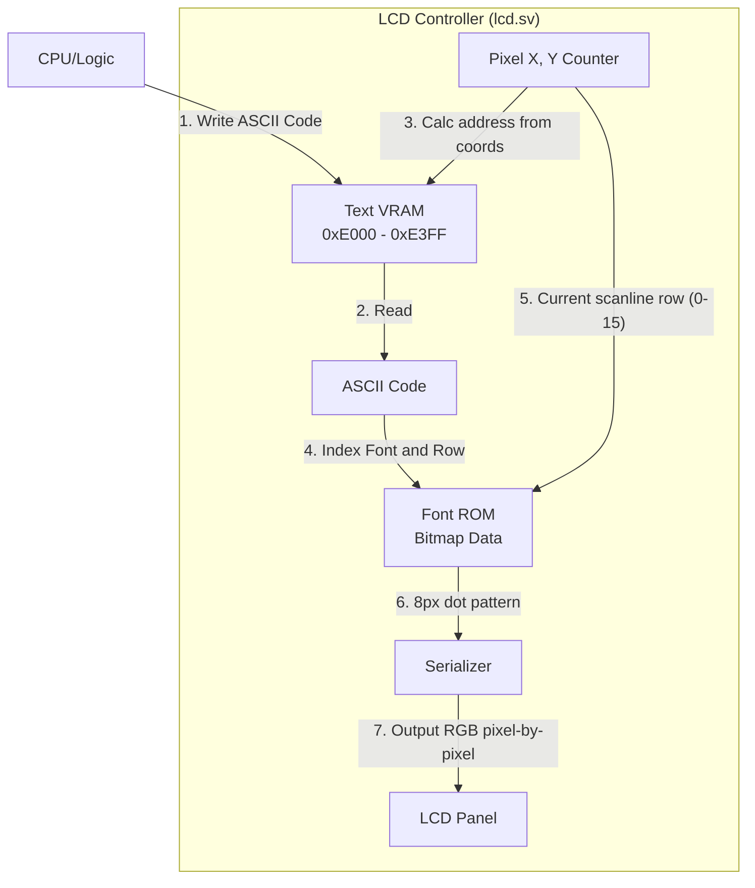

# Day 04: Visual Foundation (LCD Display & Memory Map)

---

🌐 Languages:
[English](./README.md) | [日本語](./README_ja.md)

## 📜 Overview

Until now, we have verified operations using only LEDs—providing just "one bit" of information. However, as we build a complex CPU, LEDs are no longer sufficient.

In Day 04, we will build an **"LCD Debug Dashboard"** to support our CPU development. The goal today is to create the environment that will let us see CPU internals (like instructions and registers) in real-time once the CPU is brought up.

## 🧠 Memory Model Note

Day 04–09 use a simple program ROM (`rom.sv`) to supply instructions. RAM, including Zero Page/Stack/Program RAM, is not used until Day 10.

## 🎯 Learning Objectives

- **LCD Pipeline**: Understand how pixels flow from VRAM (**BSRAM/SDPB**), through Font ROM (**pROM**), to the Panel.
- **Hardware Memory**: Basics of high-speed memory access using FPGA internal resources (BSRAM).
- **Clock Management**: Use Phase Locked Loops (PLL) to generate precise frequencies (9MHz for LCD).
- **Memory Map**: Understand the layout of the 6502 address space.
- **VRAM Operation**: Learn how writing character codes to specific memory locations corresponds to screen positions.

## 💡 Memory Map and VRAM

The **Memory Map** defines how the CPU's address space is connected to various memory blocks and peripherals. The memory map for our 6502 system is as follows:

### 6502 System Memory Map (used in this Training)

| Address Range | Purpose | Description |
| :--- | :--- | :--- |
| `0x0000 - 0x00FF` | Zero Page | Fast-access 256-byte memory area |
| `0x0100 - 0x01FF` | Stack | Area used by the Stack Pointer (SP) |
| `0x0200 - 0x7BFF` | Program RAM | Main memory for programs/data (30.5KB) |
| `0x7C00 - 0x7FFF` | Shadow VRAM | CPU-readable VRAM copy (1KB) |
| `0x8000 - 0xDFFF` | (Unmapped) | Reserved for future expansion |
| `0xE000 - 0xE3FF` | Text VRAM | Character codes (ASCII) for LCD display (1KB) |
| `0xE400 - 0xFFFF` | (Unmapped) | Reserved for I/O or expansion |

### VRAM to LCD Mapping

The LCD screen (480x272 pixels) is divided into 8x16 pixel character units, allowing for a display of **60 columns × 17 rows**. Each ASCII code in VRAM maps to a specific coordinate.

**Display Address Formula:**
`VRAM Address = 0xE000 + (Row * 60) + Column`

For example, writing `8'h41` ('A') to `0xE000` displays 'A' in the top-left corner.


```mermaid
graph TD
    subgraph "Screen Coordinates"
        C["Column <br/> 0 - 59"]
        R["Row <br/> 0 - 16"]
    end
    C --> CALC["Address Calculation <br/> 0xE000 + (Row * 60) + Column"]
    R --> CALC
    CALC --> VRAM["VRAM (SDPB) <br/> 1020 bytes"]
    VRAM --> OUT["ASCII Code <br/> at Position"]
```

### Character Rendering Pipeline


```mermaid
graph TD
    CPU[CPU/Logic] -->|1. Write ASCII Code| VRAM[Text VRAM<br/>0xE000 - 0xE3FF]

    subgraph "LCD Controller (lcd.sv)"
        VRAM -->|2. Read| Code[ASCII Code]
        Coord[Pixel X, Y Counter] -->|3. Calc address from coords| VRAM
        Code -->|4. Index Font and Row| FontROM[Font ROM<br/>Bitmap Data]
        Coord -->|"5. Current scanline row (0-15)"| FontROM
        FontROM -->|6. 8px dot pattern| Serial[Serializer]
        Serial -->|7. Output RGB pixel-by-pixel| Panel[LCD Panel]
    end
```

## 💡 Technical Insight: Using BSRAM (SDPB) & pROM

Instead of consuming limited logic resources (LUTs), we use dedicated **BSRAM (Block Static RAM)** available on the Tang Nano.

### 1. SDPB (Semi-Dual Port Block RAM)

Used for the **VRAM**. One port is dedicated to the LCD controller for reading pixels, while the other is used for writing character data. The LCD read port is clocked by the 9MHz pixel clock and completes in the pixel domain (only writes use the memory clock), allowing smooth and stable updates without display flickering.

### 2. pROM (Programmable ROM)

Used for the **Font ROM**. It comes pre-loaded with font patterns upon power-up, allowing the hardware to draw glyphs for each ASCII character.

## 🛠️ Implementation Steps

1. **Integrate `lcd_demo.sv`**:
    - Follow the TODO in `top_core.sv` to instantiate `lcd_demo` (named `u_demo`) and connect the clocks and LCD output signals.
2. **Display Demo Text**:
    - VRAM is pre-filled with text like "VRAM TEXT" on boot. Verify that this appears correctly on the screen.

### Day 04 Scope and Later CPU Days

In the Day 04 starter, we instantiate `lcd_demo` inside `top_core.sv` to establish the display output path. The CPU, instruction decoder, and register demo logic are not connected yet. You will verify that the text initialized by `lcd_demo.sv` appears correctly on the LCD.

The slow-paced demo circuit driving CPU registers and instruction category LEDs is added to `top_core.sv` in subsequent days. The LCD display in Day 04 does not show CPU instruction execution or debug information. Please refer to each specific day's `top_core.sv` and README for its actual wiring.

**About the Memory Map:** The table above introduces the logical address layout planned for subsequent CPU lessons. The Day 04 LCD demo itself has no CPU address decoding. Furthermore, Day 99 implements mirror regions in higher addresses; refer to the [Day 99 Memory Contract](../day99_completed/docs/INSTRUCTIONS.md) for the final layout.

## 🛠️ Build and Verification Steps

### 1. Simulation (`make sim` or `make test`)

```bash
make sim
# Or run with BOARD=20k
make sim BOARD=20k
```

> [!WARNING]
> **Important Note for Starter Code (Preventing Infinite Hangs)**:
> In the unedited starter code (`top_core.sv`), `lcd_demo` is not yet instantiated, so no LCD clock (`LCD_CLK`) is produced. Running `make sim` in this state causes the testbench to wait indefinitely on `@(posedge LCD_CLK)`, **hanging the simulation**.
> Be sure to complete the TODO in `top_core.sv` (instantiating `lcd_demo`) before running `make sim`.

### 2. Hardware Programming (`make download`)

```bash
# For Tang Nano 9K
make BOARD=9k download

# For Tang Nano 20K
make BOARD=20k download
```

## 💡 Design Tip: The Importance of Visualization

In hardware development, you cannot simply `printf` to a console. By establishing the LCD controller early, you build a hardware-native debugger to visually inspect CPU progress in later days.

## 📝 Exercises

- [ ] Correctly instantiate `lcd_demo` in `top_core.sv` and ensure the simulation (`make sim`) passes.
- [ ] Program the hardware (`make download`) and confirm that the demo text appears on the LCD.
- [ ] (Advanced) Modify the initialization code in `lcd_demo.sv` to display your own name.

## 📚 What I Learned Today

- [ ] Concepts of Memory Mapping.
- [ ] Relationship between VRAM and screen coordinates.
- [ ] Mechanics of character display (Font ROM).

## 🎯 Preview for Tomorrow

From Day 05, we begin building the CPU itself.
We will start by implementing the **Program Counter (PC)** along with reset and execution enable. Implementing independent A/X/Y register files is provided as an optional exercise, with CPU integration coming in later steps.
