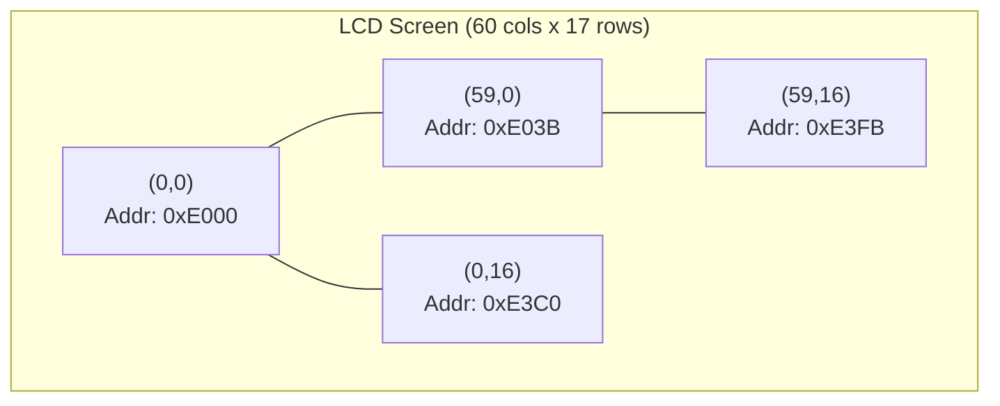
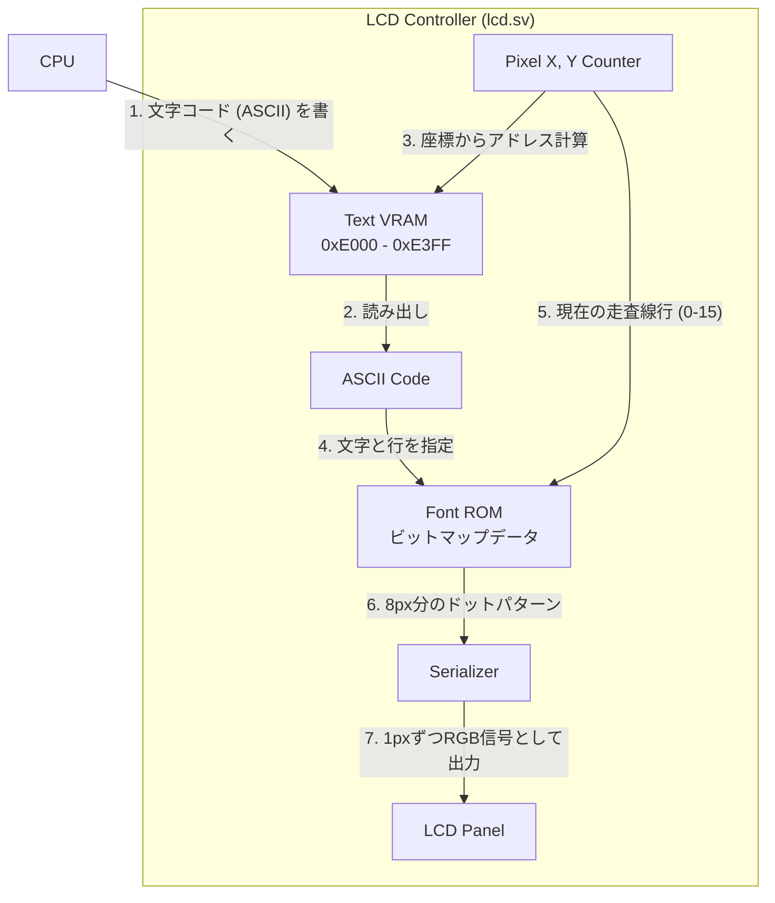
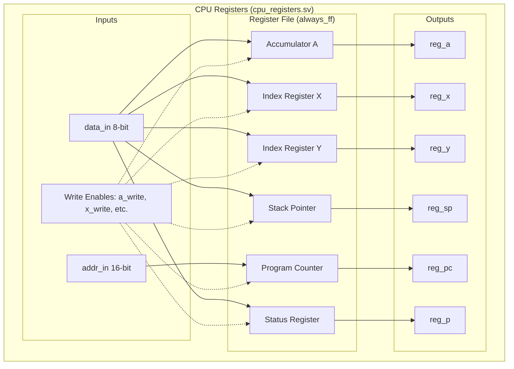
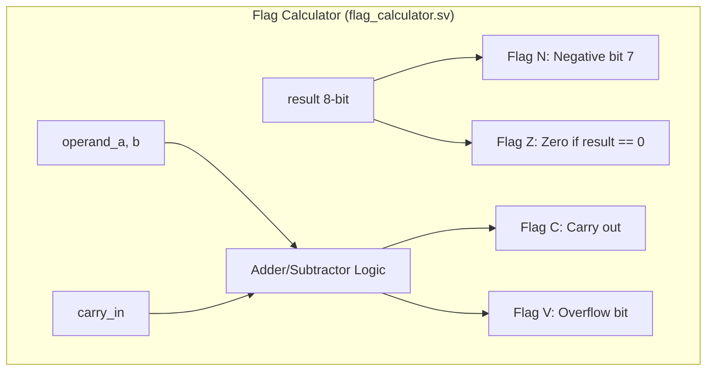
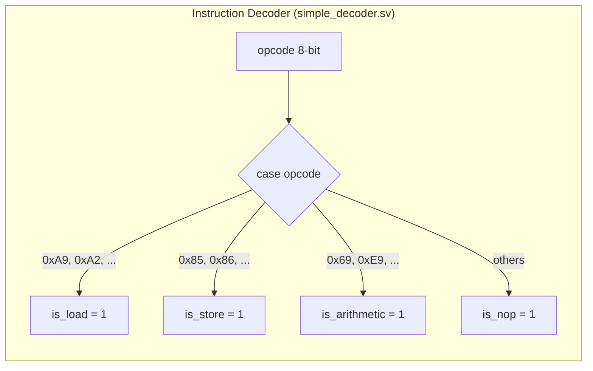
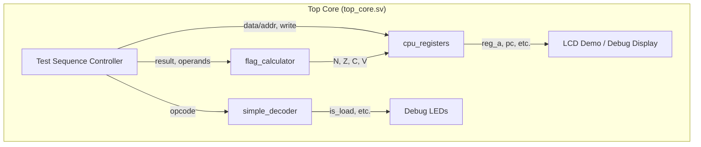

# Day 04: 基盤構築 (LCD 表示とレジスタセット)

---

🌐 対応言語:
[English](./README.md) | [日本語](./README_ja.md)

## 📜 概要

Day 03 までは、組み合わせ回路と基本的な順序回路を学びました。Day 04 では、これらを組み合わせて CPU の主要なコンポーネントを構築し始めます。

今日の目標は、6502 CPU の内部状態を保持する **レジスタセット** と、情報を視覚化するための **LCD 表示パイプライン** を統合することです。

## 🔙 復習: Day 03

次に進む前に、以下を理解しているか確認してください:

- **順序回路 (`always_ff`)**: クロックの立ち上がりエッジに同期して値を更新するロジック
- **クロック同期**: 非同期リセット (`negedge rst_n`) の扱いと初期値の設定
- **カウンタと PWM**: 状態をカウントアップし、特定のタイミングで信号を制御する応用

## 🎯 学習目標

- **LCD パイプラインの構築**: VRAM (**BSRAM/SDPB**) から Font ROM (**pROM**) を経由してパネルへ文字を表示する流れを完成させる。
- **6502 レジスタセットの実装**: A, X, Y, SP, PC, およびステータスレジスタ (P) をハードウェアで記述する。
- **命令デコードの基礎**: 8 ビットのオペコードを読み取り、命令の種類を分類するデコーダを構築する。
- **システム統合**: 基板用ラッパー (`top_9k.sv`/`top_20k.sv`) と、論理本体 (`top_core.sv`) の分離構造を理解する。

## 💡 メモリマップと VRAM の仕組み

CPU がデータを読み書きする際、どのアドレスがどこのメモリや周辺機器に繋がっているかを示したものを **メモリマップ** と呼びます。本プロジェクトで構築する 6502 システムのメモリマップ（例）は以下の通りです。

### 実習で使用する6502システムのメモリマップ

| アドレス範囲 | 用途 | 説明 |
| :--- | :--- | :--- |
| `0x0000 - 0x00FF` | Zero Page | 高速アクセス可能な 256 バイトのメモリ領域 |
| `0x0100 - 0x01FF` | Stack | スタックポインタ (SP) が使用するスタック領域 |
| `0x0200 - 0x7FFF` | Free RAM | ユーザープログラムやデータに使用可能な汎用 RAM |
| `0x8000 - 0xDFFF` | Program ROM | CPU が実行するプログラムコードを格納する領域 |
| `0xE000 - 0xE3FF` | Text VRAM | LCD 表示用文字コード (ASCII) を保持する領域 (1KB) |
| `0xE400 - 0xFFFF` | I/O / Reserved | 入出力デバイスや将来の拡張用の予約領域 |

*   **Program ROM (0x8000〜)**: CPU が実行するプログラムが格納される領域です。

### VRAM と LCD の対応関係

LCD 画面は 480x272 ピクセルですが、これを 8x16 ピクセルの文字単位で区切ると、横 60 文字 × 縦 17 文字（計 1020 文字）を表示できます。

VRAM の各アドレスに書き込まれた **ASCII 文字コード** は、LCD 上の特定の座標に対応しています。

**アドレス計算式:**
`表示アドレス = 0xE000 + (行番号 * 60) + 列番号`

例えば、アドレス `0xE000` に `8'h41` (文字 'A') を書き込むと、画面の左上に 'A' が表示されます。

### 文字が表示されるまでの流れ（レンダリングパイプライン）

CPU が VRAM に文字コードを書き込んでから、実際に LCD パネルにピクセルとして表示されるまでの流れは以下の通りです。

1. **VRAM**: 「どの位置に何の文字を出すか」という文字コードを保持。
2. **Font ROM**: 「'A' という文字はどんな形か」というビットマップ（点）の情報を保持。
3. **LCD Controller**: 画面を高速にスキャンしながら、今この瞬間に表示すべきピクセルの色を VRAM と Font ROM から引き出して決定します。

## 🛠️ 実習の手順

Day 04 では、以下の順序で実装を進めます。各ファイルにある `TODO` コメントを参考にしてください。

### ステップ 1: 基盤となるロジックの実装

まず、CPU の内部状態を保持する「レジスタ」と、演算結果を判定する「フラグ計算」を完成させます。

1. **`cpu_registers.sv`**:

6502 の各レジスタ (A, X, Y, SP, PC, P) を保持する `always_ff` ブロックを記述します。各レジスタのリセット値（PC=0x0200, SP=0xFFなど）と、書き込み有効信号 (`a_write` 等) が '1' の時の更新動作を実装してください。
2. **`flag_calculator.sv`**:

演算結果 (`result`) からステータスフラグ (N, Z, C, V) を計算する組合せ回路を記述します。特にキャリー (C) とオーバーフロー (V) の判定ロジックを正しく実装してください。
3. **`simple_decoder.sv`**:

`case` 文を使用して、8ビットのオペコードから `is_load` 等のカテゴリフラグを生成するデコードロジックを実装します。これにより、命令の種類を判別できるようになります。

### ステップ 2: システムの統合 (`top_core.sv`)

個別の部品ができたら、それらを `top_core.sv` で一つにまとめます。

1. **`top_core.sv`**:
    - `lcd_demo` をインスタンス化し、画面出力を有効にします。
    - `cpu_registers` と `simple_decoder` をインスタンス化し、テスト用の信号線と接続します。
    - デコーダの出力を、基板上の LED (`led_load` 等) に接続して動作を確認できるようにします。

### ステップ 3: 検証

実装が完了したら、シミュレーションと実機で動作を確認します。

1. **シミュレーション**:
    - `make sim` を実行し、LCD の信号（DEN）が正しく出力され、シミュレーションが `PASS` することを確認します。
2. **実機確認**:
    - `make download` (Tang Nano 9K の場合) を実行し、ボード上の LCD にデモ画面が表示され、LED が順番に点滅することを確認します。

## 💡 設計のポイント：Wrapper と Core の分離

このプロジェクトでは、**「ロジック本体 (`top_core.sv`)」** と **「基板固有の設定 (`top_9k.sv` / `top_20k.sv`)」** を明確に分離しています。

- **`top_core.sv` (System Core)**: どの FPGA 基板でも共通の 6502 関連論理を記述します。
- **`top_9k.sv` / `top_20k.sv` (Board Wrapper)**: 各基板のピン定義、リセットボタンの極性処理、LED のアクティブ低/高の反転などを担当します。

このように分離することで、異なるボードへの移植性が高まり、学習者は純粋なハードウェア記述（Core）に集中できるようになります。他の Day の課題も同様の構成になっています。

## 📝 課題

### 基礎課題

- [ ] `cpu_registers.sv` を完成させ、リセット後に PC が `0x0200`、SP が `0xFF` になることを確認する。
- [ ] `flag_calculator.sv` を実装し、演算結果が負（ビット 7 が 1）のときに Negative フラグが立つようにする。
- [ ] `simple_decoder.sv` で、LDA/LDX/LDY 命令に対して `is_load` が 1 になるように設定する。
- [ ] `top_core.sv` ですべてのモジュールをインスタンス化し、実機で LED が順番に点滅することを確認する。

### 発展課題

- [ ] `simple_decoder.sv` に、自分が興味のある 6502 命令のオペコードを追加し、それに対応する LED を光らせてみる。
- [ ] A レジスタに `0x55` を書き込んだとき、ステータスレジスタ (P) のビット 7 (Negative) がどうなるか予想し、検証する。

## 📚 今日学んだこと

- [ ] LCD パイプライン（VRAM → Font ROM → パネル）の仕組み
- [ ] BSRAM / pROM の使い方
- [ ] 6502 レジスタセット（A, X, Y, SP, PC, P）の実装
- [ ] 簡易デコーダの構築
- [ ] Wrapper と Core の分離設計

## 🎯 明日の予習

Day 05 では CPU の骨格を実装します:

- Program Counter（PC）の動作原理
- Fetch-Decode-Execute サイクル
- `NOP` 命令の実装（最もシンプルな命令）
- LCD へのデバッグ情報表示

**準備課題**: 6502 の命令フォーマット（1〜3 バイト命令）について調べておきましょう。
