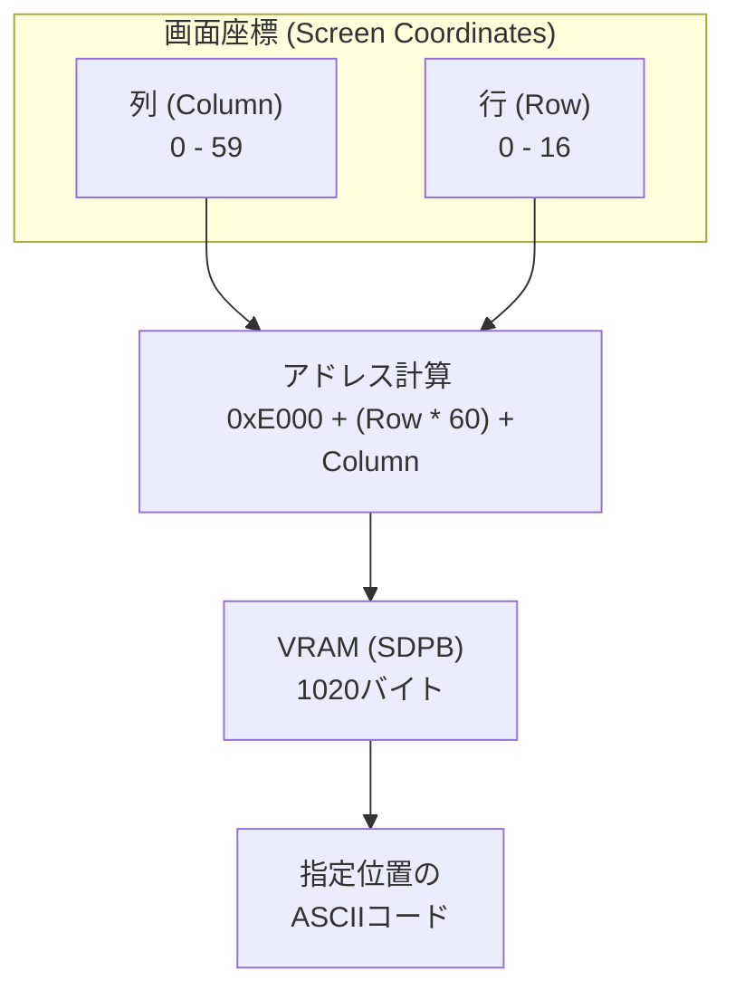
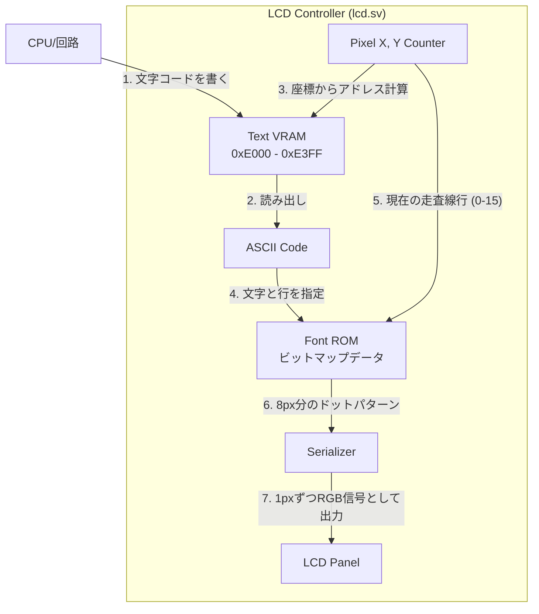

# Day 04: 視覚化基盤 (LCD 表示とメモリマップ)

---

🌐 対応言語:
[English](./README.md) | [日本語](./README_ja.md)

## 📜 概要

これまでは LED という「1 ビット」の情報だけで動作を確認してきました。しかし、これから複雑な CPU を作っていくにあたって、LED だけでは不十分です。

Day 04 では、CPU 開発を強力にサポートする **「デバッグ・ダッシュボード」** として LCD 表示機能を構築します。CPU が今どの命令を実行し、レジスタの値が何であるかをリアルタイムで確認できる環境を整えることが今日のゴールです。

## 🧠 メモリ構成の注意

Day 04〜09 はプログラム命令を `rom.sv` から供給します（簡易ROM）。Zero Page/Stack/Program RAM を含むRAM は Day 10 まで使用しません。

## 🎯 学習目標

- **LCD パイプラインの構築**: VRAM (**BSRAM/SDPB**) から Font ROM (**pROM**) を経由してパネルへ文字を表示する流れを完成させる。
- **ハードウェアメモリ**: FPGA 内部リソースである BSRAM を利用した高速なメモリアクセスの基礎。
- **クロック管理**: PLL (Phase Locked Loop) を使用して、LCD 用の 9MHz などの正確な周波数を生成する。
- **メモリマップの理解**: CPU から見たアドレス空間の配置を理解する。
- **VRAM の操作**: メモリ上の特定の場所に文字コードを書くと、画面のどこに表示されるかを学ぶ。

## 💡 メモリマップと VRAM の仕組み

CPU がデータを読み書きする際、どのアドレスがどこのメモリや周辺機器に繋がっているかを示したものを **メモリマップ** と呼びます。本プロジェクトで構築する 6502 システムのメモリマップは以下の通りです。

### 実習で使用する 6502 システムのメモリマップ

| アドレス範囲 | 用途 | 説明 |
| :--- | :--- | :--- |
| `0x0000 - 0x00FF` | Zero Page | 高速アクセス可能な 256 バイトのメモリ領域 |
| `0x0100 - 0x01FF` | Stack | スタックポインタ (SP) が使用するスタック領域 |
| `0x0200 - 0x7BFF` | Program RAM | メインメモリ (プログラム/データ), 30.5KB |
| `0x7C00 - 0x7FFF` | Shadow VRAM | CPU 読み取り用 VRAM (シャドウ領域), 1KB |
| `0x8000 - 0xDFFF` | (Unmapped) | 将来の拡張用の予約領域 |
| `0xE000 - 0xE3FF` | Text VRAM | LCD 表示用文字コード (ASCII), 1KB |
| `0xE400 - 0xFFFF` | (Unmapped) | 将来の拡張用の予約領域 |

### VRAM と LCD の対応関係

LCD 画面（480x272 ピクセル）を 8x16 ピクセルの文字単位で区切ると、**横 60 文字 × 縦 17 文字** を表示できます。VRAM の各アドレスに書き込まれた ASCII 文字コードは、LCD 上の特定の座標に対応しています。

**表示アドレス計算式:**
`VRAMアドレス = 0xE000 + (行番号 * 60) + 列番号`

例えば、アドレス `0xE000` に `8'h41` (文字 'A') を書き込むと、画面の左上に 'A' が表示されます。

### 文字が表示されるまでの流れ（レンダリングパイプライン）

## 💡 補足：BSRAM (SDPB) と pROM の活用

FPGA 本体にあるロジック（LUT）だけでメモリを作ると、すぐにリソースが枯渇してしまいます。そのため、Tang Nano に搭載されている **BSRAM (Block Static RAM)** という専用のメモリブロックを利用します。

### 1. SDPB (Semi-Dual Port Block RAM)

VRAM として使用します。一方のポートで LCD が読み出しを行い、もう一方のポートで CPU（または初期化回路）が書き込みを行うため、情報の衝突を避けながら高速な描画が可能です。

### 2. pROM (Programmable ROM)

フォントデータを格納するために使用します。あらかじめ定義されたフォントパターンを電源投入時にロードします。

## 🛠️ 実習の手順

1. **`lcd_demo.sv` の統合**:
    - `top_core.sv` 内で `lcd_demo` をインスタンス化し、実機の LCD パネルに映像が出るようにします。
2. **デモテキストの表示**:
    - 初期状態で VRAM にいくつかの文字（"VRAM TEXT" 等）が書き込まれるようになっています。これが正しく画面に表示されるか確認します。

### パート 2: デモ用回路（デモシーケンス制御）の統合

`top_core.sv` の下部には、`demo_counter` や `demo_state` といった名前のロジックが含まれています。これらの回路には、教育用ボードとしての「見える化」を支える以下の重要な役割があります。

1. **「仮設の足場」としての機能**: 現時点では CPU がメモリから命令を読み込む機能がまだ完成していません。そのため、このデモ用回路がメモリの代わりに「疑似的な命令（`0xA9` など）」と「データ（`0x55` など）」を各レジスタへ供給し、部品が正しく動くかを確認するための「足場」として機能します。
2. **人間が目で見るための低速化**: 本物の CPU は数 MHz という高速で動きますが、それでは LED の点滅や LCD の数値変化を人間が追うことができません。この回路はあえて約 1.8 秒ごとに状態を切り替えることで、動作を目視で確認できるようにしています。
3. **「ステータス・パネル」としての永続性**: 学習が進み、Day 07 以降で本物の CPU ロジック（`cpu.sv`）が完成した後も、この `demo_` ロジックは `top_core.sv` に残り続けます。これは、高速で動く CPU 本体とは独立して、「命令デコーダが正しく命令を判別できるか」を常に LED でゆっくりとデモンストレーションし続けるための、いわば**「計器盤（ダッシュボード）」**としての役割を果たすためです。

このように、このプロジェクトでは「高速に動く本番の回路」と「動作を目視で確認するための低速なデモ用（計測用）回路」を共存させる手法をとっています。

## 💡 設計のポイント：可視化（見える化）の重要性

ハードウェア開発では、内部で何が起きているかを見ることが非常に困難です。Day 04 でダッシュボードを作ることで、明日以降「CPU の PC（プログラムカウンタ）が本当に動いているか」を自分の目で確認できるようになります。

## 📝 課題

- [ ] `top_core.sv` で `lcd_demo` を正しくインスタンス化し、シミュレーションで `PASS` することを確認する。
- [ ] 実機に書き込み、LCD にデモ文字が表示されることを確認する。
- [ ] (発展) `lcd_demo.sv` 内の初期化コードを書き換えて、自分の名前を LCD に表示させてみる。

## 📚 今日学んだこと

- [ ] メモリマップの概念
- [ ] VRAM と画面座標の関係
- [ ] 文字表示（フォント ROM）の仕組み

## 🎯 明日の予習

Day 05 から、いよいよ CPU 本体の構築に入ります。
まずは CPU の「記憶」を司る **レジスタセット** と、実行場所を示す **プログラムカウンタ** を実装します。
