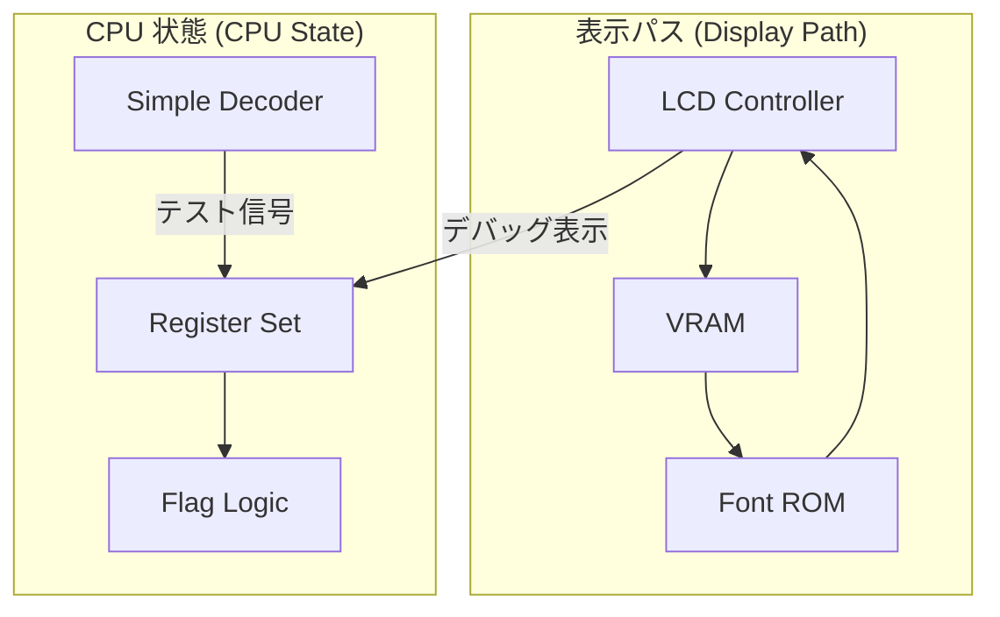
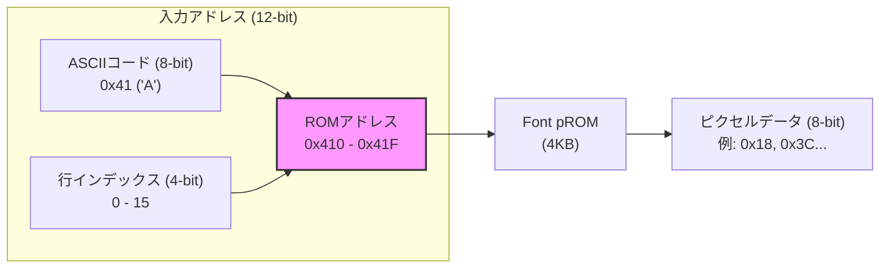
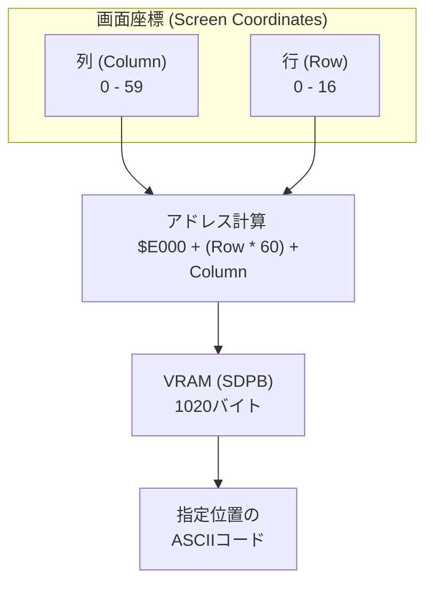

# Day 04: 基盤構築 (LCD 表示とレジスタセット)

---

🌐 対応言語:
[English](./README.md) | [日本語](./README_ja.md)

## 📜 概要

CPU の「脳」である制御ユニットを構築する前に、2 つの重要な基盤を確立する必要があります。

1.  **マシンへの「窓」 (LCD)**: CPU が何をしているかを確認するための表示パイプラインを構築します。
2.  **内部状態 (レジスタ)**: 6502 がデータやフラグを保持するアーキテクチャ上のレジスタを実装します。

今日の作業は、単発のロジックから、恒久的なアーキテクチャの基盤への移行です。

## 🎯 学習目標

-   **LCD パイプライン**: ピクセルが VRAM (**BSRAM/SDPB**) から Font ROM (**pROM**) を経由してパネルへ流れる仕組みを理解する。
-   **ハードウェアメモリ**: FPGA 内部リソースである BSRAM を利用した高速なメモリアクセスの基礎。
-   **クロック管理**: PLL (Phase Locked Loop) を使用して、LCD 用の 9MHz などの正確な周波数を生成する。
-   **6502 レジスタセット**: A, X, Y, SP, PC, およびステータスレジスタ (P) を実装する。
-   **命令デコード**: オコードの基本的な分類（Load, Store, Branch など）を行う。

## 🏗️ アーキテクチャ

Day 04 では、高速な描画パイプラインと CPU のレジスタセットを組み合わせます。



## 🛠️ 実装ステップ

### パート 1: LCD の駆動

1.  **PLL の設定**: 27MHz のベースクロックから 9MHz のクロックを生成。
2.  **タイミングジェネレータ**: `lcd.sv` で HSYNC/VSYNC/DEN 信号を作成。
3.  **レンダリング**: `lcd_demo.sv` で `vram.sv` と `font_rom.sv` を配線。

### パート 2: レジスタセット

1.  **レジスタ保持**: `cpu_registers.sv` で同期型レジスタファイルを実装。
2.  **フラグ論理**: Zero (Z), Negative (N), Carry (C) フラグの計算ロジックを実装。
3.  **テストベンチ**: `tb_cpu_registers.sv` を使用して、データの書き込みと読み出しが正しく行われるか確認。

## 💡 補足：BSRAM (SDPB) と pROM の活用

FPGA 本体にあるロジック（LUT）だけでメモリを作ると、すぐにリソースが枯渇してしまいます。そのため、Tang Nano 9K に搭載されている **BSRAM (Block Static RAM)** という専用のメモリブロックを利用します。

Gowin EDA の **IP Core Generator** を使って、以下の 2 種類を作成・使用します。

### 1. SDPB (Semi-Dual Port Block RAM)

VRAM として使用します。一方のポートで LCD が読み出しを行い、もう一方のポートで CPU が書き込みを行うため、情報の衝突を避けながら高速な描画が可能です。

**インスタンス例:**

```systemverilog
// Gowin_SDPB_vram: 1024x8bit のメモリ
Gowin_SDPB_vram vram_inst (
    .dout(vram_data),    // 読み出しデータ
    .clka(MEMORY_CLK),   // 書き込みクロック
    .cea(vram_we),       // 書き込み有効
    .ada(write_addr),    // 書き込みアドレス
    .din(write_data),    // 書き込みデータ
    .clkb(LCD_CLK),      // 読み出しクロック
    .ceb(1'b1),
    .adb(read_addr)      // 読み出しアドレス
);
```

### 2. pROM (Programmable ROM)

フォントデータを格納するために使用します。あらかじめ `.mi` ファイル（初期値ファイル）を用意し、Gowin EDA で読み込ませることで、電源投入時にデータが入った状態になります。

**インスタンス例:**

```systemverilog
Gowin_pROM_font font_rom_inst (
    .dout(font_data),
    .clk(LCD_CLK),
    .ce(1'b1),
    .ad(font_addr)
);
```

> [!TIP] > **SDPB** は「片方が Read 専用、もう片方が Write 専用（または Read も可）」の 2 ポートメモリです。描画（Read）と更新（Write）が同時に発生する LCD 処理には非常に効率的です。

## 🏗️ メモリマップとデータフロー

文字が画面に表示されるまでのデータの流れと、メモリ内でのレイアウトを図解します。

### 1. Font ROM のアドレッシング

Font ROM は、**「どの文字の (ASCII)」「どの行の (Row)」**ピクセルデータが欲しいかを指定すると、8 ピクセル分のビットマップを返します。

**例：文字 'A' (ASCII 0x41) の場合**
文字 'A' の見た目は 16 バイトのデータで定義されます。以下は、各バイトの 16 進数、2 進数、および `*` による視覚化の対応表です。

```text
Address                Hex    Binary      Visual
0x41 * 16 + 0  (行 0)  0x00   (00000000)
0x41 * 16 + 1  (行 1)  0x00   (00000000)
0x41 * 16 + 2  (行 2)  0x18   (00011000)     **
0x41 * 16 + 3  (行 3)  0x3C   (00111100)    ****
0x41 * 16 + 4  (行 4)  0x66   (01100110)   **  **
0x41 * 16 + 5  (行 5)  0x66   (01100110)   **  **
0x41 * 16 + 6  (行 6)  0x7E   (01111110)   ******
0x41 * 16 + 7  (行 7)  0x66   (01100110)   **  **
0x41 * 16 + 8  (行 8)  0x66   (01100110)   **  **
0x41 * 16 + 9  (行 9)  0x66   (01100110)   **  **
0x41 * 16 + 10 (行 10) 0x66   (01100110)   **  **
0x41 * 16 + 11 (行 11) 0x00   (00000000)
0x41 * 16 + 12 (行 12) 0x00   (00000000)
... (以下略) ...
```



### 2. VRAM の画面レイアウト

VRAM は 60 列 × 17 行 のグリッド（計 1020 バイト）として管理されています。例えば、VRAM の開始アドレスを `$E000` とすると、以下のようにマップされます。

-   `$E000`: 画面左上の文字コード (Column 0, Row 0)
-   `$E000 + 59`: 1 行目の右端 (Column 59, Row 0)
-   `$E000 + 60`: 2 行目の左端 (Column 0, Row 1)
-   `$E000 + 1019`: 画面右下の文字コード (Column 59, Row 16)



## 💡 「可視化のアーキテクチャ」

ハードウェア開発では、コンソールに「print」することはできません。LCD コントローラを早期に構築することで、ハードウェアネイティブなデバッガを作成したことになります。このコースの後半では、レジスタや PC の値が手元のボード上でリアルタイムに更新される様子を見ることになります！
