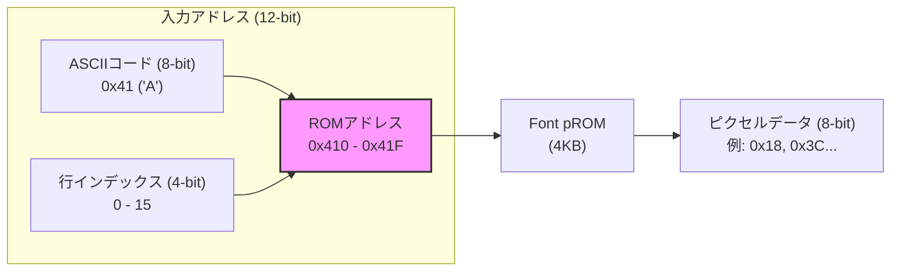
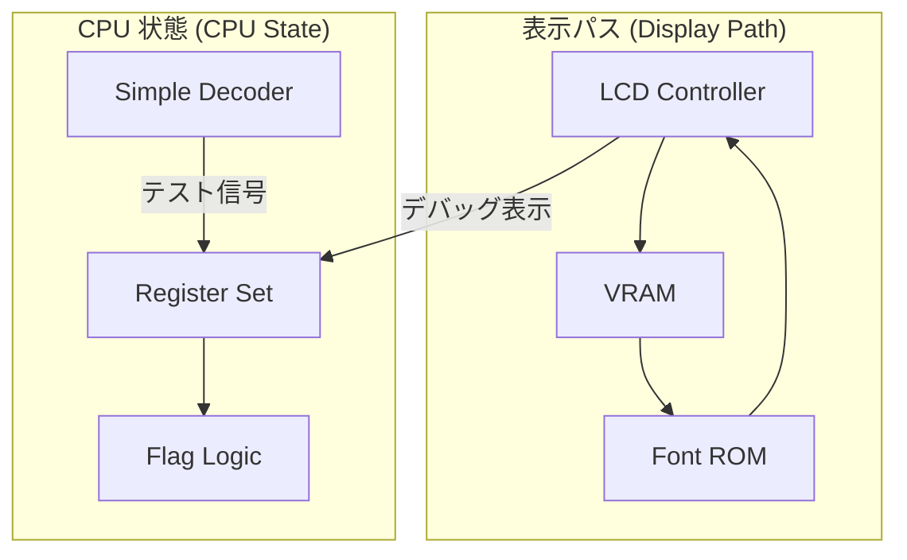
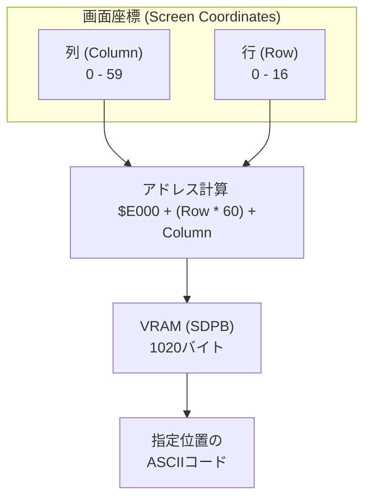

# Day 04: 基盤構築 (LCD 表示とレジスタセット)

---

🌐 対応言語:
[English](./README.md) | [日本語](./README_ja.md)

## 🎯 学習目標

- **LCD パイプライン**: ピクセルが VRAM (**BSRAM/SDPB**) から Font ROM (**pROM**) を経由してパネルへ流れる仕組みを理解する。
- **ハードウェアメモリ**: FPGA 内部リソースである BSRAM を利用した高速なメモリアクセスの基礎。
- **クロック管理**: PLL (Phase Locked Loop) を使用して、LCD 用の 9MHz などの正確な周波数を生成する。
- **6502 レジスタセット**: A, X, Y, SP, PC, およびステータスレジスタ (P) を実装する。
- **命令デコード**: オコードの基本的な分類（Load, Store, Branch など）を行う。

## 📚 理論

### ソフトウェアエンジニアの方へ：マシンへの「窓」

CPU の「脳」である制御ユニットを構築する前に、2 つの重要な基盤を確立する必要があります。

1. **マシンへの「窓」 (LCD)**: CPU が何をしているかを確認するための表示パイプラインを構築します。
2. **内部状態 (レジスタ)**: 6502 がデータやフラグを保持するアーキテクチャ上のレジスタを実装します。

ハードウェア開発では、コンソールに「print」することはできません。LCD コントローラを早期に構築することで、**ハードウェアネイティブなデバッガ**を作成したことになります。このコースの後半では、レジスタや PC の値が手元のボード上でリアルタイムに更新される様子を見ることになります！

### FPGA メモリ: BSRAM (SDPB) と pROM

FPGA 本体にあるロジック（LUT）だけでメモリを作ると、すぐにリソースが枯渇してしまいます。そのため、Tang Nano 9K に搭載されている **BSRAM (Block Static RAM)** という専用のメモリブロックを利用します。

以下の 2 種類のメモリ IP コアを使用します：

1. **VRAM 用の SDPB (Semi-Dual Port Block RAM)**:
    - 一方のポートで **LCD コントローラ** がピクセルを読み出します。
    - もう一方のポートで **CPU** が文字データを書き込みます。
    - この「デュアルポート」アクセスにより、表示タイミングを妨げることなくスムーズな更新が可能になります。

2. **Font ROM 用の pROM (Programmable ROM)**:
    - 電源投入時にフォントパターン（ASCII ビットマップ）があらかじめロードされた状態になります。

### メモリデータフロー

Font ROM は、**「どの文字の (ASCII)」「どの行の (Row)」**ピクセルデータが欲しいかを指定すると、8 ピクセル分のビットマップを返します。

## 💡 コラム：クロックドメインとデュアルポートメモリ

このプロジェクトでは、**2つの異なる時間軸**（クロックドメイン）を扱います。

1. **LCD ドメイン (9MHz):** ピクセルパイプラインは、物理的な LCD パネルの仕様に合わせて正確に 9MHz で動作する必要があります。
2. **CPU ドメイン (システムクロック):** ロジックはメインのシステムクロック（27MHz、またはデバッグ用に低速化したクロック）で動作します。

**ソフトウェアエンジニアのための例え:**
テンポの違う 2 人のドラマーがいると想像してください。
- **LCD ドラマー (9MHz):** 非常に厳格なテンポです。ビートを外すと画面が乱れます。
- **CPU ドラマー (システムクロック):** 速く叩いたり遅く叩いたりできます（デバッグ用に可変）。

**課題:** CPU ドラマーが、LCD ドラマーがシンバルを叩いている瞬間にメモ（データ）を渡そうとしたらどうなるでしょうか？通常のメモリ（シングルポート）では、衝突事故（タイミング違反）が起きてしまいます。

**解決策: デュアルポートメモリ (SDPB)**
SDPB メモリは、**2つの扉がある郵便受け**のような働きをします。
- **扉 A (CPU 側):** CPU は好きな時に手紙を入れます。
- **扉 B (LCD 側):** LCD は好きな時に手紙を取り出します。
ハードウェアが衝突しないように魔法（調停）をかけてくれるため、複雑な排他制御（Mutex など）を考えることなく、自由に読み書きができます。これは FPGA の大きな利点です！

## 💡 「可視化のアーキテクチャ」

Day 04 では、高速な描画パイプラインと CPU のレジスタセットを組み合わせます。

## 🛠️ 実習 1: LCD の駆動

### ステップ

1. **PLL の設定**: IP Core Generator を使用して、27MHz のベースクロックから 9MHz のクロックを生成します。
2. **タイミングジェネレータ**: `lcd.sv` で HSYNC/VSYNC/DEN 信号を作成し、物理パネルを駆動します。
3. **レンダリング**: `lcd_demo.sv` で `vram.sv` (SDPB) と `font_rom.sv` (pROM) を接続し、文字を表示します。

### VRAM の画面レイアウト

VRAM は論理的に **60 列 × 17 行** のグリッド（計 1020 バイト）として管理されています。

## 🛠️ 実習 2: レジスタセット

### ステップ

1. **レジスタ保持**: `cpu_registers.sv` で同期型レジスタファイルを実装します。これには 8 ビットレジスタ (A, X, Y, P) と 16 ビットレジスタ (PC, SP) が含まれます。
2. **フラグ論理**: 演算結果に基づいて Zero (Z)、Negative (N)、Carry (C) フラグを計算するロジックを実装します。
3. **テストベンチ**: `tb_cpu_registers.sv` を使用して、データの書き込みと読み出しが正しく行われ、フラグが期待通りに更新されるかを確認します。

## 📝 課題

### 基礎課題

1. **LCD**: VRAM を使用して LCD 画面に "HELLO FPGA" と表示してください。
2. **レジスタ**: `cpu_registers` モジュールを実装し、シミュレーションテストに合格してください。
3. **統合**: レジスタ（例：A レジスタ）の値を LCD 画面に表示してください。

### 発展課題

1. **スクロール**: VRAM の読み出しアドレスオフセットを変更して、ハードウェアスクロール機能を実装してください。
2. **カーソル**: 点滅するカーソルを表示に追加してください。

## 📚 今日学んだこと

- [ ] FPGA 内部ブロック RAM (BSRAM) の使用方法
- [ ] LCD パネルとのインターフェース方法 (HSYNC/VSYNC)
- [ ] 6502 レジスタセットのアーキテクチャ
- [ ] CPU ステータスフラグ (Zero, Negative) の計算方法

## 🎯 明日の予習

Day 05 では、コア処理ユニットを構築します：

- **ALU (算術論理演算ユニット)**: Day 02 の単純な ALU を超え、完全な CPU 用 ALU へと進化させます。
- **制御ロジック**: 命令を ALU の操作に接続します。
- **実行サイクル**: フェッチ、デコード、実行。
