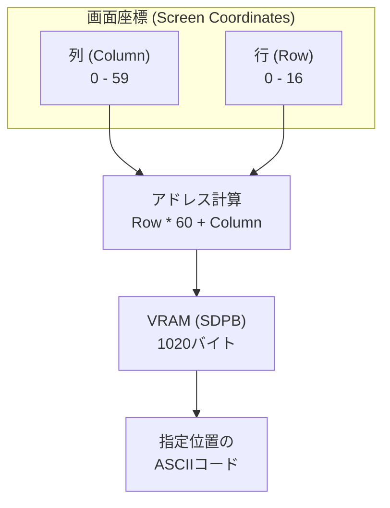
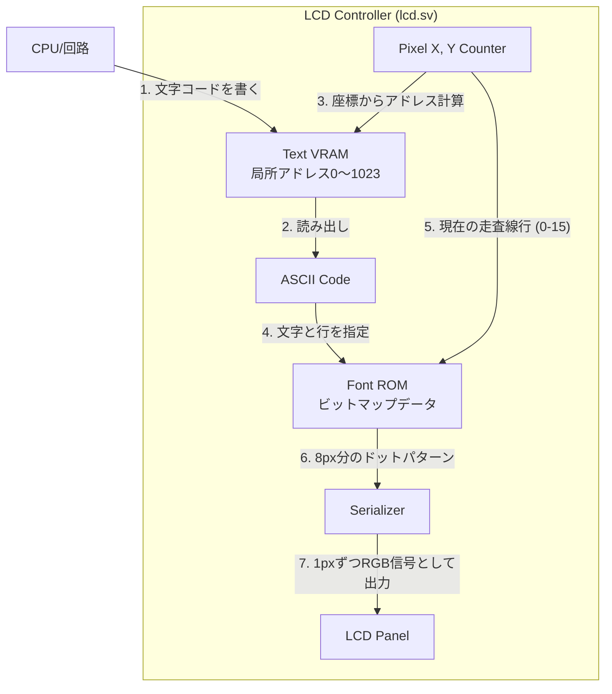

# Day 04: 視覚化基盤 (LCD 表示とメモリマップ)

---

🌐 対応言語:
[English](./README.md) | [日本語](./README_ja.md)

## 実習の見取り図

この Day のスターターで編集します。

| 項目           | 内容                                   |
| -------------- | -------------------------------------- |
| 編集する箇所   | top_core.svでlcd_demoを接続            |
| 提供済みの前提 | LCD、VRAM、font、PLLは提供済み         |
| テストの期待値 | `make sim` でLCDのsmoke確認            |
| 実機で見るもの | VRAM TEXT等の固定デモ文字。CPUは未接続 |

## 📜 概要

これまでは LED という「1 ビット」の情報だけで動作を確認してきました。しかし、これから複雑な CPU を作っていくにあたって、LED だけでは不十分です。

Day 04 では、CPU 開発を強力にサポートする**「デバッグ・ダッシュボード」**として LCD 表示機能を構築します。今日のゴールは固定デモ文字の表示です。CPU の命令・レジスタ表示は後続 Day で接続します。

## 🧠 メモリ構成の注意

Day 04〜09 はプログラム命令を `rom.sv` から供給します（簡易 ROM）。Zero Page/Stack/Program RAM を含む RAM は Day 10 まで使用しません。

## 🎯 学習目標

- **LCD パイプラインの構築**: VRAM (**BSRAM/SDPB**) から Font ROM (**pROM**) を経由してパネルへ文字を表示する流れを完成させる。
- **ハードウェアメモリ**: FPGA 内部リソースである BSRAM を利用した高速なメモリアクセスの基礎。
- **クロック管理**: PLL (Phase Locked Loop) を使用して、LCD 用の 9MHz などの正確な周波数を生成する。
- **メモリマップの理解**: CPU から見たアドレス空間の配置を理解する。
- **VRAM の操作**: メモリ上の特定の場所に文字コードを書くと、画面のどこに表示されるかを学ぶ。

## 💡 メモリマップと VRAM の仕組み

CPU がデータを読み書きする際、どのアドレスがどこのメモリや周辺機器に繋がっているかを示したものを**メモリマップ**と呼びます。本プロジェクトで構築する 6502 システムのメモリマップは以下の通りです。

### このDayのVRAMアドレス

Day04 は CPU 未接続で、初期化回路が VRAM の書込みポートに 0～1023 の局所アドレスを出力します。表示に使うのは先頭 1020 バイトです。CPU のメモリマップは[Day10](../day10/README_ja.md)、CPU からの VRAM 書込みは[Day99](../day99_completed/README_ja.md)で扱います。

### VRAM と LCD の対応関係

LCD 画面（480x272 ピクセル）を 8x16 ピクセルの文字単位で区切ると、**横 60 文字 × 縦 17 文字**を表示できます。VRAM の各アドレスに書き込まれた ASCII 文字コードは、LCD 上の特定の座標に対応しています。

**表示アドレス計算式:**
`VRAMポートのアドレス = 行番号 * 60 + 列番号`

例えば、VRAM ポートのアドレス `0` に `8'h41` (文字 'A') を書き込むと、画面の左上に 'A' が表示されます。


```mermaid
graph TD
    subgraph "画面座標 (Screen Coordinates)"
        C["列 (Column) <br/> 0 - 59"]
        R["行 (Row) <br/> 0 - 16"]
    end
    C --> CALC["アドレス計算 <br/> Row * 60 + Column"]
    R --> CALC
    CALC --> VRAM["VRAM (SDPB) <br/> 1020バイト"]
    VRAM --> OUT["指定位置の <br/> ASCIIコード"]
```

### 文字が表示されるまでの流れ（レンダリングパイプライン）


```mermaid
graph TD
    CPU[CPU/回路] -->|1. 文字コードを書く| VRAM[Text VRAM<br/>局所アドレス0～1023]

    subgraph "LCD Controller (lcd.sv)"
        VRAM -->|2. 読み出し| Code[ASCII Code]
        Coord[Pixel X, Y Counter] -->|3. 座標からアドレス計算| VRAM
        Code -->|4. 文字と行を指定| FontROM[Font ROM<br/>ビットマップデータ]
        Coord -->|"5. 現在の走査線行 (0-15)"| FontROM
        FontROM -->|6. 8px分のドットパターン| Serial[Serializer]
        Serial -->|7. 1pxずつRGB信号として出力| Panel[LCD Panel]
    end
```

## 💡 補足：BSRAM (SDPB) と pROM の活用

FPGA 本体にあるロジック（LUT）だけでメモリを作ると、すぐにリソースが枯渇してしまいます。そのため、Tang Nano に搭載されている**BSRAM (Block Static RAM)**という専用のメモリブロックを利用します。

### 1. SDPB (Semi-Dual Port Block RAM)

VRAM として使用します。一方のポートで LCD が読み出しを行い、もう一方のポートで CPU（または初期化回路）が書き込みを行います。LCD 読み出しポートは 9MHz 画素クロックで駆動され、表示読み出しは画素クロックドメインで完結します（書き込みのみメモリクロックを使用）。情報の衝突を避けながら高速かつ安定した描画が可能です。

### 2. pROM (Programmable ROM)

フォントデータを格納するために使用します。あらかじめ定義されたフォントパターンを FPGA のコンフィグレーションデータに含めます。

## 🛠️ 実習の手順

1. **`lcd_demo.sv` の統合**:
    - `top_core.sv` 内の TODO に従って `lcd_demo` をインスタンス化（モジュール名 `u_demo`）し、クロックや各種 LCD 出力信号を接続します。
2. **デモテキストの表示**:
    - 初期状態で VRAM にいくつかの文字（"VRAM TEXT" 等）が書き込まれるようになっています。これが正しく画面に表示されるか確認します。

### Day 04 の範囲と後続Dayとの違い

Day 04 のスターターでは、`top_core.sv` から `lcd_demo` を接続し、画面表示経路を作ります。ここでは CPU、命令デコーダ、CPU レジスタのデモ回路はまだ接続しません。`lcd_demo.sv` が初期化時に書き込むテキストを LCD に表示できるかを確認します。

CPU レジスタや命令分類 LED を使った低速デモは、後続 Day の `top_core.sv` に追加される別の回路です。Day 04 の LCD 表示が CPU の命令実行やデバッグ情報を表示しているわけではありません。各 Day の実際の接続関係は、その Day の `top_core.sv` と README で確認してください。

**メモリマップについて:**CPU の論理アドレスと VRAM ポートの局所アドレスは別です。Day99 では CPU アドレスをデコードして VRAM に接続します。

## 🛠️ ビルドと検証手順

### 1. シミュレーション (`make sim` または `make test`)

```bash
make sim
# または BOARD=20k で実行
make sim BOARD=20k
```

> [!WARNING]
> **スターターコード実行時の注意（無限ハング防止）**:
> 初期状態の `top_core.sv` では `lcd_demo` がまだインスタンス化されていないため、LCD クロック（`LCD_CLK`）が出力されません。この状態で `make sim` を実行すると、テストベンチがクロックの立ち上がり待ち（`@(posedge LCD_CLK)`）で停止し、**シミュレーションが終了せずハング**します。
> 必ず `top_core.sv` の TODO に従って `lcd_demo` をインスタンス化してから `make sim` を実行してください。

### 2. 実機への書き込み (`make download`)

```bash
# Tang Nano 9K の場合
make BOARD=9k download

# Tang Nano 20K の場合
make BOARD=20k download
```

## 💡 設計のポイント：可視化（見える化）の重要性

ハードウェア開発では、内部で何が起きているかを見ることが非常に困難です。Day 04 でダッシュボードを作ることで、明日以降「CPU の PC（プログラムカウンタ）が本当に動いているか」を自分の目で確認できるようになります。

## 📝 課題

- [ ] `top_core.sv` で `lcd_demo` を正しくインスタンス化し、シミュレーション（`make sim`）で `PASS` することを確認する。
- [ ] 実機に書き込み（`make download`）、LCD にデモ文字が表示されることを確認する。
- [ ] (発展) `lcd_demo.sv` 内の初期化コードを書き換えて、自分の名前を LCD に表示させてみる。

## 📚 今日学んだこと

- [ ] メモリマップの概念
- [ ] VRAM と画面座標の関係
- [ ] 文字表示（フォント ROM）の仕組み

## 🎯 明日の予習

Day 05 から、いよいよ CPU 本体の構築に入ります。
まずプログラム位置を保持する**プログラムカウンタ**とリセット・実行許可を実装します。A/X/Y などの独立レジスタセットは追加練習で、CPU 本体への統合は後の段階です。
