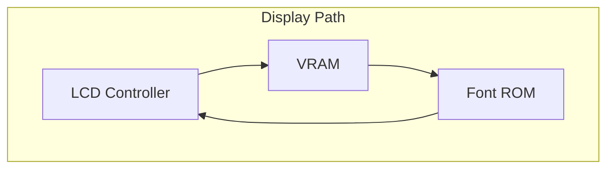
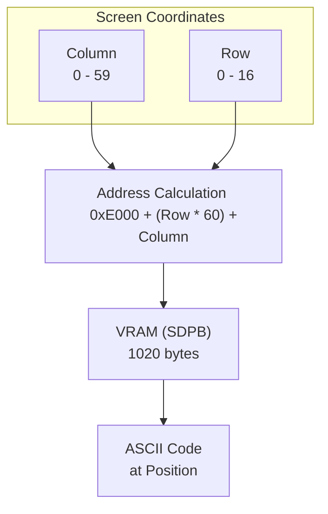

# Day 04: Visual Foundation (LCD Display & Memory Map)

---

🌐 Available languages:
[English](./README.md) | [日本語](./README_ja.md)

## 📜 Overview

In Day 04, we established a critical foundation for CPU development: **A Window into the Machine (LCD)**. By building a display pipeline, we can now visually observe what the CPU is doing inside the FPGA.

## 🎯 Learning Objectives

- **LCD Pipeline**: Understand how pixels flow from VRAM (**BSRAM/SDPB**), through Font ROM (**pROM**), to the Panel.
- **Hardware Memory**: Basics of high-speed memory access using FPGA internal resources (BSRAM).
- **Clock Management**: Use Phase Locked Loops (PLL) to generate precise frequencies (9MHz for LCD).
- **Memory Map**: Understand the layout of the 6502 address space.
- **VRAM Operation**: Learn how writing character codes to specific memory locations corresponds to screen positions.

## 🏗️ Architecture

On Day 04, we combined a fast rendering pipeline with a character-based VRAM.

## 🛠️ Implementation Steps

1. **PLL Setup**: Generate a 9MHz clock from the 27MHz base.
2. **Timing Generator**: Create HSYNC/VSYNC/DEN signals in `lcd.sv`.
3. **Rendering**: Wire `vram.sv` and `font_rom.sv` in `lcd_demo.sv`.

## 💡 Technical Insight: Using BSRAM (SDPB) & pROM

Instead of consuming limited logic resources (LUTs), we use dedicated **BSRAM (Block Static RAM)** available on the Tang Nano.

### 1. SDPB (Semi-Dual Port Block RAM)

Used for the **VRAM**. One port is dedicated to the LCD controller for reading pixels, while the other is used for writing character data. This allows smooth updates without display flickering.

### 2. pROM (Programmable ROM)

Used for the **Font ROM**. It comes pre-loaded with font patterns upon power-up, allowing the hardware to draw glyphs for each ASCII character.

## 🏗️ Memory Data Flow & Layout

### 6502 System Memory Map (used in this Training)

| Address Range | Purpose | Description |
| :--- | :--- | :--- |
| `0x0000 - 0x00FF` | Zero Page | Fast-access 256-byte memory area |
| `0x0100 - 0x01FF` | Stack | Area used by the Stack Pointer (SP) |
| `0x0200 - 0x7FFF` | Free RAM | General-purpose RAM for user programs |
| `0x8000 - 0xDFFF` | Program ROM | Area storing the program code |
| `0xE000 - 0xE3FF` | Text VRAM | Character codes (ASCII) for LCD display (1KB) |
| `0xE400 - 0xFFFF` | I/O / Reserved | Reserved for I/O devices or expansion |

### VRAM Screen Layout

The VRAM is logically organized as a 60 columns × 17 rows grid (1020 bytes total).

## 💡 The "Architecture of Visibility"

In hardware development, you cannot "print" to a console. By building the LCD controller early, you created a hardware-native debugger. Starting from tomorrow, you will see your CPU's internal state updating in real-time on this screen!
