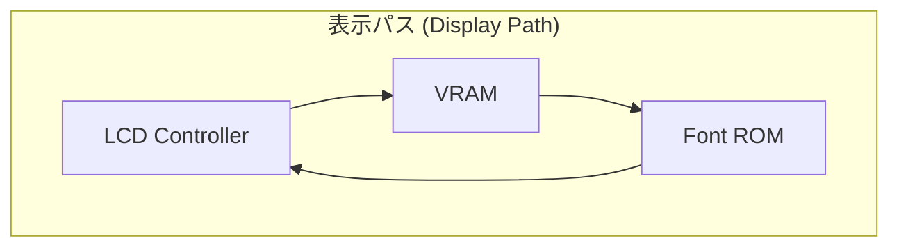
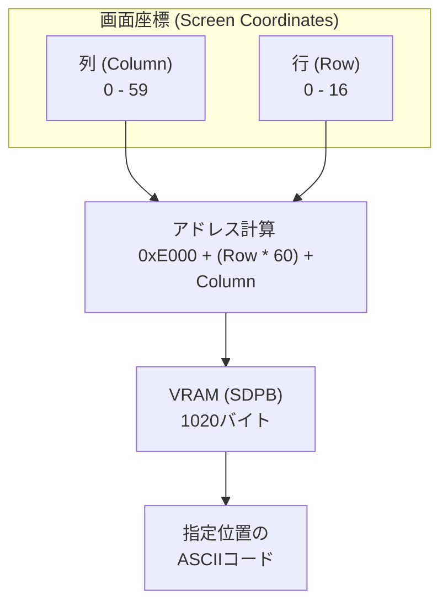

# Day 04: 視覚化基盤 (LCD 表示とメモリマップ)

---

🌐 対応言語:
[English](./README.md) | [日本語](./README_ja.md)

## 📜 概要

Day 04 では、CPU 開発を強力にサポートする **「デバッグ・ダッシュボード」** として LCD 表示機能を構築しました。CPU が内部でどのような状態にあるかをリアルタイムで確認できる環境を整えることがこの日のゴールでした。

## 🧠 メモリ構成の注意

Day 04〜09 はプログラム命令を `rom.sv` から供給します（簡易ROM）。RAM はデータ用で、プログラムを RAM に置く構成は Day 11 以降です。

## 🎯 学習目標

- **LCD パイプライン**: ピクセルが VRAM (**BSRAM/SDPB**) から Font ROM (**pROM**) を経由してパネルへ流れる仕組みを理解する。
- **ハードウェアメモリ**: FPGA 内部リソースである BSRAM を利用した高速なメモリアクセスの基礎。
- **クロック管理**: PLL (Phase Locked Loop) を使用して、LCD 用の 9MHz などの正確な周波数を生成する。
- **メモリマップの理解**: CPU から見たアドレス空間の配置を理解する。
- **VRAM の操作**: メモリ上の特定の場所に文字コードを書くと、画面のどこに表示されるかを学ぶ。

## 🏗️ アーキテクチャ

Day 04 では、高速な描画パイプラインを構築しました。

## 🛠️ 実装ステップ

### パート 1: LCD の駆動

1. **PLL の設定**: 27MHz のベースクロックから 9MHz のクロックを生成。
2. **タイミングジェネレータ**: `lcd.sv` で HSYNC/VSYNC/DEN 信号を作成。
3. **レンダリング**: `lcd_demo.sv` で `vram.sv` と `font_rom.sv` を配線。

### パート 2: デモ用回路（デモシーケンス制御）の統合

`top_core.sv` の下部には、`demo_counter` や `demo_state` といった名前のロジックが含まれています。これらの回路には、教育用ボードとしての「見える化」を支える以下の重要な役割があります。

1. **「仮設の足場」としての機能**: 現時点では CPU がメモリから命令を読み込む機能がまだ完成していません。そのため、このデモ用回路がメモリの代わりに「疑似的な命令（`0xA9` など）」と「データ（`0x55` など）」を各レジスタへ供給し、部品が正しく動くかを確認するための「足場」として機能します。
2. **人間が目で見るための低速化**: 本物の CPU は数 MHz という高速で動きますが、それでは LED の点滅や LCD の数値変化を人間が追うことができません。この回路はあえて約 1.8 秒ごとに状態を切り替えることで、動作を目視で確認できるようにしています。
3. **「ステータス・パネル」としての永続性**: 学習が進み、Day 07 以降で本物の CPU ロジック（`cpu.sv`）が完成した後も、この `demo_` ロジックは `top_core.sv` に残り続けます。これは、高速で動く CPU 本体とは独立して、「命令デコーダが正しく命令を判別できるか」を常に LED でゆっくりとデモンストレーションし続けるための、いわば**「計器盤（ダッシュボード）」**としての役割を果たすためです。

このように、このプロジェクトでは「高速に動く本番の回路」と「動作を目視で確認するための低速なデモ用（計測用）回路」を共存させる手法をとっています。

## 💡 補足：BSRAM (SDPB) と pROM の活用

FPGA 本体にあるロジック（LUT）だけでメモリを作ると、すぐにリソースが枯渇してしまいます。そのため、Tang Nano に搭載されている **BSRAM (Block Static RAM)** という専用のメモリブロックを利用します。

### 1. SDPB (Semi-Dual Port Block RAM)

VRAM として使用します。一方のポートで LCD が読み出しを行い、もう一方のポートで CPU（または初期化回路）が書き込みを行うため、情報の衝突を避けながら高速な描画が可能です。

### 2. pROM (Programmable ROM)

フォントデータを格納するために使用します。あらかじめ定義されたフォントパターンを電源投入時にロードします。

## 🏗️ メモリマップとデータフロー

文字が画面に表示されるまでのデータの流れと、メモリ内でのレイアウトを図解します。

### 実習で使用する 6502 システムのメモリマップ

| アドレス範囲 | 用途 | 説明 |
| :--- | :--- | :--- |
| `0x0000 - 0x00FF` | Zero Page | 高速 8bit アドレッシング, 256B |
| `0x0100 - 0x01FF` | Stack | ハードウェアスタック操作, 256B |
| `0x0200 - 0x7BFF` | Program RAM | メインメモリ (プログラム/データ), 30.5KB |
| `0x7C00 - 0x7FFF` | Shadow VRAM | CPU 読み取り用 VRAM (シャドウ領域), 1KB |
| `0x8000 - 0xDFFF` | (Unmapped) | 将来の拡張用 |
| `0xE000 - 0xE3FF` | Text VRAM | LCD 表示用文字コード (ASCII), 1KB |
| `0xE400 - 0xFFFF` | (Unmapped) | 将来の拡張用 |

### VRAM の画面レイアウト

VRAM は 60 列 × 17 行 のグリッド（計 1020 バイト）として管理されています。例えば、VRAM の開始アドレスを `0xE000` とすると、以下のようにマップされます。

- `0xE000`: 画面左上の文字コード (Column 0, Row 0)
- `0xE3FB`: 画面右下の文字コード (Column 59, Row 16)

## 💡 「可視化のアーキテクチャ」

ハードウェア開発では、コンソールに「print」することはできません。LCD コントローラを早期に構築することで、ハードウェアネイティブなデバッガを作成しました。明日以降、CPU の内部状態がこの画面に表示されることになります！
