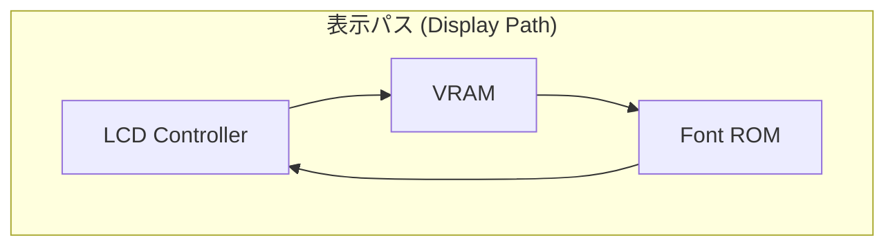
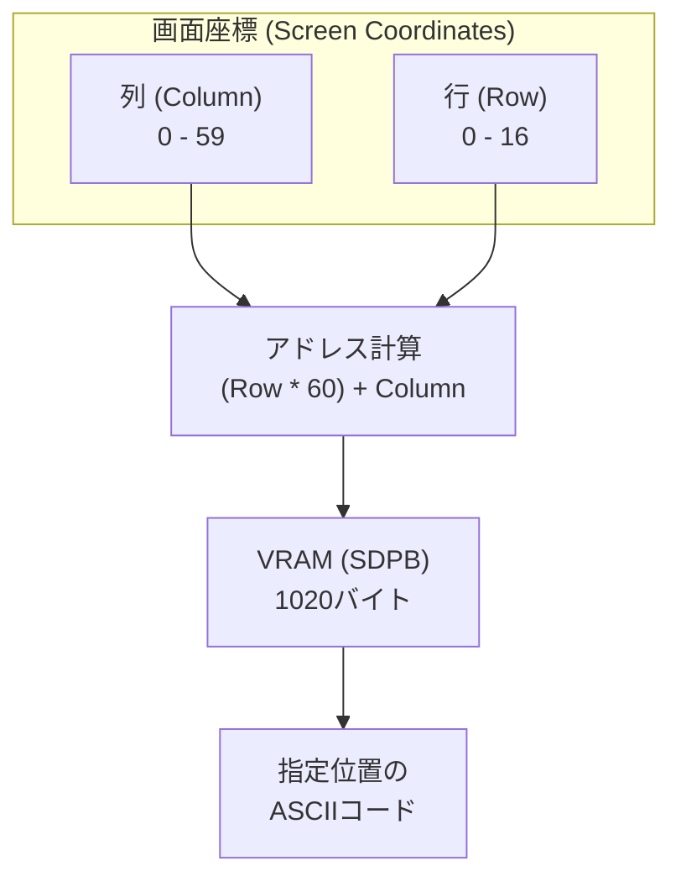

# Day 04: 視覚化基盤 (LCD 表示とメモリマップ)

---

🌐 対応言語:
[English](./README.md) | [日本語](./README_ja.md)

## 実習の見取り図

完成例では下記の課題が実装済みです。

| 項目               | 内容                                   |
| ------------------ | -------------------------------------- |
| 編集する箇所       | top_core.svでlcd_demoを接続            |
| 用意されているもの | LCD、VRAM、フォント、PLL は用意済み    |
| テストの期待値     | `make sim` でLCDの基本的な動作確認     |
| 実機で見るもの     | VRAM TEXT等の固定デモ文字。CPUは未接続 |

## 📜 概要

Day 04 では、CPU 開発を強力にサポートする**「デバッグ・ダッシュボード」**として LCD 表示機能を構築しました。CPU を後続 Day で観測するため、固定デモ文字の表示経路を作ることがこの日のゴールでした。

## 🧠 メモリ構成の注意

Day 04〜09 はプログラム命令を `rom.sv` から供給します（簡易 ROM）。Zero Page/Stack/Program RAM を含む RAM は Day 10 まで使用しません。

## 🎯 学習目標

- **LCD パイプライン**: ピクセルが VRAM (**BSRAM/SDPB**) から Font ROM (**pROM**) を経由してパネルへ流れる仕組みを理解する。
- **ハードウェアメモリ**: FPGA 内部リソースである BSRAM を利用した高速なメモリアクセスの基礎。
- **クロック管理**: PLL (Phase Locked Loop) を使用して、LCD 用の 9MHz などの正確な周波数を生成する。
- **メモリマップの理解**: CPU から見たアドレス空間の配置を理解する。
- **VRAM の操作**: メモリ上の特定の場所に文字コードを書くと、画面のどこに表示されるかを学ぶ。

## 🏗️ アーキテクチャ

Day 04 では、高速な描画パイプラインを構築しました。

```mermaid
graph TD
    subgraph "表示パス (Display Path)"
        LCD[LCD Controller] --> VRAM
        VRAM --> FR[Font ROM]
        FR --> LCD
    end
```

## 🛠️ 実装ステップ

### パート 1: LCD の駆動

1. **PLL の設定**: 27MHz のベースクロックから 9MHz のクロックを生成。
2. **タイミングジェネレータ**: `lcd.sv` で HSYNC/VSYNC/DEN 信号を作成。
3. **レンダリング**: `lcd_demo.sv` で `vram.sv` と `font_rom.sv` を配線。

### パート 2: LCD のみの統合

Day 04 の完成版は LCD 表示パイプラインの構築に集中しています。CPU レジスタやデコーダのデモ回路は後日登場します。

## 💡 補足：BSRAM (SDPB) と pROM の活用

FPGA 本体にあるロジック（LUT）だけでメモリを作ると、すぐにリソースが枯渇してしまいます。そのため、Tang Nano に搭載されている**BSRAM (Block Static RAM)**という専用のメモリブロックを利用します。

### 1. SDPB (Semi-Dual Port Block RAM)

VRAM として使用します。一方のポートを LCD 読み出し、もう一方を初期化回路や CPU の書き込みに使える構成です。同じアドレスへの同時アクセス時の結果はプリミティブ設定に依存するため、この教材では衝突しないアクセス設計を前提にします。
LCD 読み出しポートは 9MHz 画素クロックで駆動され、表示読み出しは画素クロックドメインで完結します（day99/day18 と同じ）。書き込みのみメモリクロックを使用します。

### 2. pROM (Programmable ROM)

フォントデータを格納します。あらかじめ定義されたフォントパターンは FPGA のコンフィグレーションデータに含まれます。

## 🏗️ メモリマップとデータフロー

文字が画面に表示されるまでのデータの流れと、メモリ内でのレイアウトを図解します。

### このDayのVRAMアドレス

CPU は未接続です。VRAM ポートの局所アドレス空間は 0～1023 ですが、初期化回路が書き込むのは 0～1019（可視の 60x17 セル = 1020 バイト）だけです。1020～1023 は未使用です。CPU の配置は[Day10](../day10/README_ja.md)と[Day99](../day99_completed/README_ja.md)を参照してください。

### VRAM の画面レイアウト

VRAM は 60 列 × 17 行のグリッド（計 1020 バイト）として管理されています。VRAM ポートの局所アドレスと画面座標の対応は次のとおりです。

- `0`: 画面左上の文字コード (Column 0, Row 0)
- `1019`: 画面右下の文字コード (Column 59, Row 16)

```mermaid
graph TD
    subgraph "画面座標 (Screen Coordinates)"
        C["列 (Column) <br/> 0 - 59"]
        R["行 (Row) <br/> 0 - 16"]
    end
    C --> CALC["アドレス計算 <br/>  (Row * 60) + Column"]
    R --> CALC
    CALC --> VRAM["VRAM (SDPB) <br/> 1020バイト"]
    VRAM --> OUT["指定位置の <br/> ASCIIコード"]
```

## 💡 「可視化のアーキテクチャ」

ハードウェア開発では、コンソールに「print」することはできません。LCD コントローラを早期に構築することで、ハードウェアネイティブなデバッガを作成しました。明日以降、CPU の内部状態がこの画面に表示されることになります！
