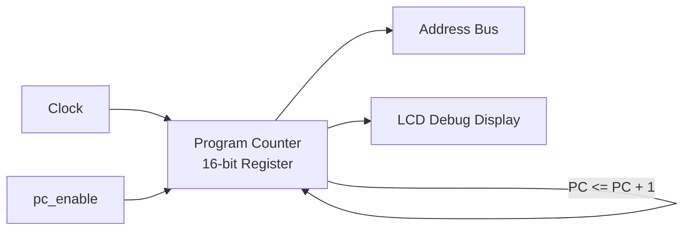

# Day 05: The First Step of CPU (Registers & Program Counter)

---

🌐 Languages:
[English](./README.md) | [日本語](./README_ja.md)

## 📜 Overview

In Day 04, we built an "LCD Debug Dashboard" to support CPU development and learned the concept of Memory Mapping. Now that we have the "eyes" to project the internal state, it is finally time to start building the "body (CPU)" to be displayed on that screen.

In Day 05, we will implement the **"Register Set"** for memory and the **"Program Counter (PC)"** to track the execution flow.

 These are the most fundamental building blocks for an autonomous CPU.

## 🎯 Learning Objectives

- Implement the **6502 Register Set (A, X, Y, SP, P)** as sequential logic.
- Understand the role of the **Program Counter (PC)** and implement it as sequential logic.
- Understand the essence of the **NOP (No Operation) instruction**: "Do nothing, but take one step forward."
- Experience the minimum cycle of automatic execution where the CPU "moves to the next address."

## 💡 Stepping Up: From Day 04 to Day 05

While Day 04 was about building the "Display," Day 05 is about starting to build the "CPU" that will be projected on that screen.

| Item | Day 04 (Visual Foundation) | Day 05 (Starting CPU Design) |
| :--- | :--- | :--- |
| **Main Deliverable** | LCD Rendering Pipeline (VRAM/Font) | **Register Set & PC** |
| **On the Screen** | Fixed Demo Text | **Constantly Updating PC Value** |
| **Learning Focus** | Memory Mapping vs. Display Coordinates | **State Holding & Updating via Sequential Logic** |
| **Purpose** | Building a dashboard for efficiency | Building the "legs" for the CPU to walk on its own |

### Why start with `NOP`?

For software engineers, `NOP` (No Operation) might seem like a "useless instruction that does nothing." However, in hardware design, `NOP` is a crucial concept for verifying the smallest unit of automatic execution: **"Do nothing, but increment the Program Counter by one and move to the next instruction."**

Before automating complex data movements or calculations, we first complete the basic "walk" where the CPU automatically points to the next address every time the clock ticks.

## 🏗️ Architecture

To "walk," the CPU needs a counter to keep track of its current location and decide where to go next.

## 🛠️ Implementation Steps

1. **Implement `cpu_registers.sv`**:
    - Describe A, X, Y, SP, and P registers using `always_ff`.
    - Set initial values during reset (SP=0xFF, P=0x34, etc.).
2. **Implement `cpu.sv`**:
    - Set the PC to the initial value `0x8000` during reset.
    - When `pc_enable` is `1`, increment the PC by `1'b1` on the rising edge of the clock.
3. **Connect in `top_core.sv`**:
    - Instantiate the `cpu` and `cpu_registers` modules.
    - Instead of yesterday's fixed text, connect the PC output of this new `cpu` to the LCD display.
4. **Verify Operation**:
    - Confirm on the LCD that the `PC` value automatically counts up at regular intervals: `8000`, `8001`, `8002`, and so on.

## 📝 Exercises

### Basic Tasks

- [ ] Complete `cpu_registers.sv` and ensure all registers have their specified initial values after reset.
- [ ] Complete `cpu.sv` and verify in simulation that the PC counts up correctly.
- [ ] Integrate both modules into `top_core.sv` and verify the PC value changes on the actual board.

### Advanced Tasks

- [ ] Explain why the 6502's PC is 16 bits in terms of addressable memory capacity.
- [ ] Change the clock division ratio used to generate `pc_enable` and observe how the count-up speed changes.
