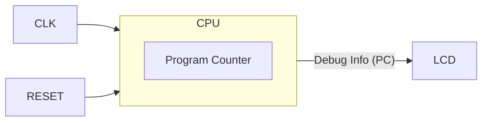

# Day 05: CPU Skeleton & NOP Instruction

---

🌐 Available languages:
[English](./README.md) | [日本語](./README_ja.md)

## 📜 Overview

It's time to start implementing the CPU! The goal of Day 05 is to implement the most fundamental component of a CPU: the **Program Counter (PC)**.

We will connect the CPU's PC value to the LCD display circuit created in Day 04 to visually verify that the PC increments with every clock cycle. This is the "Hello World" of CPU design.

## 🎯 Learning Objectives

- **Create CPU Module**: Create a basic `cpu.sv` file.
- **Program Counter (PC)**: Implement the register that hold the address of the next memory location.
- **Sequential Logic**: Understand how the PC updates on every clock edge.
- **Visual Verification**: Display the PC on the LCD.

## 🏗️ Architecture

The structure is very simple for now.

## 🛠️ Implementation Steps

1. **Create `cpu.sv`**:
    - Inputs: `clk`, `rst_n`
    - Outputs: `address_bus` (16bit), `debug_pc` (16bit)
2. **Implement PC**:
    - Initialize to `0x8000` on reset.
    - Logic: `PC <= PC + 1` whenever enabled.
3. **Integrate into Top Module**:
    - Modify `lcd_demo.sv` to instantiate your `cpu`.
    - Update the VRAM writing logic to display the `debug_pc` value in hexadecimal on the LCD.

## 📘 Concept: What is a Program Counter?

The **Program Counter (PC)** is a register that allows the CPU to remember **"where in memory to read next"**.

**Analogy:**
Think of the PC as a **bookmark** in a book, or the **Instruction Pointer (IP)** if you've done assembly debugging.

1. Read the instruction at the bookmark's location.
2. Do what it says.
3. Move the bookmark to the next line.

In Day 05, we aren't reading from memory yet, but we will implement this basic "move the bookmark forward" behavior and verify it visually.

## 💡 Why start here?

Implementing only the PC allows us to verify the entire toolchain—from SystemVerilog code to FPGA deployment and LCD display—before adding the complexity of instruction decoding.

## 🧪 Verification

- **Simulation**: Confirm `PC` increments: `8000` -> `8001` -> `8002` ...
- **FPGA**: If the PC value appears on the LCD and counts up rapidly, you've succeeded (if it's too fast to read, try displaying the upper bits or dividing the clock).

## 🎯 Preview for Tomorrow

In Day 06, we will breathe more life into our CPU by implementing the **A register** and our first data instruction: **`LDA #imm`**. We will also introduce a **structured architecture** using opcode headers and separate memory modules to make the CPU more scalable.
