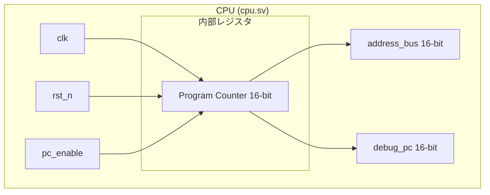
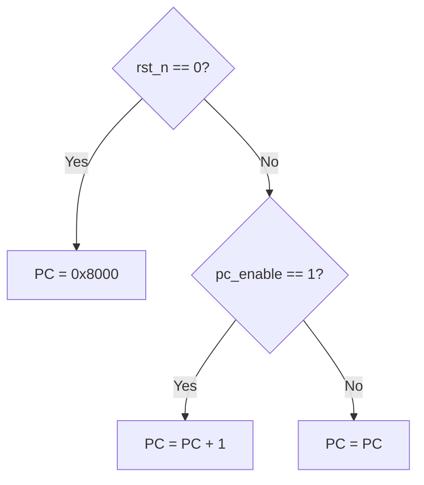
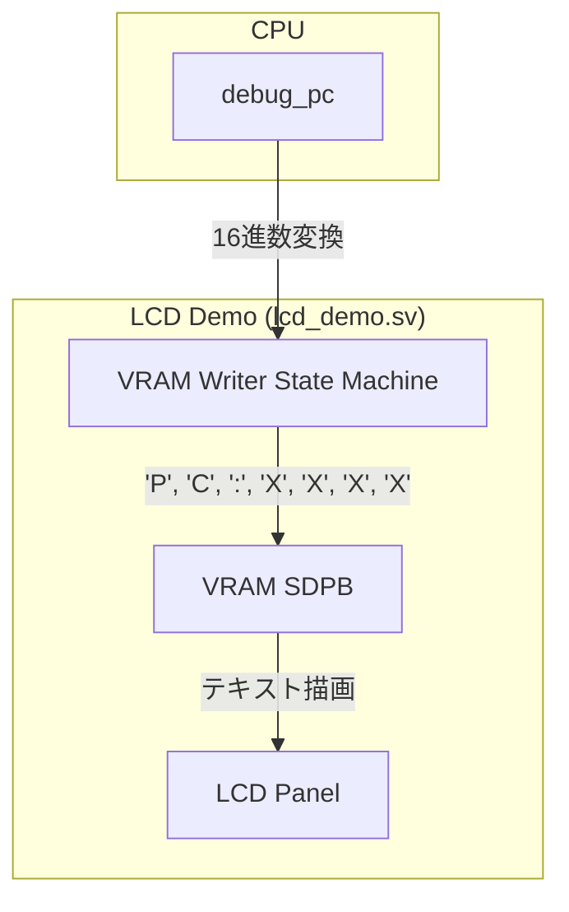

# Day 05: CPU の骨格と NOP 命令

---

🌐 対応言語:
[English](./README.md) | [日本語](./README_ja.md)

## 📜 概要

いよいよ CPU の実装を開始します。Day 05 の目標は、CPU の最も基本的な要素である **プログラムカウンタ (PC)** を実装することです。

Day 04 で作成した LCD 表示回路に CPU の PC の値を接続し、PC がクロックごとにカウントアップしていく様子を視覚的に確認します。これは CPU 自作における「Hello World」に相当します。

## 🔙 復習: Day 04

次に進む前に、以下を理解しているか確認してください:

- **6502 レジスタセット**: A, X, Y, PC, SP, P の役割と構成
- **フラグ計算**: N, Z, C, V フラグが演算結果からどのように導かれるか
- **LCD レンダリング**: VRAM から読み取った文字を画面に表示するパイプライン

## 🎯 学習目標

- **CPU モジュールの作成**: 基本的な `cpu.sv` を作成する。
- **プログラムカウンタ (PC)**: 次のアドレスを保持するレジスタを実装する。
- **順序回路の理解**: クロックに同期して PC が更新される仕組みを理解する。
- **視覚的確認**: PC の値を LCD に表示する。
- **テストのパス**: ロジック検証用テストベンチ (`sim/tb_cpu.sv`) をパスさせる。

## 🏗️ アーキテクチャ

CPU の中身はまだ空っぽですが、すべての動作の基本となるプログラムカウンタ（PC）を中心に構成されます。

## 🛠️ 実装ステップ

### ステップ 1: CPU モジュール (`cpu.sv`) の作成

CPU の最小限のインターフェースと、PC がインクリメントされるロジックを記述します。

1. **PC の初期化**: 6502 は通常 `0xFFFC` から開始しますが、このプロジェクトでは簡略化のため `0x8000` を開始アドレスとします。
2. **PC の更新**: クロックの立ち上がりで、リセット解除かつ `pc_enable` が有効な時に `+1` します。

### ステップ 2: 画面表示 (`lcd_demo.sv`) との統合

CPU の内部状態（`debug_pc`）を LCD に表示するための「デバッグ表示パイプライン」を完成させます。

1. **インスタンス化**: `lcd_demo.sv` の中で `cpu` モジュールを実体化します。
2. **書き込みロジック**: PC の値を 16 進数文字（0-F）に変換し、VRAM の特定のアドレス（画面の端など）に書き込むようにステートマシンを修正します。

## 📘 概念: プログラムカウンタ (PC) とは？

**PC (Program Counter)** は、CPU が **「次にメモリのどこを読むべきか」** を覚えているためのレジスタです。

本に挟んだ **「しおり」** をイメージしてください。

1. しおりのページにある命令を **フェッチ（取り出し）** する。
2. その命令を **実行** する。
3. しおりを次の行（アドレス）に **進める**。

Day 05 ではまだメモリから命令を読みませんが、この「しおりを先に進める」という CPU の心臓部の動作だけを作り、その動きを目で見て確認します。

## 💡 なぜここから始めるのか？

最初は PC のカウントアップだけに絞ることで、SystemVerilog の記述から FPGA への書き込み、そして LCD 表示までのツールチェーン全体が正しく動いているかを、命令解読の複雑さに惑わされずに確認できます。

## 🧪 動作確認

Day 05 以降、**テストベンチ (`day05/sim/`) は完成した状態で提供されています。** 自分で作成したコードの正しさを検証するために活用してください。

- **シミュレーション**: `make sim` を実行します。`PC` が `8000` -> `8001` -> `8002` ... と増えていき、最終的に `PASS` と表示されれば成功です。
- **実機 (FPGA)**: LCD 画面に PC の値が表示され、カウントアップしていれば成功です（速すぎて読めない場合は、上位ビットを表示するように `lcd_demo.sv` を調整してみてください）。

## 🎯 明日の予習

Day 06 では、いよいよデータを操作する最初の命令 **`LDA #imm`** と **A レジスタ** を実装します。また、CPU を拡張しやすくするために、**命令コードの定数化**や**メモリの外部モジュール化**といった、より実践的なアーキテクチャの構造化も導入します。
