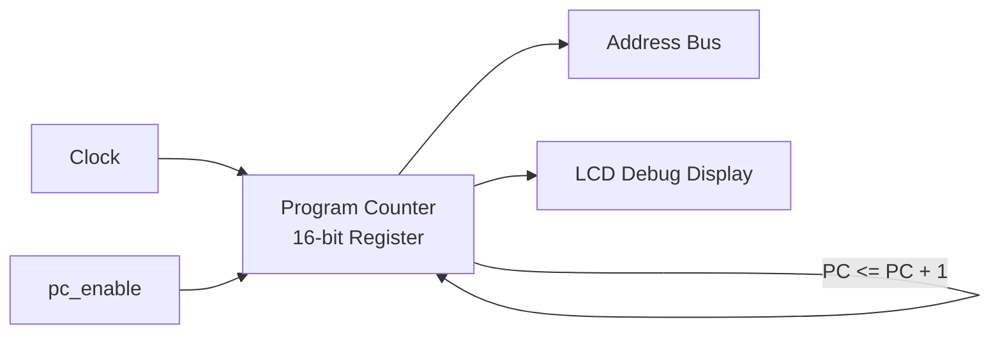

# Day 05: CPU の産声 (レジスタセットとプログラムカウンタ)

---

🌐 対応言語:
[English](./README.md) | [日本語](./README_ja.md)

## 📜 概要

Day 04 では、CPU 開発を支える「デバッグ・ダッシュボード」として LCD 表示機能を構築し、メモリマップの概念を学びました。内部の状態を映し出す「目」が完成した今、いよいよその画面に映し出すための「体（CPU）」を作り始めます。

Day 05 では、CPU が情報を記憶するための **「レジスタセット」** と、次に実行する命令の場所を指し示す **「プログラムカウンタ (PC)」** を実装します。

これらは、CPU が自立して動作するための最も基礎的な部品です。

## 🎯 学習目標

- **6502 内部レジスタセット (A, X, Y, SP, P)** を順序回路として実装する。
- **プログラムカウンタ (PC)** の役割を理解し、順序回路として実装する。
- **NOP (No Operation) 命令** の本質（「何もしないが、一歩進む」）を理解する。
- CPU が「次のアドレスへ進む」という自動実行の最小サイクルを体験する。

## 💡 Day 04 から Day 05 へのステップアップ

Day 04 では「表示機能」を作りましたが、Day 05 ではその画面に映し出す「中身（CPU）」を作り始めます。

| 項目 | Day 04 (視覚化基盤) | Day 05 (CPU 設計の開始) |
| :--- | :--- | :--- |
| **主な成果物** | LCD 表示パイプライン (VRAM/Font) | **レジスタセット & PC** |
| **画面に映るもの** | 固定のデモテキスト | **動き続ける PC の値** |
| **学習の焦点** | メモリマップと表示座標の関係 | **順序回路による状態の保持と更新** |
| **目的** | 開発効率を上げる計器盤の構築 | CPU が自ら歩き出すための「足」を作る |

### なぜ `NOP` から始めるのか？

ソフトウェアエンジニアにとって、`NOP` (No Operation) は「何もしない無駄な命令」に見えるかもしれません。しかし、ハードウェア設計において、`NOP` は **「何もしないが、プログラムカウンタを 1 つ進め、次の命令へ移る」** という、自動実行の最小単位を検証するための極めて重要な概念です。

いきなりデータの移動や演算を自動化する前に、まずは「クロックが刻まれるたびに、CPU が自動的に次のアドレスを指し示す」という、基本的な「歩み」を完成させます。

## 🏗️ アーキテクチャ

CPU が「歩く」ために必要なのは、今どこにいるかを記録し、次へ進むためのカウンタです。

## 🛠️ 実習の手順

1. **`cpu_registers.sv` の実装**:
    - A, X, Y, SP, P レジスタを `always_ff` で記述する。
    - リセット時の初期値を設定する（SP=0xFF, P=0x34 など）。
2. **`cpu.sv` の実装**:
    - リセット時に PC を初期値 `0x8000` に設定する。
    - `pc_enable` が `1` のとき、クロックの立ち上がりで PC を `+ 1'b1` インクリメントする。
3. **`top_core.sv` での接続**:
    - `cpu` モジュールと `cpu_registers` をインスタンス化する。
    - 昨日の固定テキストの代わりに、この新しい `cpu` の PC 出力を LCD 表示に接続する。
4. **動作確認**:
    - LCD 上の `PC` の値が、一定間隔で `8000`, `8001`, `8002`... と自動でカウントアップしていくことを確認する。

## 📝 課題

### 基礎課題

- [ ] `cpu_registers.sv` を完成させ、リセット後の各レジスタが規定の初期値になるようにする。
- [ ] `cpu.sv` を完成させ、シミュレーションで PC が正しくカウントアップすることを確認する。
- [ ] `top_core.sv` に各モジュールを正しく組み込み、実機で PC の値が変化することを確認する。

### 発展課題

- [ ] なぜ 6502 の PC は 16 ビットなのか、扱えるメモリ容量の観点から説明せよ。
- [ ] `pc_enable` を生成している分周比を変えて、カウントアップの速度を変化させてみよ。
