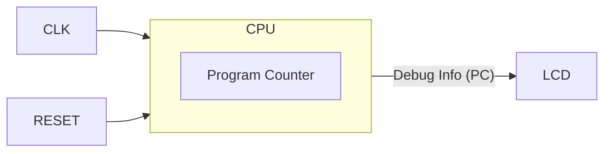

# Day 05: CPU の骨格と NOP 命令

---

🌐 対応言語:
[English](./README.md) | [日本語](./README_ja.md)

## 📜 概要

いよいよ CPU の実装を開始します。Day 05 の目標は、CPU の最も基本的な要素である **プログラムカウンタ (PC)** を実装することです。

Day 04 で作成した LCD 表示回路に CPU の PC の値を接続し、PC がクロックごとにカウントアップしていく様子を視覚的に確認します。これは CPU 自作における「Hello World」に相当します。

## 🎯 学習目標

- **CPU モジュールの作成**: 基本的な `cpu.sv` を作成する。
- **プログラムカウンタ (PC)**: 次のアドレスを保持するレジスタを実装する。
- **順序回路の理解**: クロックに同期して PC が更新される仕組みを理解する。
- **視覚的確認**: PC の値を LCD に表示する。

## 🏗️ アーキテクチャ

今回は非常にシンプルです。

## 🛠️ 実装ステップ

1. **`cpu.sv` の作成**:
    - 入力: `clk`, `rst_n`
    - 出力: `address_bus` (16bit), `debug_pc` (16bit)
2. **PC の実装**:
    - リセット時に `0x8000` に初期化。
    - イネーブル信号が有効なときに `PC <= PC + 1` するロジックを記述。
3. **トップモジュールへの統合**:
    - `lcd_demo.sv` を改造し、作成した `cpu` インスタンスを接続。
    - LCD の画面上に `debug_pc` の値を 16 進数で表示するように `vram` への書き込みロジックを修正。

## 📘 概念: プログラムカウンタ (PC) とは？

**PC (Program Counter)** は、CPU が **「次にメモリのどこを読むべきか」** を覚えているためのレジスタ（記憶場所）です。

**わかりやすい例え:**
PC は、本に挟んだ **「しおり（ブックマーク）」** だと思ってください。あるいは、アセンブリデバッグをしたことがあるなら **インストラクションポインタ (IP)** そのものです。

1. しおりのページにある命令を読む。
2. その命令を実行する。
3. しおりを次の行（アドレス）に進める。

Day 05 ではまだメモリを読みませんが、この基本的な「しおりを先に進める」動作だけを作り、その動きを目で見て確認します。

## 💡 なぜここから始めるのか？

最初は PC のカウントアップだけに絞ることで、SystemVerilog の記述から FPGA への書き込み、そして LCD 表示までのツールチェーン全体が正しく動いているかを、命令解読の複雑さに惑わされずに確認できます。

## 🧪 動作確認

- **シミュレーション**: `PC` が `8000` -> `8001` -> `8002` ... と増えていくことを確認。
- **実機 (FPGA)**: LCD 画面に PC の値が表示され、猛烈な勢いでカウントアップしていれば成功です（速すぎて読めない場合は、クロックを分周するか、上位ビットを表示してみてください）。

## 🎯 明日の予習

Day 06 では、いよいよデータを操作する最初の命令 **`LDA #imm`** と **A レジスタ** を実装します。また、CPU を拡張しやすくするために、**命令コードの定数化**や**メモリの外部モジュール化**といった、より実践的なアーキテクチャの構造化も導入します。
