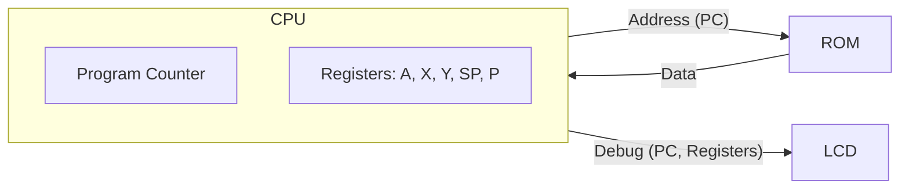

# Day 05: The First Step of CPU (Registers & Program Counter)

---

🌐 Available languages:
[English](./README.md) | [日本語](./日本語/README_ja.md)

## 📜 Overview

In Day 04, we built an "LCD Debug Dashboard" to support CPU development and learned the concept of Memory Mapping. Now that we have the "eyes" to project the internal state, it is finally time to start building the "body (CPU)" to be displayed on that screen.

Implementation of the CPU has begun! The goal of Day 05 was to

 implement the most fundamental elements of a CPU: the **Register Set** and the **Program Counter (PC)**, and to execute the **`NOP`** (No Operation) instruction.

We connected the CPU's internal state to the LCD display circuit built on Day 04 to visually verify that the PC increments with every clock cycle.

## 🎯 Learning Objectives

- **Implement 6502 Register Set**: Create `cpu_registers.sv` to hold the A, X, Y, SP, and P registers.
- **Program Counter (PC)**: Implement a 16-bit register that holds the address of the next instruction.
- **Automated Execution Cycle**: Build the basic cycle of incrementing the PC in preparation for fetching instructions from memory.
- **Understand NOP**: Experience the minimum unit of automatic execution: "Do nothing, but take one step forward."

## 🏗️ Architecture

We defined the "Memory" and "Location" of the CPU.

## 🛠️ Implementation Summary

1. **Implement `cpu_registers.sv`**:
    - Described a synchronous register file using `always_ff`.
    - Set reset values: SP=0xFF, PC=0x8000, P=0x34.
2. **Implement `cpu.sv`**:
    - Wrote logic to increment the PC by `1'b1` synchronized with the `pc_enable` signal.
3. **Integration in `top_core.sv`**:
    - Instantiated and connected `cpu` and `cpu_registers`.
    - Updated the LCD to display PC and register values.

## 💡 Technical Insight: Why NOP?

While `NOP` (No Operation) does nothing, for the CPU, it involves the fundamental cycle of "Fetch -> Decode -> Increment PC". Once this works, the "legs" of your CPU are ready to walk.

## 🧪 Verification

- **Simulation**: Confirm `PC` increments: `8000` -> `8001` -> `8002` ...
- **FPGA**: Verify that the PC value appears on the LCD and counts up automatically.

## 🎯 Preview for Tomorrow

On Day 06, we will implement the first real instruction that manipulates data: `LDA #imm`. We will focus on the **Instruction Decoder** to understand opcode meanings and the **Flag Calculator** to evaluate operation results.
