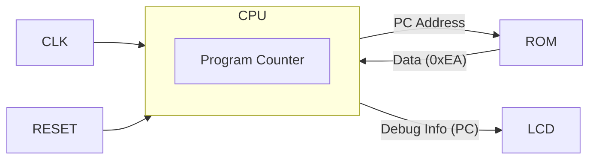

# Day 05: CPU Skeleton & NOP Instruction

---

🌐 Available languages:
[English](./README.md) | [日本語](./README_ja.md)

## 📜 Overview

It's time to start implementing the CPU! The goal of Day 05 is to implement the most fundamental component of a CPU, the **Program Counter (PC)**, and execute the **`NOP`** (No Operation) instruction.

We will connect the CPU's PC value to the LCD display circuit created in Day 04 to visually verify that the PC increments with every clock cycle.

## 🎯 Learning Objectives

- **Create CPU Module**: Create a new `cpu.sv` file accepting clock and reset inputs.
- **Program Counter (PC)**: Implement the register that holds the address of the next instruction.
- **Instruction Fetch**: Build the mechanism to read instruction codes from memory (ROM).
- **NOP Instruction**: Decode opcode `0xEA` (NOP) and increment the PC.

## 🏗️ Architecture

The structure is very simple for now.

## 🛠️ Implementation Steps

1. **Create `cpu.sv`**:
    - Inputs: `clk`, `reset`
    - Outputs: `address_bus` (16bit), `data_in` (8bit, input), `debug_pc` (16bit, for LCD)
2. **Implement PC**:
    - Initialize to `0x8000` (or your preferred entry point) on reset.
    - Logic: `PC <= PC + 1` on every clock cycle.
3. **Integrate into Top Module**:
    - Modify `lcd_demo.sv` to instantiate your `cpu`.
    - Update the VRAM writing logic to display the `debug_pc` value in hexadecimal on the LCD.

## 💡 Why NOP?

`NOP` (No Operation) does nothing, but for the CPU, it involves the fundamental cycle of "Fetch Instruction -> Decode -> Increment PC". Once this works, the heart of your CPU has started beating.

## 🧪 Verification

- **Simulation**: Confirm `PC` increments: `8000` -> `8001` -> `8002` ...
- **FPGA**: If the PC value appears on the LCD and counts up rapidly, you've succeeded (if it's too fast to read, try displaying the upper bits or dividing the clock).

## 🎯 Preview for Tomorrow

In Day 06, we will implement our first real instruction that manipulates data: `LDA #imm` (Load Accumulator with Immediate Value). This will involve adding the **A register** and handling instruction operands.
