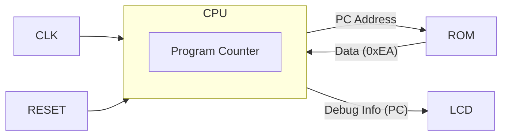

# Day 05: CPUの骨格とNOP命令

---

🌐 対応言語:
[English](./README.md) | [日本語](./README_ja.md)

## 📜 概要

いよいよ CPU の実装を開始します。Day 05 の目標は、CPU の最も基本的な要素である **プログラムカウンタ (PC)** を実装し、何もしない命令 **`NOP`** (No Operation) を実行させることです。

Day 04 で作成した LCD 表示回路に CPU の PC の値を接続し、PC がクロックごとにカウントアップしていく様子を視覚的に確認します。

## 🎯 学習目標

- **CPU モジュールの作成**: `cpu.sv` を新規作成し、クロックとリセットを入力として受け取る。
- **プログラムカウンタ (PC)**: 次に実行する命令のアドレスを保持するレジスタを実装する。
- **命令フェッチ**: メモリ（ROM）から命令コードを読み出す仕組みを作る。
- **NOP 命令**: オペコード `0xEA` (NOP) を解釈し、PC をインクリメントする。

## 🏗️ アーキテクチャ

今回は非常にシンプルです。

## 🛠️ 実装ステップ

1.  **`cpu.sv` の作成**:
    -   入力: `clk`, `reset`
    -   出力: `address_bus` (16bit), `data_in` (8bit, 入力), `debug_pc` (16bit, LCD用)
2.  **PC の実装**:
    -   リセット時に `0x8000` (または任意のエントリポイント) に初期化。
    -   クロックごとに `PC <= PC + 1` するロジックを記述。
3.  **トップモジュールへの統合**:
    -   `lcd_demo.sv` を改造し、作成した `cpu` インスタンスを接続。
    -   LCD の画面上に `debug_pc` の値を 16進数で表示するように `vram` への書き込みロジックを修正。

## 💡 解説: なぜ NOP なのか？

`NOP` (No Operation) は「何もしない」命令ですが、CPU にとっては「命令をフェッチし、解読し、PC を進める」という基本的なサイクルを回す重要な動作です。これが動けば、CPU の心臓部が動き出したことになります。

## 🧪 動作確認

-   **シミュレーション**: `PC` が `8000` -> `8001` -> `8002` ... と増えていくことを確認。
-   **実機 (FPGA)**: LCD 画面に PC の値が表示され、猛烈な勢いでカウントアップしていれば成功です（速すぎて読めない場合は、クロックを分周するか、上位ビットを表示してみてください）。

## 🎯 明日の予習

Day 06 では、いよいよデータを操作する最初の命令 `LDA #imm` (Load Accumulator with Immediate Value) を実装します。**Aレジスタ** の追加や、命令のオペランドの扱いなどがテーマになります。
