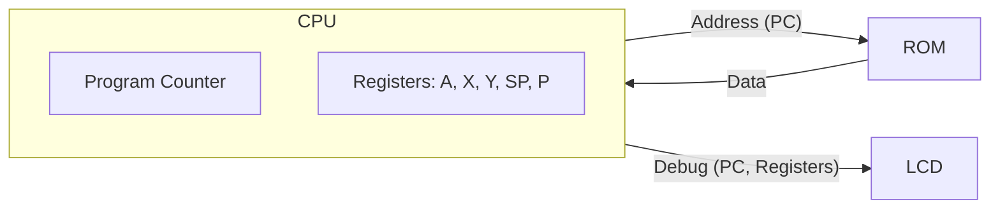

# Day 05: CPU の産声 (レジスタセットとプログラムカウンタ)

---

🌐 対応言語:
[English](./README.md) | [日本語](./README_ja.md)

## 📜 概要

Day 04 では、CPU 開発を支える「デバッグ・ダッシュボード」として LCD 表示機能を構築し、メモリマップの概念を学びました。内部の状態を映し出す「目」が完成した今、いよいよその画面に映し出すための「体（CPU）」を作り始めます。

Day 05 の目標は、CPU の最も基本的な要素である **レジスタセット** と **プログラムカウンタ (PC)** を実装し、何もしない命令 **`NOP`** (No Operation) を実行させることです。

Day 04 で作成した LCD 表示回路に CPU の内部状態を接続し、PC がクロックごとにカウントアップしていく様子を視覚的に確認します。

## 🎯 学習目標

- **6502 レジスタセットの実装**: A, X, Y, SP, P レジスタを保持する `cpu_registers.sv` を作成する。
- **プログラムカウンタ (PC)**: 次に実行する命令のアドレスを保持する 16 ビットレジスタを実装する。
- **自動実行サイクル**: メモリから命令を読み出す準備として、PC をインクリメントする基本サイクルを構築する。
- **NOP 命令の理解**: 「何もしないが、一歩進む」という自動実行の最小単位を体験する。

## 🏗️ アーキテクチャ

今回は、CPU の「記憶」と「場所」を定義しました。

## 🛠️ 実習の内容

1. **`cpu_registers.sv` の実装**:
    - `always_ff` ブロックを用いて同期型レジスタファイルを記述。
    - リセット値の設定: SP=0xFF, PC=0x8000, P=0x34。
2. **`cpu.sv` の実装**:
    - `pc_enable` 信号に同期して PC を `+ 1'b1` するロジックを記述。
3. **トップモジュールへの統合**:
    - `top_core.sv` で `cpu` と `cpu_registers` を接続。
    - LCD の画面上に PC や各レジスタの値を表示。

## 💡 解説: なぜ NOP なのか？

`NOP` (No Operation) は「何もしない」命令ですが、CPU にとっては「命令をフェッチし、解読し、PC を進める」という基本的なサイクルを回す重要な動作です。これが動けば、CPU の「足腰」が完成したことになります。

## 🧪 動作確認

- **シミュレーション**: `PC` が `8000` -> `8001` -> `8002` ... と増えていくことを確認。
- **実機 (FPGA)**: LCD 画面に PC の値が表示され、自動でカウントアップしていれば成功です。

## 🎯 明日の予習

Day 06 では、いよいよデータを操作する最初の命令 `LDA #imm` を実装します。命令の意味を理解するための **デコーダ** と、演算結果を判定する **フラグ計算** がテーマになります。
