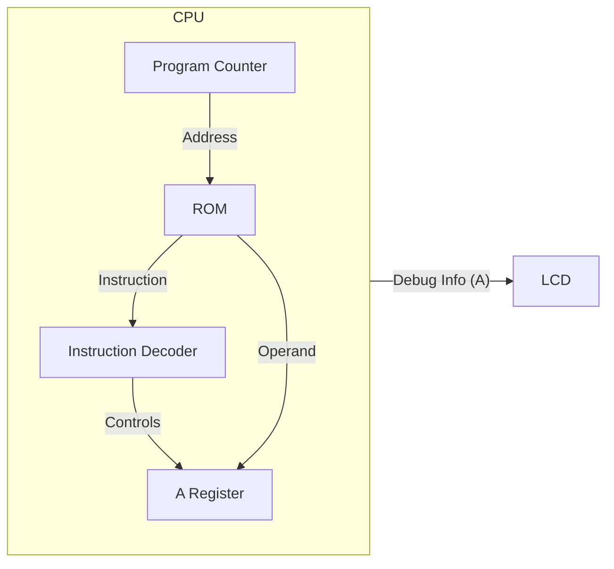

# Day 06: Memory Access & LDA Instruction

---

🌐 Available languages:
[English](./README.md) | [日本語](./README_ja.md)

## 📜 Overview

In Day 06, we will breathe more life into our CPU by implementing its first data-handling instruction: **`LDA #imm`** (Load Accumulator with Immediate value). This involves adding the **Accumulator (A register)**, one of the most important registers in the 6502.

We will also implement the logic to fetch an 8-bit _operand_ that follows the instruction code in memory.

## 🔙 Review: Day 05

Before proceeding, make sure you understand:

- **Program Counter (PC)**: Holds the address of the next instruction
- **Sequential Logic**: `always_ff @(posedge clk)` for clock-synchronized updates
- **LCD Display**: How to output debug information to the display

## 🎯 Learning Objectives

- **Implement the Accumulator (A)**: Add the primary 8-bit register for arithmetic and logic operations.
- **Architectural Structure**: Introduce `opcodes.svh` for symbolic instruction names and `rom.sv` for memory separation.
- **Instruction Fetch & Decode**: Implement a state machine to fetch opcodes and operands independently.
- **Handle `LDA #imm` & `NOP`**: Decode and execute basic instructions using the new structure.
- **Visualize on LCD**: Display both `PC` and `A` register values.

## 🏗️ Architecture

We add the A register and a simple state machine to manage the multi-cycle instruction fetch.

## 🛠️ Implementation Steps

1. **Define Opcodes**:
    - Create `include/opcodes.svh` and define `OP_LDA_IMM = 8'hA9` and `OP_NOP = 8'hEA`.
    - This improves code readability as we add more instructions.
2. **Separate Memory (ROM)**:
    - Create `rom.sv` to handle instruction storage, separating it from CPU logic.
3. **Implement CPU State Machine**:
    - Introduce states like `STATE_FETCH_OPCODE` and `STATE_FETCH_OPERAND` in `cpu.sv`.
    - Fetch `data_in` from the new ROM module.
4. **Update LCD Display**:
    - Add `debug_a` output and update the display logic to show `PC: XXXX A: XX`.

## 💡 What is "Immediate Addressing"?

"Immediate" means the data the instruction needs is located _immediately_ after the instruction code in memory.

Example in memory:

- Address `0x8000`: `0xA9` (LDA #imm instruction)
- Address `0x8001`: `0x42` (The value to load)

When this is executed, the A register will contain the value `0x42`.

## 🧪 Verification

- **Test Program**: Create a simple ROM that contains `A9 42` (LDA #$42). You can add `EA` (NOP) instructions after it.
- **Simulation**: Verify that after two clock cycles, the `A` register holds the value `0x42`.
- **FPGA**: Check the LCD. It should display "A: 42" (or whatever value you chose). The PC should stop incrementing after fetching the operand, or continue if you have more instructions.

## 🎯 Preview for Tomorrow

In Day 07, we will add the **X and Y index registers** and implement instructions to transfer data between registers, such as `TAX` (Transfer A to X).
