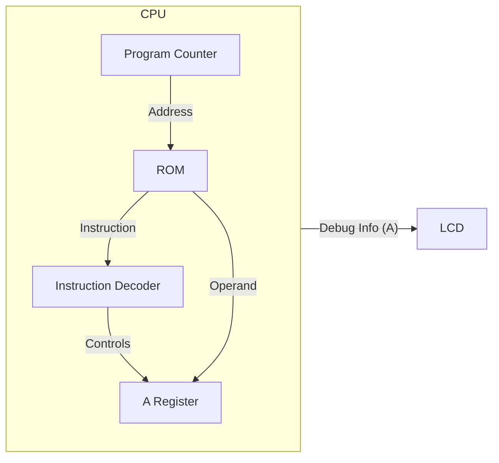

# Day 06: Memory Access & LDA Instruction

---

🌐 Available languages:
[English](./README.md) | [日本語](./README_ja.md)

## 📜 Overview

In Day 06, we will breathe more life into our CPU by implementing its first data-handling instruction: **`LDA #imm`** (Load Accumulator with Immediate value). This involves adding the **Accumulator (A register)**, one of the most important registers in the 6502.

We will also implement the logic to fetch an 8-bit _operand_ that follows the instruction code in memory.

## 🔙 Review: Day 05

Before proceeding, make sure you understand:

- **Program Counter (PC)**: Holds the address of the next instruction
- **Sequential Logic**: `always_ff @(posedge clk)` for clock-synchronized updates
- **LCD Display**: How to output debug information to the display

## 🎯 Learning Objectives

- **Implement the Accumulator (A)**: Add the primary 8-bit register for arithmetic and logic operations.
- **Architectural Structure**: Introduce `opcodes.svh` for symbolic instruction names and `rom.sv` for memory separation.
- **Instruction Fetch & Decode**: Implement a state machine to fetch opcodes and operands independently.
- **Handle `LDA #imm` & `NOP`**: Decode and execute basic instructions using the new structure.
- **Visualize on LCD**: Display both `PC` and `A` register values.

## 🏗️ Architecture

We add the A register and a simple state machine to manage the multi-cycle instruction fetch.

## 🛠️ Implementation Steps

1. **Define Opcodes**:
    - Create `include/opcodes.svh` and define `OP_LDA_IMM = 8'hA9` and `OP_NOP = 8'hEA`.
    - This improves code readability as we add more instructions.
2. **Separate Memory (ROM)**:
    - Create `rom.sv` to handle instruction storage, separating it from CPU logic.
3. **Implement CPU State Machine**:
    - Introduce states like `STATE_FETCH_OPCODE` and `STATE_FETCH_OPERAND` in `cpu.sv`.
    - Fetch `data_in` from the new ROM module.
4. **Update LCD Display**:
    - Add `debug_a` output and update the display logic to show `PC: XXXX A: XX`.

## 📘 Fundamentals: Machine Code & Mnemonics

For software engineers, the relationship between Assembly and Machine Code might be a bit opaque at first.

### 1. Mnemonics vs. Machine Code

The code we write is called **Assembly Language**, which uses human-readable **Mnemonics**.
However, the CPU cannot understand this directly. It only understands **Machine Code**, which is just a sequence of numbers.

**Analogy:**

- **Assembly** is like your C++ or Python source code. It's for humans.
- **Machine Code** is like the compiled `.exe` or `.pyc` bytecode. It's for the machine.
- **Assembler** is the compiler that translates one to the other.

| Language         | Example    | Description                                      |
| :--------------- | :--------- | :----------------------------------------------- |
| **Assembly**     | `LDA #$A9` | For humans. Means "Load value into Accumulator". |
| **Machine Code** | `A9 42`    | For CPU. A sequence of hex bytes.                |

In this course, we will write machine code by hand (hand-assembly) to truly understand what the CPU sees.

### 2. Instruction Length (1-byte vs 2-byte)

Machine code instructions can be 1 byte long or take multiple bytes if they need data (operands).

- **1-byte Instruction (e.g., NOP)**

  - Just `EA`.
  - Means "No Operation", so no extra data is needed.

- **2-byte Instruction (e.g., LDA #imm)**
  - Uses 2 bytes like `A9 42`.
  - 1st byte `A9` is the **Opcode** (Operation Code) telling the CPU "We are about to do a Load!".
  - 2nd byte `42` is the **Operand**, the actual value to load.

## 📘 Architecture Deep Dive: How PC Works

The Program Counter (PC) is not just a counter; it is the **conductor** of the CPU.
It points to "where in memory the next instruction is located."

Let's trace how PC changes when executing `LDA #$42` (Machine Code: `A9 42`).

1. **Fetch Opcode**

    - PC points to `8000`.
    - CPU reads **`A9`** from memory address `8000`.
    - CPU decodes `A9`, understands "This is LDA! I need data next."
    - PC moves to `8001`.

2. **Fetch Operand**
    - PC points to `8001`.
    - CPU reads **`42`** from memory address `8001`.
    - CPU puts this `42` into the A Register.
    - PC moves to `8002`, ready for the next instruction.

In this way, the PC advances step-by-step, reading machine code from memory, which the CPU then interprets and executes. This is the fundamental operating principle of computers.

## 💡 What is "Immediate Addressing"?

"Immediate" means the data the instruction needs is located _immediately_ after the instruction code in memory.

Example in memory:

- Address `0x8000`: `0xA9` (LDA #imm instruction)
- Address `0x8001`: `0x42` (The value to load)

When this is executed, the A register will contain the value `0x42`.

## 🧪 Verification

Starting from Day 05, **the testbench (`day06/sim/`) is provided in a complete state.** Use it to verify the correctness of your implementation.

- **Test Program**: Create a simple ROM containing `A9 42` (LDA #$42).
- **Simulation**: Run `make sim`. Success is achieved if the `A` register holds `0x42` after two clock cycles and the simulation outputs `PASS`.
- **FPGA**: Check the LCD. It should display "A: 42" (or your chosen value).

## 🎯 Preview for Tomorrow

In Day 07, we will add the **X and Y index registers** and implement instructions to transfer data between registers, such as `TAX` (Transfer A to X).
