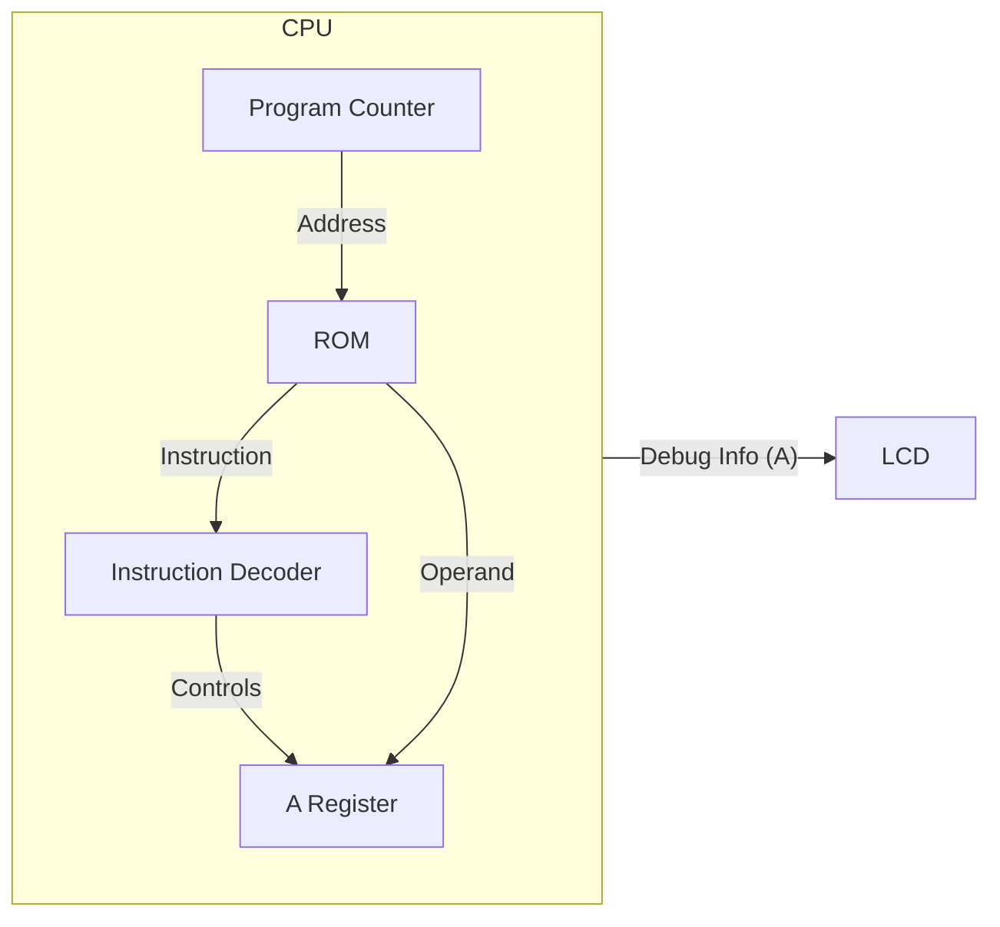

# Day 06: メモリアクセスと LDA 命令

---

🌐 対応言語:
[English](./README.md) | [日本語](./README_ja.md)

## 📜 概要

Day 06 では、CPU に最初のデータ操作命令である **`LDA #imm`** (Load Accumulator with Immediate value) を実装し、CPU にさらなる生命を吹き込みます。これには、6502 で最も重要なレジスタの一つである **アキュムレータ（A レジスタ）** の追加が含まれます。

また、メモリ上の命令コードに続く 8 ビットの*オペランド*をフェッチするロジックも実装します。

## 🎯 学習目標

-   **アキュムレータ(A)の実装**: 算術論理演算の主役となる 8 ビットのレジスタを追加。
-   **アーキテクチャの構造化**: `opcodes.svh` による命令の定数化と、`rom.sv` によるメモリの分離。
-   **命令のフェッチとデコード**: ステートマシンを導入し、複数サイクルにわたる命令実行を管理。
-   **`LDA #imm` と `NOP` の実装**: 新しい構造を用いて基本的な命令を実装。
-   **LCD での可視化**: PC に加え、A レジスタの値を表示。

## 🏗️ アーキテクチャ

A レジスタと、複数サイクルかかる命令フェッチを管理するための簡単なステートマシンを追加します。

## 🛠️ 実装ステップ

1.  **命令コードの定義**:
    -   `include/opcodes.svh` を作成し、`OP_LDA_IMM = 8'hA9` や `OP_NOP = 8'hEA` を定義。
    -   マジックナンバーを排除し、コードの可読性を高めます。
2.  **メモリ(ROM)の分離**:
    -   `rom.sv` を作成し、CPU ロジックからプログラム内容を分離します（関心の分離）。
3.  **ステートマシンの実装**:
    -   `cpu.sv` に `STATE_FETCH_OPCODE` や `STATE_FETCH_OPERAND` といった状態を導入。
    -   外部の ROM からデータをフェッチして動作するように拡張します。
4.  **LCD 表示の更新**:
    -   `debug_a` 出力を追加し、画面上に `PC: XXXX A: XX` と表示されるように修正。

## 💡 「即値アドレッシング」とは？

「即値」とは、命令が必要とするデータが、メモリ上で命令コードの*直後*に配置されていることを意味します。

メモリ上の例:

-   アドレス `0x8000`: `0xA9` (LDA #imm 命令)
-   アドレス `0x8001`: `0x42` (ロードする値)

これが実行されると、A レジスタには `0x42` という値が入ります。

## 🧪 動作確認

-   **テストプログラム**: `A9 42` (LDA #$42) を含む簡単な ROM を作成します。その後ろに `EA` (NOP) 命令を追加してもよいでしょう。
-   **シミュレーション**: 2 クロックサイクルの後、`A` レジスタが `0x42` を保持することを確認します。
-   **実機 (FPGA)**: LCD を確認します。「A: 42」（またはあなたが選んだ値）と表示されるはずです。PC はオペランドをフェッチした後に停止するか、さらに命令があれば進み続けます。

## 🎯 明日の予習

Day 07 では、**X および Y インデックスレジスタ**を追加し、`TAX` (Transfer A to X) のようなレジスタ間でデータを転送する命令を実装します。
