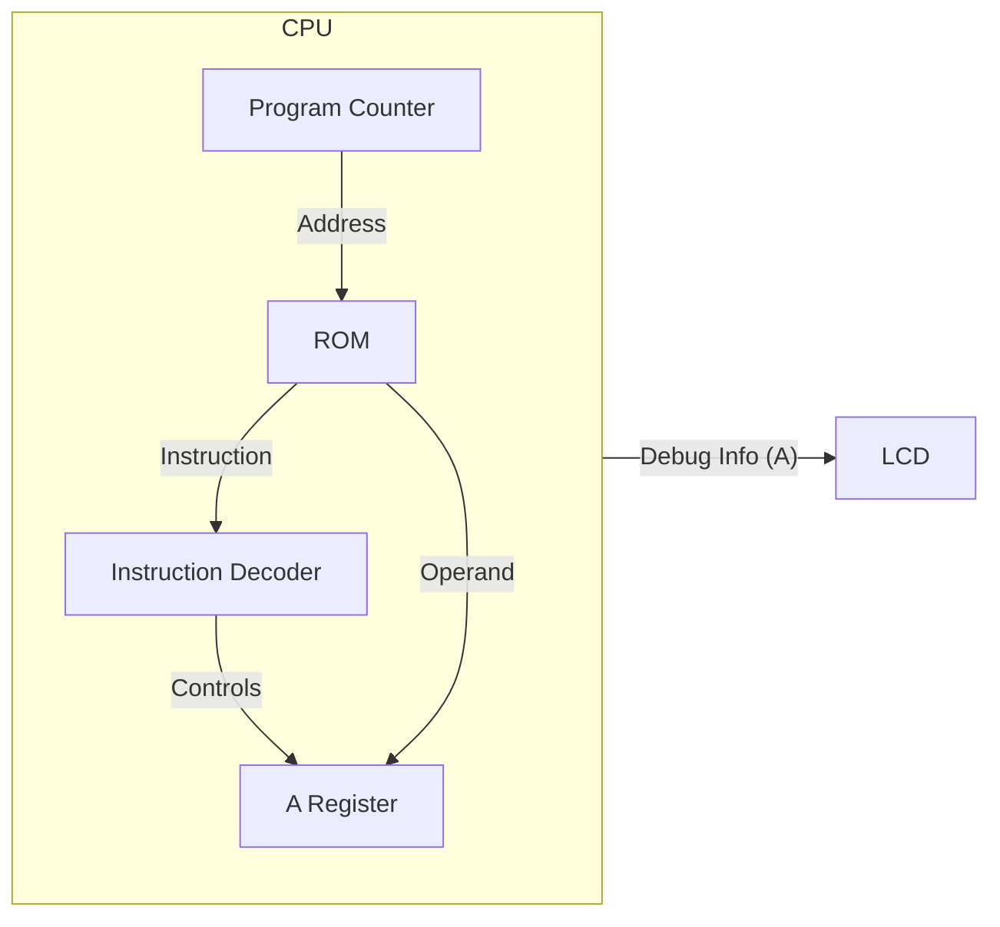

# Day 06: メモリアクセスと LDA 命令

---

🌐 対応言語:
[English](./README.md) | [日本語](./README_ja.md)

## 📜 概要

Day 06 では、CPU に最初のデータ操作命令である **`LDA #imm`** (Load Accumulator with Immediate value) を実装し、CPU にさらなる生命を吹き込みます。これには、6502 で最も重要なレジスタの一つである **アキュムレータ（A レジスタ）** の追加が含まれます。

また、メモリ上の命令コードに続く 8 ビットの*オペランド*をフェッチするロジックも実装します。

## 🔙 復習: Day 05

次に進む前に、以下を理解しているか確認してください:

- **プログラムカウンタ (PC)**: 次の命令のアドレスを保持
- **順序回路**: `always_ff @(posedge clk)` によるクロック同期更新
- **LCD 表示**: デバッグ情報を画面に出力する方法

## 🎯 学習目標

- **アキュムレータ(A)の実装**: 算術論理演算の主役となる 8 ビットのレジスタを追加。
- **アーキテクチャの構造化**: `opcodes.svh` による命令の定数化と、`rom.sv` によるメモリの分離。
- **命令のフェッチとデコード**: ステートマシンを導入し、複数サイクルにわたる命令実行を管理。
- **`LDA #imm` と `NOP` の実装**: 新しい構造を用いて基本的な命令を実装。
- **LCD での可視化**: PC に加え、A レジスタの値を表示。
- **テストのパス**: ロジック検証用テストベンチ (`sim/tb_cpu.sv`) をパスさせる。

## 🏗️ アーキテクチャ

A レジスタと、複数サイクルかかる命令フェッチを管理するための簡単なステートマシンを追加します。

## 🛠️ 実装ステップ

1. **命令コードの定義**:
    - `include/opcodes.svh` を作成し、`OP_LDA_IMM = 8'hA9` や `OP_NOP = 8'hEA` を定義。
    - マジックナンバーを排除し、コードの可読性を高めます。
2. **メモリ(ROM)の分離**:
    - `rom.sv` を作成し、CPU ロジックからプログラム内容を分離します（関心の分離）。
3. **ステートマシンの実装**:
    - `cpu.sv` に `STATE_FETCH_OPCODE` や `STATE_FETCH_OPERAND` といった状態を導入。
    - 外部の ROM からデータをフェッチして動作するように拡張します。
4. **LCD 表示の更新**:
    - `debug_a` 出力を追加し、画面上に `PC: XXXX A: XX` と表示されるように修正。

## 📘 基礎知識: 機械語とニーモニック

ソフトウェアエンジニアの方にとって、アセンブリ言語と機械語の関係は最初は少し分かりにくいかもしれません。

### 1. ニーモニックと機械語

私たちが書くプログラムは **アセンブリ言語 (Assembly)** と呼ばれ、人間が読みやすい **ニーモニック (Mnemonic)** で記述します。
しかし、CPU はこれを直接理解することはできません。CPU が理解できるのは **機械語 (Machine Code)** と呼ばれる数字の羅列だけです。

**ソフトウェアエンジニアのための例え:**

- **アセンブリ言語** は、C++ や Python のソースコードのようなものです。人間が読むためのものです。
- **機械語** は、コンパイルされた `.exe` や `.pyc` バイトコードのようなものです。機械が読むためのものです。
- **アセンブラ** は、ソースコードを機械語に変換するコンパイラのようなものです。

| 言語               | 表記例     | 説明                                                |
| :----------------- | :--------- | :-------------------------------------------------- |
| **アセンブリ言語** | `LDA #$A9` | 人間用。「値を A レジスタにロードせよ」という意味。 |
| **機械語**         | `A9 42`    | CPU 用。16 進数のバイト列。                         |

この変換を行うのが **アセンブラ** というソフトですが、このコースでは CPU が実際に何を見ているのかを理解するために、手動で（ハンドアセンブルで）機械語を書いていきます。

### 2. 命令の長さ (1 バイト長 vs 2 バイト長)

機械語には、1 バイトで完結するものと、後ろにデータ（オペランド）を必要とするものがあります。

- **1 バイト命令 (例: NOP)**

  - `EA` だけ。
  - 「何もしない」という命令なので、追加のデータは不要です。

- **2 バイト命令 (例: LDA #imm)**
  - `A9 42` のように 2 バイト使います。
  - 1 バイト目の `A9` が「これからロード命令をやるぞ！」という合図（オペコード）。
  - 2 バイト目の `42` がロードしたい実際の値（オペランド）。

## 📘 アーキテクチャ解説: PC はどう動く？

プログラムカウンタ (PC) は単なるカウンターではなく、**CPU の司令塔**です。
「次に実行すべき命令がメモリのどこにあるか」を指し示しています。

`LDA #$42` (機械語: `A9 42`) が実行されるときの PC の動きを見てみましょう。

1. **命令の取得 (Fetch Opcode)**

    - PC は `8000` を指しています。
    - CPU はメモリの `8000` 番地から **`A9`** を読み込みます。
    - CPU は `A9` を解析し、「これは LDA 命令だ！次はデータが必要だ」と理解します。
    - PC は `8001` に進みます。

2. **データの取得 (Fetch Operand)**
    - PC は `8001` を指しています。
    - CPU はメモリの `8001` 番地から **`42`** を読み込みます。
    - CPU はこの `42` を A レジスタに入れます。
    - PC は `8002` に進み、次の命令に備えます。

このように、PC が 1 つずつ進みながらメモリから機械語を読み出し、CPU がそれを解釈して動く。これがコンピュータの動作原理です。

## 💡 「即値アドレッシング」とは？

「即値」とは、命令が必要とするデータが、メモリ上で命令コードの*直後*に配置されていることを意味します。

メモリ上の例:

- アドレス `0x8000`: `0xA9` (LDA #imm 命令)
- アドレス `0x8001`: `0x42` (ロードする値)

これが実行されると、A レジスタには `0x42` という値が入ります。

## 🧪 動作確認

Day 05 以降、**テストベンチ (`day06/sim/`) は完成した状態で提供されています。** 自分で作成したコードの正しさを検証するために活用してください。

- **テストプログラム**: `A9 42` (LDA #$42) を含む簡単な ROM を作成します。
- **シミュレーション**: `make sim` を実行します。2 クロックサイクルの後、`A` レジスタが `0x42` を保持し、最終的に `PASS` と表示されれば成功です。
- **実機 (FPGA)**: LCD を確認します。「A: 42」（またはあなたが選んだ値）と表示されるはずです。

## 🎯 明日の予習

Day 07 では、**X および Y インデックスレジスタ**を追加し、`TAX` (Transfer A to X) のようなレジスタ間でデータを転送する命令を実装します。
