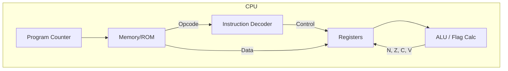

# Day 06: Understanding Instructions (LDA & Flags)

---

🌐 Available languages:
[English](./README.md) | [日本語](./日本語/README_ja.md)

## 📜 Overview

On Day 06, we gave our CPU its first "intelligence" by implementing the **`LDA #imm`** (Load Accumulator with Immediate value) instruction. This involved building an **Instruction Decoder** and **Flag Calculator** to finally put the **Accumulator (A register)** prepared on Day 05 into practical use.

Today, the CPU evolved from simply "stepping forward" to "manipulating data according to instructions."

## 🎯 Learning Objectives

- **Implement Instruction Decoder**: Create `simple_decoder.sv` to classify 8-bit opcodes into categories.
- **Integrate Flag Calculator**: Implement `flag_calculator.sv` to compute Zero (Z) and Negative (N) flags based on results.
- **Introduce State Machines**: Manage the multi-cycle "Fetch → Decode → Execute" flow.
- **Immediate Addressing**: Understand the mechanism of loading data that directly follows the opcode in memory.

## 🏗️ Architecture

The decoder and flag logic are now integrated within the CPU core.

## 🛠️ Implementation Summary

1. **Implement `simple_decoder.sv`**:
    - Used a `case` statement to recognize `0xA9` as `is_load`.
2. **Implement `flag_calculator.sv`**:
    - Described combinational logic where Z=1 if the result is 0, and N=1 if bit 7 is 1.
3. **Extend `cpu.sv`**:
    - Implemented a 2-state machine (`STATE_FETCH_OPCODE` and `STATE_FETCH_OPERAND`).
    - Handled the `LDA #imm` instruction by incrementing PC by +2 and updating the Accumulator.

## 💡 Technical Insight: What is "Immediate Addressing"?

"Immediate" means the data the instruction needs is located *immediately* after the instruction code in memory.

Example in memory:

- `0x8000`: `0xA9` (LDA instruction)
- `0x8001`: `0x42` (The value to load)

When the decoder finds `0xA9`, the CPU decides to read the value from `0x8001` in the next cycle and put it into the A register. This is the foundation of CPU execution.

## 🧪 Verification

- **Test Program**: Verified with a ROM containing `A9 42` (LDA #$42).
- **FPGA**: Confirmed that "A: 42" appears on the LCD and that the Negative and Zero flags update correctly.

## 🎯 Preview for Tomorrow

In Day 07, we will add the **X and Y index registers** and implement instructions to transfer data between registers, such as `TAX` (Transfer A to X).
