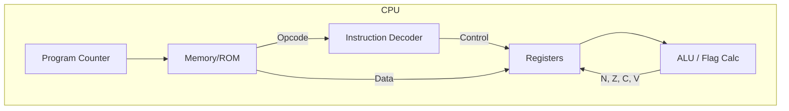

# Day 06: 命令の理解と実行 (LDA 命令とフラグ)

---

🌐 対応言語:
[English](./README.md) | [日本語](./README_ja.md)

## 📜 概要

Day 06 では、CPU に最初のデータ操作命令である **`LDA #imm`** (Load Accumulator with Immediate value) を実装し、CPU に「知性」を与えました。これには、Day 05 で用意した **アキュムレータ（A レジスタ）** を本格的に動かすためのデコーダとフラグ計算機の実装が含まれます。

今日、CPU はついに「ただ進む」だけではなく、「命令に従ってデータを操作する」ことができるようになりました。

## 🧠 メモリ構成の注意

Day 04〜10 はプログラム命令を `rom.sv` から供給します（簡易ROM）。RAM はデータ用で、プログラムを RAM に置く構成は Day 11 以降です。

## 💡 Day 05 から Day 06 へのステップアップ

Day 05 では、CPU が「ただ一歩進む (PC+1)」という最小の動きを習得しました。Day 06 では、ついに「命令を理解し、データを動かす」という CPU 本来の機能に取り組みました。

## 🎯 学習目標

- **命令デコーダの実装**: 8 ビットのオペコードを読み取り、命令の種類を分類する `simple_decoder.sv` を作成。
- **フラグ計算機の連動**: 演算結果に基づいて Zero (Z) や Negative (N) フラグを計算する `flag_calculator.sv` を実装。
- **ステートマシンの導入**: 複数サイクルにわたる「フェッチ → デコード → 実行」の流れを管理。
- **即値アドレッシング**: 命令の直後にあるデータをレジスタに読み込む仕組みを理解。

## 🏗️ アーキテクチャ

デコーダとフラグ計算ロジックが CPU 内に組み込まれました。

## 🛠️ 実習の内容

1. **`simple_decoder.sv` の実装**:
    - `case` 文を用いて `0xA9` を `is_load` として認識させる。
2. **`flag_calculator.sv` の実装**:
    - 結果が 0 なら Z=1、ビット 7 が 1 なら N=1 とする組合せ回路を記述。
3. **`cpu.sv` の拡張**:
    - `STATE_FETCH_OPCODE` と `STATE_FETCH_OPERAND` の 2 状態ステートマシンを実装。
    - `LDA #imm` 命令を実行した際、PC を +2 進め、A レジスタを更新。

## 💡 解説: 「即値アドレッシング」とは？

「即値 (Immediate)」とは、命令が必要とするデータがメモリ上で命令コードの*直後*に配置されていることを意味します。

メモリ上の例:

- `0x8000`: `0xA9` (LDA 命令)
- `0x8001`: `0x42` (ロードしたい値)

デコーダが `0xA9` を見つけると、CPU は「次のサイクルで `0x8001` から値を読み、それを A レジスタに入れよう」と判断します。これが CPU 実行の基本です。

## 🧪 動作確認

- **テストプログラム**: `A9 42` (LDA #$42) を含む ROM で検証。
- **実機 (FPGA)**: LCD に「A: 42」と表示され、Negative や Zero フラグが正しく変化することを確認。

## 🎯 明日の予習

Day 07 では、**X および Y インデックスレジスタ**を追加し、`TAX` (Transfer A to X) のようなレジスタ間でデータを転送する命令を実装します。
