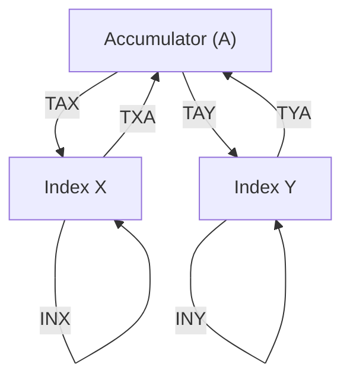

# Day 07: Register Operations (X & Y)

---

🌐 Available languages:
[English](./README.md) | [日本語](./README_ja.md)

## 📜 Overview

In addition to the Accumulator, the 6502 has two versatile 8-bit index registers: the **X Register** and the **Y Register**. In Day 07, we will add these to our CPU.

These registers are essential for many addressing modes and are often used as loop counters or offsets. We will implement instructions to transfer values between registers and perform basic increment/decrement operations.

## 🎯 Learning Objectives

- **Utilize X and Y Registers**: Put the general-purpose index registers implemented in Day 05 into practical use.
- **Implement Transfer Instructions**: Implement `TAX`, `TAY`, `TXA`, and `TYA`.
- **Implement Increment Instructions**: Implement `INX` and `INY`.
- **Expand Decoder**: Master handling single-byte instructions with no operands.

## 🏗️ Instructions to Implement



| Opcode | Mnemonic | Description | Cycles |
| :----: | -------- | ----------- | :----: |
| `0xAA` | `TAX`    | Copy A to X |   2    |
| `0xA8` | `TAY`    | Copy A to Y |   2    |
| `0x8A` | `TXA`    | Copy X to A |   2    |
| `0x98` | `TYA`    | Copy Y to A |   2    |
| `0xE8` | `INX`    | Increment X |   2    |
| `0xC8` | `INY`    | Increment Y |   2    |

_Note: On a real 6502, these take 2 cycles. In our simplified FPGA model, you might implement them in a single cycle._

## 🛠️ Implementation Steps

1. **Declare Registers**:
    - In `cpu.sv`, add `logic [7:0] X, Y;`.
2. **Extend the Decoder**:
    - In the `always_comb` block, add the new opcodes (`0xAA`, `0xA8`, `0x8A`, `0x98`, `0xE8`, `0xC8`) to your `case` statement.
3. **Transfer Logic**:
    - `TAX`: `X <= A;`
    - `TXA`: `A <= X;`
4. **Arithmetic Logic**:
    - `INX`: `X <= X + 1;`
    - Note: These instructions usually update the Zero (Z) and Negative (N) flags, but we will handle flag implementation in Day 08.
5. **Update LCD Display**:
    - Add `debug_x` and `debug_y` ports to the CPU and display their values on the LCD.

## 💡 The Role of Index Registers

The X and Y registers shine when implementing **indexed addressing modes** (e.g., `LDA $1234,X`). This allows the CPU to efficiently read data from tables or arrays in memory.

## 🧪 Verification

- **Test Program**:

    ```asm
    LDA #$40
    TAX        ; X = 0x40
    INX        ; X = 0x41
    TXA        ; A = 0x41
    ```

- **FPGA**: Verify on the LCD that the X register changes as expected.

## 🎯 Next Step

In Day 08, we will significantly strengthen the CPU's computational power by integrating the **ALU (Arithmetic Logic Unit)** for full addition/subtraction and the **Processor Status (P) register** to bundle our status flags.
