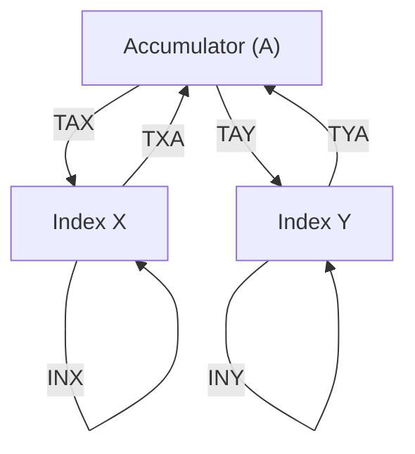

# Day 07: Register Operations (X & Y)

---

🌐 Available languages:
[English](./README.md) | [日本語](./README_ja.md)

## Lesson at a glance

The reference solution already implements the tasks below.

| Item | Details |
| --- | --- |
| Where to edit | TAX/TAY/TXA/TYA/INX/INY TODOs in cpu.sv |
| Provided foundation | a/x/y, debug outputs and LDA handling |
| Expected test results | The injected transfer/increment program ends with A/X/Y=$43 |
| What to observe on hardware | ROM starts with LDA #$40 and reaches A=$41, then executes NOPs (X/Y=$41 is confirmed by the CPU test in simulation) |

## 📜 Overview

In addition to the Accumulator, the 6502 has two versatile 8-bit index registers: the **X Register** and the **Y Register**. In Day 07, we will add these to our CPU.

These registers are essential for many addressing modes and are often used as loop counters or offsets. We will implement instructions to transfer values between registers and perform INX/INY increments. DEX/DEY decrements are introduced on Day15.

## 🧠 Memory Model Note

Day 04–09 use a simple program ROM (`rom.sv`) to supply instructions. RAM, including Zero Page/Stack/Program RAM, is not used until Day 10.

## 🎯 Learning Objectives

- **Utilize X and Y Registers**: Add X/Y to the CPU and use them in transfer and increment instructions.
- **Implement Transfer Instructions**: Implement `TAX`, `TAY`, `TXA`, and `TYA`.
- **Implement Increment Instructions**: Implement `INX` and `INY`.
- **Expand Decoder**: Master handling single-byte instructions with no operands.

## 🏗️ Instructions to Implement


```mermaid
graph TD
    A["Accumulator (A)"]
    X[Index X]
    Y[Index Y]

    A -- TAX --> X
    A -- TAY --> Y
    X -- TXA --> A
    Y -- TYA --> A
    X -- INX --> X
    Y -- INY --> Y
```

| Opcode | Mnemonic | Description | Cycles |
| :----: | -------- | ----------- | :----: |
| `0xAA` | `TAX`    | Copy A to X | 2      |
| `0xA8` | `TAY`    | Copy A to Y | 2      |
| `0x8A` | `TXA`    | Copy X to A | 2      |
| `0x98` | `TYA`    | Copy Y to A | 2      |
| `0xE8` | `INX`    | Increment X | 2      |
| `0xC8` | `INY`    | Increment Y | 2      |

_Note: On a real 6502, these take 2 cycles. In our simplified FPGA model, you might implement them in a single cycle._

> [!TIP]
> **Column: Opcodes**
>
> In Day 06 we used `LDA` as `0xA9`, and in Day 07 we define `TAX` as `0xAA`, etc.
> These are standard 6502 opcodes listed in references like the
> [6502 Instruction Set](https://www.masswerk.at/6502/6502_instruction_set.html).
> You can hand-assemble them, but longer programs get tedious.
> In that case, you can assemble with `ca65` like this:
>
> ```bash
> cat > hoge.s << 'END'
>    .org $0200
>    LDA #$42
>    TAX
> END
> ```
>
> Then you can generate a listing and see that `LDA #$42` becomes `0xA9 0x42`:
>
> ```bash
> ca65 -l hoge.lst hoge.s
>
> cat hoge.lst
>
> 000000r 1                   .org $0200
> 000200  1  A9 42            LDA #$42
> 000202  1  AA               TAX
> 000202  1
> ```
>
> The [day99_completed examples](../day99_completed/examples/Makefile) use this flow to assemble 6502 code into FPGA-ready binaries.

## 🛠️ Implementation Steps

1. **Declare Registers**:
    - Check the existing `logic [7:0] a, x, y;` declarations and reset.
2. **Extend the Decoder**:
    - In the `STATE_FETCH_OPCODE` case inside `always_ff`, add the new opcodes (`0xAA`, `0xA8`, `0x8A`, `0x98`, `0xE8`, `0xC8`) to `case (data_in)`.
3. **Transfer Logic**:
    - `TAX`: `x <= a;`
    - `TXA`: `a <= x;`
4. **Arithmetic Logic**:
    - `INX`: `x <= x + 1'b1;`
    - Note: These instructions usually update the Zero (Z) and Negative (N) flags, but we will handle flag implementation in Day 08.
5. **Verify X/Y Changes**:
    - The LCD in this Day shows PC and A only. Verify X/Y with `make test-cpu`; the injected program ends with A/X/Y=$43. The LCD starts displaying X in Day 09.

## 💡 The Role of Index Registers

The X and Y registers shine when implementing **indexed addressing modes** (e.g., `LDA $1234,X`). This allows the CPU to efficiently read data from tables or arrays in memory.

## 🧪 Verification

The completed CPU test is `make test-cpu`; run it from this directory. `make sim` separately runs only the LCD/TFT smoke test. Passing these tests covers their assertions only, not every instruction or hardware behavior.

- **Test Program**:

    ```asm
    LDA #$40
    TAX        ; X = $40
    TAY        ; Y = $40
    INX        ; X = $41
    INY        ; Y = $41
    TXA        ; A = $41
    TYA        ; A = $41
    ```

    This is the sequence in `rom.sv`; after `TYA`, A, X, and Y are `$41`. The shared starter testbench injects a separate `$42` program.

- **FPGA**: The LCD shows PC and A only. Confirm that A reaches $41 after the ROM program runs; X/Y changes are confirmed in simulation (the LCD starts showing X in Day 09).

## 🎯 Next Step

In Day 08, we will significantly strengthen the CPU's computational power by integrating the **ALU (Arithmetic Logic Unit)** for full addition/subtraction and the **Processor Status (P) register** to bundle our status flags.

CPU unit tests and the hardware ROM use different inputs. The hardware expectations above are derived from `rom.sv` and the LCD wiring; they do not mean that operation has been verified on every board.

LCD VSync passes through a two-stage synchronizer into the display-write clock domain. Its rising edge starts a frame update. VRAM and font reads remain in the pixel-clock domain.
