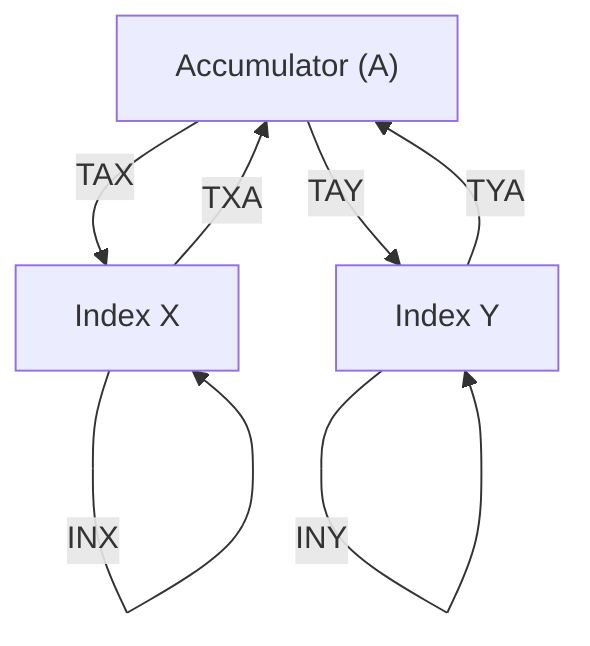

# Day 07: レジスタ操作 (X & Y)

---

🌐 Available languages:
[English](./README.md) | [日本語](./README_ja.md)

## 実習の見取り図

完成例では下記の課題が実装済みです。

| 項目           | 内容                                      |
| -------------- | ----------------------------------------- |
| 編集する箇所   | cpu.svのTAX/TAY/TXA/TYA/INX/INY TODO      |
| 提供済みの前提 | a/x/yとdebug出力、LDA処理                 |
| テストの期待値 | 注入プログラムの転送・増加後A/X/Y=$43     |
| 実機で見るもの | ROMはLDA #$40から開始しA/X/Y=$41。以降NOP |

## 📜 概要

6502 にはアキュムレータの他に、多目的に使える 8 ビットのインデックスレジスタが 2 つあります。**X レジスタ**と**Y レジスタ**です。Day 07 では、これらを CPU に追加します。

これらのレジスタは多くのアドレッシングモードで必須であり、ループカウンタやオフセットとして頻繁に使用されます。今回は、レジスタに値を転送したり、値を増やしたり（INX/INY。DEX/DEY は Day15）する命令を実装します。

## 🧠 メモリ構成の注意

Day 04〜09 はプログラム命令を `rom.sv` から供給します（簡易 ROM）。Zero Page/Stack/Program RAM を含む RAM は Day 10 まで使用しません。

## 🎯 学習目標

- **X, Y レジスタの活用**: CPU に X/Y レジスタを追加し、転送・インクリメント命令で使う。
- **レジスタ転送命令の実装**: `TAX` (Transfer A to X) と `TAY` (Transfer A to Y) を実装する。
- **インクリメント命令の実装**: `INX` (Increment X) と `INY` (Increment Y) を実装する。
- **デコーダの拡張**: 1 バイト命令（オペランドなし）の処理をマスターする。

## 🏗️ 実装する命令



| オペコード | ニーモニック | 説明                | サイクル数 |
| :--------: | ------------ | ------------------- | :--------: |
| `0xAA`     | `TAX`        | A の値を X にコピー | 2          |
| `0xA8`     | `TAY`        | A の値を Y にコピー | 2          |
| `0x8A`     | `TXA`        | X の値を A にコピー | 2          |
| `0x98`     | `TYA`        | Y の値を A にコピー | 2          |
| `0xE8`     | `INX`        | X を +1 する        | 2          |
| `0xC8`     | `INY`        | Y を +1 する        | 2          |

※ 実際の 6502 では 2 サイクルですが、単純化した FPGA モデルでは 1 サイクルで実行するように実装することも可能です。

> [!TIP]
> **コラム: オペコード**
>
> Day06では`LDA`を`0xA9`、Day07では上記のように`TAX`を`0xAA`などと定義しています。
> これは6502CPUのオペコードで、[6502 Instruction Set](https://www.masswerk.at/6502/6502_instruction_set.html)
> などにまとまっています。
> これを元に変換（ハンドアセンブル）するのもいいのですが、プログラムが長くなってくると面倒です。
> その場合は以下のように`ca65`を使ってアセンブルすることができます。
>
> ```bash
> cat > hoge.s << 'END'
>    .org $0200
>    LDA #$42
>    TAX
> END
> ```
>
> すると以下のようなファイルができます。`LDA #$42`が`0xA942`になっているのがわかります。
>
> ```bash
> ca65 -l hoge.lst hoge.s
>
> cat hoge.lst
>
> 000000r 1                   .org $0200
> 000200  1  A9 42            LDA #$42
> 000202  1  AA               TAX
> 000202  1
> ```
>
> [day99_completedのexamples](../day99_completed/examples/Makefile)では、この仕組みを活用して6502のサンプルアセンブリーからFPGA型式のバイナリを生成しています。

## 🛠️ 実装ステップ

1. **レジスタの宣言**:
    - 既存の `logic [7:0] a, x, y;` とリセットを確認します。
2. **デコーダの拡張**:
    - `always_ff` 内の `STATE_FETCH_OPCODE` の `case (data_in)` に、新しいオペコード (`0xAA`, `0xA8`, `0x8A`, `0x98`, `0xE8`, `0xC8`) を `case` 文に追加します。
3. **転送ロジックの実装**:
    - `TAX`: `x <= a;`
    - `TXA`: `a <= x;`
4. **算術ロジックの実装**:
    - `INX`: `x <= x + 1'b1;`
    - 注意: 本来これらは Zero (Z) と Negative (N) フラグを更新しますが、フラグの実装は Day 08 で行います。
5. **LCD 表示の更新**:
    - 既存の `debug_x` / `debug_y` 出力と LCD 配線で、更新した値を確認します。

## 💡 インデックスレジスタの役割

X と Y レジスタは、将来的に**インデックス付きアドレッシングモード**（例：`LDA $1234,X`）を実装する際に真価を発揮します。これにより、メモリ上のテーブルや配列から効率的にデータを読み込むことができるようになります。

## 🧪 動作確認

完成版 CPU テストはこのディレクトリで `make test-cpu` を実行します。`make sim` は LCD/TFT smoke test を実行し、CPU は `make test-cpu` で別に検査します。テスト合格は各テストの assertion 範囲だけを確認するもので、全命令や実機動作を保証しません。

- **テストプログラム**:

    ```asm
    LDA #$40
    TAX        ; X = $40
    TAY        ; Y = $40
    INX        ; X = $41
    INY        ; Y = $41
    TXA        ; A = $41
    TYA        ; A = $41
    ```

    これは完成版 `rom.sv` の命令列です。`TYA` の後は A/X/Y がすべて `$41` です。共有スターターのテストベンチは別の `$42` プログラムを注入します。

- **実機 (FPGA)**: LCD で X レジスタが期待通りに変化することを確認します。

## 🎯 次のステップ

Day 08 では、CPU の計算能力を本格的に強化するため、**ALU (Arithmetic Logic Unit)**による本格的な加減算と、フラグをまとめて保持する**プロセッサステータス (P) レジスタ**の統合を行います。

CPU 単体テストと実機 ROM は別の入力です。表の実機期待値は `rom.sv` / LCD 配線から読み取った値であり、全ボードでの実機確認済みという意味ではありません。

LCD の VSync は表示書込みクロックへ 2 段同期し、立上りでフレーム更新を開始します。VRAM 読出しと font 読出しは画素クロック内で処理します。
