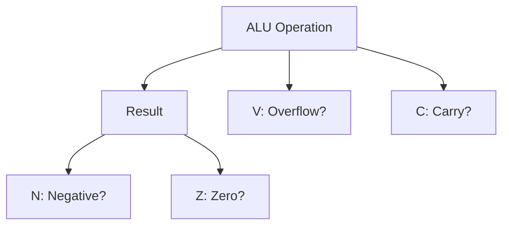

# Day 08: Arithmetic Operations & Status Flags

---

🌐 Available languages:
[English](./README.md) | [日本語](./README_ja.md)

## 📜 Overview

Today, we build the **Arithmetic Logic Unit (ALU)**, the core of the CPU's computational power, supporting full addition and subtraction. We will also integrate the **Processor Status (P) register**, which bundles the individual status flags we began implementing in Day 06.

This allows the CPU to perform complete addition (`ADC`) and subtraction (`SBC`) operations and observe how the results affect the status flags (N, V, Z, C) through the P register. This is a major leap towards making logical decisions in programs.

## 🧠 Memory Model Note

Day 04–09 use a simple program ROM (`rom.sv`) to supply instructions. RAM, including Zero Page/Stack/Program RAM, is not used until Day 10.

## 🔙 Review: Day 07

Before proceeding, make sure you understand:

- **X and Y Registers**: Index registers used for addressing and counting
- **Register Transfers**: `TAX`, `TXA` move data between registers
- **Single-byte Instructions**: Instructions without operands (implied addressing)

## 🎯 Learning Objectives

- **Integrate ALU**: Fully support 8-bit addition and subtraction.
- **Integrate Status Register (P)**: Connect the flag calculation logic from Day 06 to the P register.
- **Complete `ADC` / `SBC`**: Implement accurate arithmetic that accounts for carry/borrow.
- **Observe Flag Changes**: Confirm on the LCD that the P register content (Negative, Overflow, Zero, Carry) changes correctly based on operation results.

## 🏗️ Status Flags



The 6502 flags are updated automatically by many instructions. We focus on the four primary arithmetic flags:

**Analogy:**
Think of these as the **"return status"** of a function call. After you run `ADC` (Add), the CPU implicitly returns these booleans to tell you *how* it went.

- **N (Negative)**: "Result is negative?" (Bit 7 is 1)
- **V (Overflow)**: "Did signed math break?" (Result exceeded ±127)
- **Z (Zero)**: "Is the result zero?" (Result is 0)
- **C (Carry)**: "Did unsigned math overflow?" (Result > 255)

## 🏗️ Instructions to Implement

| Opcode | Mnemonic   | Description                                     | Cycles |
| :----: | ---------- | ----------------------------------------------- | :----: |
| `0x69` | `ADC #imm` | Add operand + Carry to Accumulator              |   2    |
| `0xE9` | `SBC #imm` | Subtract operand - (1 - Carry) from Accumulator |   2    |
| `0x18` | `CLC`      | Clear Carry flag (0)                            |   2    |
| `0x38` | `SEC`      | Set Carry flag (1)                              |   2    |

## 🛠️ Implementation Steps

1. **Declare Flags**:
    - In `cpu.sv`, add `logic N, V, Z, C;`.
2. **Create ALU (Combinational Logic)**:
    - Use `always_comb` to define arithmetic logic.
    - `ADC`: `{C_out, result} = A + operand + C;`
    - `SBC`: Equivalent to `A + (~operand) + C`.
3. **Flag Update Logic**:
    - `Z = (result == 8'h00);`
    - `N = result[7];`
    - `V = (A[7] == operand[7]) && (A[7] != result[7]);` (for ADC)
4. **Update LCD Display**:
    - Update the VRAM writer to display flag states (NVZC) as 0/1 on the LCD alongside the Accumulator.

## 💡 6502 Subtraction & Carry

In the 6502, it is standard to call `SEC` (Set Carry) before an `SBC` operation. This is because the formula is `A - data - (1 - C)`, meaning `C=1` represents "No Borrow".

## 🧪 Verification

This Day includes a CPU testbench. If the starter TODOs are not yet implemented, it is expected and normal for the CPU test to fail. After implementing the TODOs, run `make test-cpu` and confirm the tests pass. Passing the tests verifies the tested scope only and does not guarantee untested instructions or real-hardware behavior.

- **Test Program**:

    ```asm
    CLC
    LDA #$3C
    ADC #$42   ; A = 0x7E (C=0 V=0 Z=0 N=0)
    ADC #$45   ; A = 0xC3 (C=0 V=1 Z=0 N=1: pos+pos -> neg)
    SEC
    SBC #$C3   ; A = 0x00 (C=1 V=0 Z=1 N=0)
    SBC #$01   ; A = 0xFF (C=0 Z=0 N=1: borrow)
    LDA #$01
    ADC #$FF   ; A = 0x00 (C=1 V=0 Z=1 N=0: carry out)
    ```

- **Simulation**: Run `make test-cpu` and verify the simulation outputs `PASS` (`make sim` additionally runs the TFT smoke test).
- **FPGA**: Confirm on the LCD that the calculation results and flags change as expected.

## 🎯 Next Step

In Day 09, we will use these flags (Z, C, etc.) to control the program flow using **Branch Instructions**.
