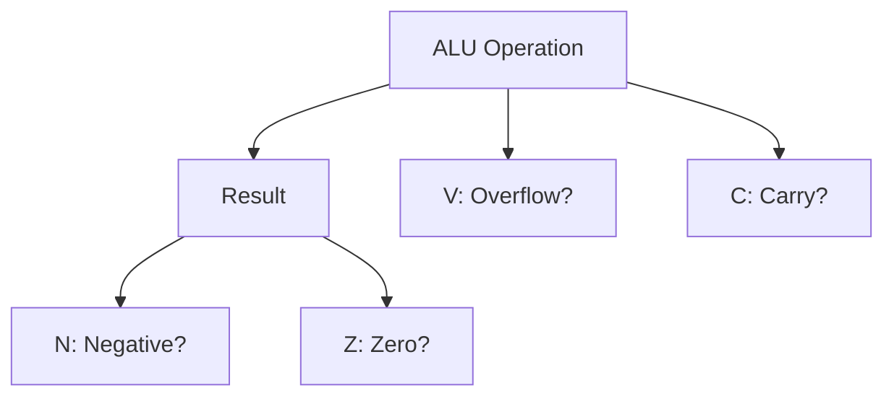

# Day 08: 算術演算とステータスフラグ

---

🌐 Available languages:
[English](./README.md) | [日本語](./README_ja.md)

## 📜 概要

今日はいよいよ CPU の計算能力の中核である**算術論理演算ユニット(ALU)**による本格的な加減算を構築します。また、Day 06 で実装した各フラグを 1 つのレジスタにまとめた**プロセッサステータス(P)レジスタ**も統合します。

これにより、CPU は加算(`ADC`)と減算(`SBC`)を完全に実行できるようになり、その結果がステータスフラグ（N、V、Z、C）にどのように影響するかを P レジスタを通じて確認できるようになります。これは、複雑な論理判断を行うための大きな一歩です。

## 🧠 メモリ構成の注意

Day 04〜10 はプログラム命令を `rom.sv` から供給します（簡易ROM）。RAM はデータ用で、プログラムを RAM に置く構成は Day 11 以降です。

## 🔙 復習: Day 07

次に進む前に、以下を理解しているか確認してください:

- **X, Y レジスタ**: アドレッシングやカウントに使うインデックスレジスタ
- **レジスタ転送**: `TAX`, `TXA` などでレジスタ間のデータ移動
- **1 バイト命令**: オペランドを持たない命令（暗黙アドレッシング）

## 🎯 学習目標

- **ALU の統合**: 8 ビットの加減算を本格的にサポートする。
- **ステータスレジスタ(P)の統合**: Day 06 で作成したフラグ計算ロジックを P レジスタに結びつける。
- **`ADC` / `SBC` 命令の完成**: キャリーを考慮した正確な演算を実装する。
- **フラグ変化の観測**: 演算結果から P レジスタの内容（Negative, Overflow, Zero, Carry）が正しく変化することを LCD で確認する。
- **テストのパス**: ロジック検証用テストベンチ (`sim/tb_cpu.sv`) をパスさせる。
- **テストのパス**: ロジック検証用テストベンチ (`sim/tb_cpu.sv`) をパスさせる。

## 🏗️ ステータスフラグ



6502 のフラグは多くの命令によって自動的に更新されます。今回は、主要な 4 つの算術フラグに焦点を当てます。

**例え:**
これらは関数呼び出しの **「戻り値（ステータスコード）」** のようなものです。`ADC`（加算）などの命令を実行した後、CPU は「どうなったか」を伝えるためにこれらのブール値を暗黙的に返します。

- **N (Negative)**: 「結果は負の数か？」（ビット 7 が 1）
- **V (Overflow)**: 「符号付き計算が壊れたか？」（±127 を超えた）
- **Z (Zero)**: 「結果はゼロか？」（結果が 0）
- **C (Carry)**: 「符号なし計算が溢れたか？」（255 を超えた）

## 🏗️ 実装する命令

| オペコード | ニーモニック | 説明                                  | サイクル数 |
| :--------: | ------------ | ------------------------------------- | :--------: |
|   `0x69`   | `ADC #imm`   | A + operand + Carry を A に格納       |     2      |
|   `0xE9`   | `SBC #imm`   | A - operand - (1 - Carry) を A に格納 |     2      |
|   `0x18`   | `CLC`        | キャリーフラグ (C) をクリア (0)       |     2      |
|   `0x38`   | `SEC`        | キャリーフラグ (C) をセット (1)       |     2      |

## 🛠️ 実装ステップ

1. **フラグの宣言**:
    - `cpu.sv` に `logic N, V, Z, C;` を追加。
2. **ALU (組み合わせ回路) の作成**:
    - `always_comb` で演算ロジックを記述します。
    - `ADC`: `{C_out, result} = A + operand + C;`
    - `SBC`: 実際には `A + (~operand) + C` と等価です。
3. **フラグ更新ロジック**:
    - `Z = (result == 8'h00);`
    - `N = result[7];`
    - `V = (A[7] == operand[7]) && (A[7] != result[7]);` (ADC 時)
4. **LCD 表示の更新**:
    - 現在の A レジスタの値だけでなく、フラグの状態 (NVZC) を LCD に表示するようにします。

## 💡 6502 の減算とキャリー

6502 の `SBC` は、減算前に `SEC` (Set Carry) を呼ぶのが一般的です。これは `A - data - (1 - C)` という式に基づいているためで、`C=1` が「ボローなし」を意味します。

## 🧪 動作確認

Day 05 以降、**テストベンチ (`day08/sim/`) は完成した状態で提供されています。** 自分で作成したコードの正しさを検証するために活用してください。

- **テストプログラム**:

    ```asm
    SEC        ; C = 1
    LDA #$0A   ; A = 10
    SBC #$05   ; A = 5, C = 1 (ボローなし)

    CLC        ; C = 0
    LDA #$FF   ; A = -1
    ADC #$01   ; A = 0, C = 1, Z = 1 (桁あふれ)
    ```

- **シミュレーション**: `make sim` を実行し、演算結果とフラグが正しく変化し、最終的に `PASS` と表示されることを確認します。
- **実機 (FPGA)**: LCD で演算結果とフラグが正しく変化することを確認します。

## 🎯 次のステップ

Day 09 では、これらのフラグ（Z, C など）を使ってプログラムの実行順序を制御する **分岐命令 (Branch Instructions)** を実装します。
