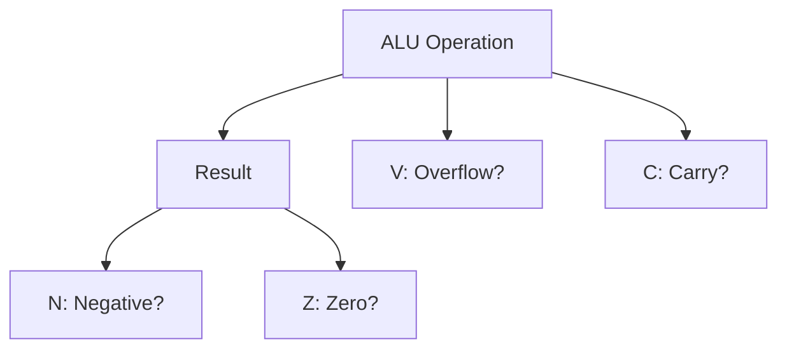

# Day 08: Arithmetic Operations & Status Flags

---

🌐 Available languages:
[English](./README.md) | [日本語](./README_ja.md)

## 📜 Overview

Today, we build the **Arithmetic Logic Unit (ALU)**, the core of the CPU's computational power, supporting full addition and subtraction. We will also integrate the **Processor Status (P) register**, which bundles the individual status flags we began implementing in Day 06.

This allows the CPU to perform complete addition (`ADC`) and subtraction (`SBC`) operations and observe how the results affect the status flags (N, V, Z, C) through the P register. This is a major leap towards making logical decisions in programs.

## 🧠 Memory Model Note

Day 04–09 use a simple program ROM (`rom.sv`) to supply instructions. RAM, including Zero Page/Stack/Program RAM, is not used until Day 10.

## 🎯 Learning Objectives

- **Integrate ALU**: Fully support 8-bit addition and subtraction.
- **Integrate Status Register (P)**: Connect the flag calculation logic from Day 06 to the P register.
- **Complete `ADC` / `SBC`**: Implement accurate arithmetic that accounts for carry/borrow.
- **Observe Flag Changes**: Confirm on the LCD that the P register content (Negative, Overflow, Zero, Carry) changes correctly based on operation results.

## 🏗️ Status Flags



The 6502 flags are updated automatically by many instructions. We focus on the four primary arithmetic flags:

- **N (Negative)**: Set to 1 if bit 7 of the result is 1 (negative number).
- **V (Overflow)**: Set to 1 if a signed arithmetic result exceeds ±127.
- **Z (Zero)**: Set to 1 if the result is 0.
- **C (Carry)**: Set to 1 if addition overflows or subtraction does NOT borrow.

## 🏗️ Instructions to Implement

| Opcode | Mnemonic   | Description                                     | Cycles |
| :----: | ---------- | ----------------------------------------------- | :----: |
| `0x69` | `ADC #imm` | Add operand + Carry to Accumulator              |   2    |
| `0xE9` | `SBC #imm` | Subtract operand - (1 - Carry) from Accumulator |   2    |
| `0x18` | `CLC`      | Clear Carry flag (0)                            |   2    |
| `0x38` | `SEC`      | Set Carry flag (1)                              |   2    |

## 🛠️ Implementation Steps

1. **Declare Flags**:
    - In `cpu.sv`, add `logic N, V, Z, C;`.
2. **Create ALU (Combinational Logic)**:
    - Use `always_comb` to define arithmetic logic.
    - `ADC`: `{C_out, result} = A + operand + C;`
    - `SBC`: Equivalent to `A + (~operand) + C`.
3. **Flag Update Logic**:
    - `Z = (result == 8'h00);`
    - `N = result[7];`
    - `V = (A[7] == operand[7]) && (A[7] != result[7]);` (for ADC)
4. **Update LCD Display**:
    - Update the VRAM writer to display flag states (NVZC) as 0/1 on the LCD alongside the Accumulator.

## 💡 6502 Subtraction & Carry

In the 6502, it is standard to call `SEC` (Set Carry) before an `SBC` operation. This is because the formula is `A - data - (1 - C)`, meaning `C=1` represents "No Borrow".

## 🧪 Verification

- **Test Program**:

    ```asm
    SEC        ; C = 1
    LDA #$0A   ; A = 10
    SBC #$05   ; A = 5, C = 1 (No borrow)

    CLC        ; C = 0
    LDA #$FF   ; A = -1
    ADC #$01   ; A = 0, C = 1, Z = 1 (Carry out)
    ```

- **FPGA**: Verify on the LCD that the calculation results and flags change correctly.

## 🎯 Next Step

In Day 09, we will use these flags (Z, C, etc.) to control the program flow using **Branch Instructions**.
